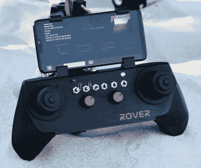

# 一年后，开源的火星探测器

> 原文：<https://hackaday.com/2020/07/02/the-open-source-mars-rover-one-year-later/>

顾名思义，在 Hackaday，我们每天都努力为您带来有趣的项目。但这并不一定意味着一个项目只有一天时间来美化这些传奇的篇章。事实上，恰恰相反。我们总是很高兴重访一个项目，并找出自从我们上次与它相遇以来它已经发展了多远，尤其是当创作者自己主动联系给我们更新时。

当[【Jakob Krantz】最近写信让我们加快这个不可思议的开源漫游者项目](https://github.com/jakkra/Mars-Rover)时，这正是发生的事情。不到一年前，我们第一次看到这个 3D 打印的*好奇号*启发的机器人，当时它本质上只是一个大盒子，用螺栓固定了独特的美国宇航局摇臂-转向架悬挂。现在，它不仅看起来更接近激发它的火星漫游者，而且它还学到了许多新的技巧，真正将这个项目推向了一个新的水平。

 铰接头和抓取臂不仅仅有助于出售*好奇心*看，它们实际上是功能性的。[Jakob]注意到他还没有集成运动学，所以移动手臂更多是为了展示而不是实际应用，但在未来它应该能够伸出手抓住物体。有了头部的新摄像头，他甚至能够以第一人称视角看到他所拍摄的东西。

[去年[Jakob]使用标准的 RC 发射器](https://hackaday.com/2019/08/27/3d-printed-rover-enjoys-long-walks-on-the-beach/)来驱动漫游者，但他后来组装了一个定制的控制器，这真是一件美妙的事情。它使用一个 ESP32 和 LoRa 模块与漫游者内部的匹配硬件进行通信，以及一个夹在顶部的智能手机，它通过 WiFi 显示遥测和视频。[控制器实际上是它自己的独立项目](https://github.com/jakkra/RoverController)，所以即使你不在市场上购买缩小版的火星漫游车，它的控制器也能为你的下一个机器人项目派上用场。

想必火星车背面的[多任务放射性同位素热电发电机(MMRTG)](https://hackaday.com/2019/02/08/the-deep-space-energy-crisis-could-soon-be-over/) 只是假装…但对于这个人，我们就不确定了。再给他一年，谁知道呢。