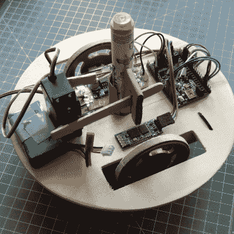

# 现实世界反击了

> 原文：<https://hackaday.com/2022/02/12/the-real-world-strikes-back/>

我的儿子迷上了“[秘密编码者](https://www.wired.com/2016/05/secret-coders-essentials/)”，这是一部漫画小说系列，其中两个孩子通过学习用[标志计算机语言](https://en.wikipedia.org/wiki/Logo_(programming_language))编程，发现并挫败了一个接管世界的阴谋。当我告诉他，这些“海龟机器人”原本实际上是真实的物理事物时，他想要一个。所以我们用我手头的一些不错的 DC 齿轮马达做了一个。

海龟机器人基本上有三项工作:沿直线前进一段可控的距离，转动一定的角度，以及举起和放下一支笔。如果你已经在尖叫“使用步进电机！”在你的屏幕上，你可能是对的。但我有这些漂亮的 Faulhaber/Micromo 齿轮电机，带编码器，只是在壁橱里收集灰尘，所以我用了它们。正因为如此，机器人在生活中的三个目标中的两个上磕磕绊绊——伺服提笔器工作得很好。

 完全匹配的 DC 汽车不存在。我当然知道这一点，因为我以前和 DC 汽车公司一起制造过机器人。但它们都有复杂的控制机制和/或反馈，这使得它没有实际意义。不在这里。这个机器人需要完全直线行驶，没有任何线条引导它或更有趣的导航算法。

我们花了整整半个小时驾驶它在不完全是但几乎是正方形的地方走来走去，调整每一边的 PWM，短时间反向运行电机以制动车轮，并通常尝试将旋转角度映射到电机驱动的毫秒数。你知道吗，我儿子很喜欢。对于二年级学生来说，这些概念非常简单，猜测正确的 PWM 值就像一个游戏。当我们终于得到了足够好的，有一个小庆祝活动。

我当然知道它真正需要的是编码器反馈。我毕竟是故意安装那些编码器齿轮马达的。但是处理正交和可能的 PID 环路来控制和同步两侧不适合我的儿子，至少在未来几年内不适合。(他们*这几天*在四年级学闭环控制理论吧？)我将不得不在某个晚上他睡觉的时候离线做这些。

但我希望他会记住从幼稚的方式中吸取的教训。抽象是伟大的，但是没有两台发动机是完全一样的。你可能会认为你可以校准它，但电机在驱动*和*滑行行为上是不同的，所以你要做的校准比你一开始想的要多得多。现实世界是艰难的，虽然有理论、想法和抽象来指导你很重要，但是当轮子落地时，你必须调整它才能工作。而且这样做很有趣，当它最终画出一个摇摇欲坠的正方形时，也非常值得。

This article is part of the Hackaday.com newsletter, delivered every seven days for each of the last 200+ weeks. It also includes our favorite articles from the last seven days that you can see on [the web version of the newsletter](https://mailchi.mp/hackaday.com/hackaday-newsletter-649368). Want this type of article to hit your inbox every Friday morning? [You should sign up](http://eepurl.com/gTMxQf)!