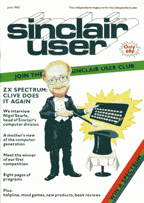
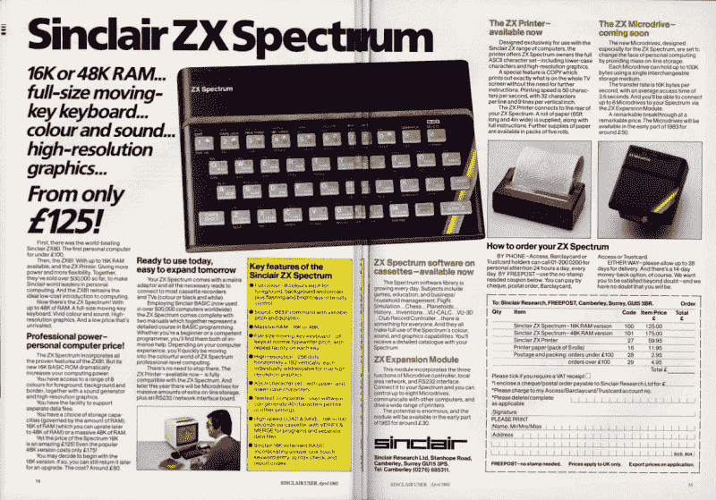
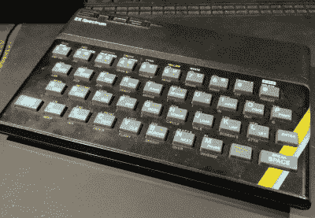
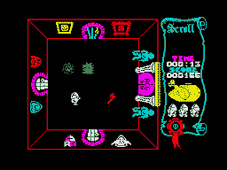
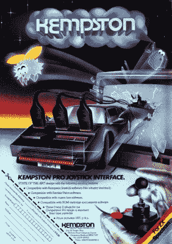
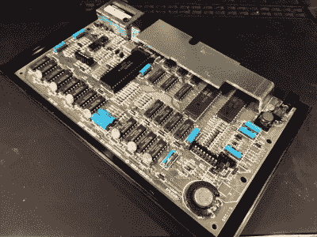

# 辛克莱·ZX 光谱 40 岁了

> 原文：<https://hackaday.com/2022/04/26/the-sinclair-zx-spectrum-turns-40/>

对于逆向计算迷来说，这是一个吉祥的时刻，因为辛克莱·ZX 光谱推出已经 40 年了。这台廉价的英国微型计算机从来都不是最好的，但是它的巨大成功和随之而来的巨大软件库使它成为英国拥有的第一台家用计算机。在 2022 年，它可能只活在 20 世纪 80 年代的怀旧情绪中，但它的遗产远远不止于此，因为它为整整一代倾向于技术的年轻人提供了一个负担得起的工具，让他们开始一生的计算。

## 1982 年到底是什么样的？

[Sinclair User issue 3](https://archive.org/details/Sinclair_User_003/mode/2up) captures the excitement surrounding the Spectrum launch.

复古爱好者中有一个流行的迷因，认为 20 世纪 80 年代是色彩、像素艺术品、合成音乐和媚俗设计的狂欢。事实是，我在 70 年代破旧的废墟中长大，偶尔瞥见令人兴奋的 80 年代的未来。对于倾向于科技的青少年来说尤其如此，因为在 1982 年初，家用电脑市场还没有达到其全部的大众市场潜力。市面上有很多机器出售，但令人兴奋的是有钱父母的成年人或孩子的专属领地。像 Sinclair 的 ZX81 这样的廉价机器可以让我们体验一下什么是可能的，但是它们的技术局限性很快就会被实验者发现。

1982 年将会改变这一切，围绕着三台机器的巨大兴奋。在英国，Acorn BBC Micro 于 1981 年 12 月推出，Commodore 64 于 1982 年初推出，辛克莱带来了他们的答案，首先是关于 ZX82 的谣言，然后是频谱形式的现实。

这种新型的机器都有相当大的内存，高分辨率(就当时而言！)彩色图形，最重要的是声音。BBC Micro 注定是学校的首选电脑，64 是每个人都想要的电脑，但如果你能说服你的父母它将是多么有教育意义，Spectrum 是你有理由期待得到的机器，因为它最便宜，125 英镑(相当于今天的 470 英镑，约合 615 美元)。

This dual-page advert for the Spectrum could be found across all manner of magazines in 1982.

## 永远不如它的竞争对手，但更便宜

40 years later, the design still looks sharp.

对于 1982 年的青少年来说，光谱是一件非常重要的事情，但是从 2022 年开始，它是如何增加的呢？很明显，这是他们早期 ZX81 的发展，具有相同的 Sinclair BASIC 和相同的单键关键字输入系统的更新版本。这一设计来自 Rick Dickinson，他也是塑造了 81 年的工业设计师，对于频谱来说，有一个新的键盘，它的底层薄膜上有一个柔软的橡胶模塑。

凭借 3.5 MHz Z80，它可以在处理方面展开竞争，但其架构和内存管理模式与前代非常相似。费兰蒂 ULA 改进的逻辑设计现在将处理器从绘制扫描线中解放出来，因此不再有显示空白的快速模式，处理器的全部功率可以一直使用。最初的 Spectrum 配有 16 MB 的内存，可通过内部子板升级到 48 kB，但这些早期型号很快被一种仅 48k 的型号取代，成为销量巨大的版本。

Typical ZX Spectrum gameplay, in this case *[Atic Atac](https://en.wikipedia.org/wiki/File:Atic_Atac_gameplay.png)*

高分辨率图形的分辨率为 256 x 192 像素，比 ZX81 的块图形有了很大的改进，但基于属性的颜色系统的分辨率要低得多，并且产生了颜色块的效果。聪明的软件设计者可以通过排列他们的瓷砖来尽可能多地掩盖这一点，但有时这种效果甚至可以在最精美的标题中看到。Acorn 和 Commodore 都有更好的图形功能，但 Sinclair 的优秀足以让青少年观众原谅它。(顺便说一句，聪明的 ZX81 黑客最终找到了如何让它在没有附加功能的情况下也能做到高分辨率，但这为时已晚，无法引起轰动)。

公平地说，第一代 Spectrums 的声音功能令人失望，只是一个连接到 I/O 端口上的扬声器，可以发出哔哔声，甚至是一些非常聪明的编程的低质量 PWM，但不能被描述为与其他具有专用声音芯片的机器竞争。后来的机器纠正了这种情况，但我们在这里只关心原始的。

Essential for any Spectrum user: You HAD to own a Kempston joystick interface!

除了所描述的硬件之外，Spectrum 几乎没有其他内置的东西。与当时大多数计算机一样，存储是通过磁带进行的，没有 Commodore 或 Acorn 的端口阵列，它只是将 Z80 信号暴露在后部的边缘连接器上。Sinclair 自己生产了一个热敏打印机附件，以及可以访问操纵杆、串行端口、简单网络的接口，当然还有他们的 T2 Microdrive 磁带循环存储外设。界面，大多数业主会有，虽然不是来自辛克莱，肯普斯顿操纵杆界面是一个必不可少的任何业主。

因此，该频谱以其极具吸引力的价格获得了巨大成功，尽管它是 Sinclair 产品的最佳传统，这种设备承诺很多，但提供的东西却比竞争对手少。它很快催生了一个健康的生态系统，由杂志和第三方公司提供每一个可以想象的升级或软件，全国各地的 80 后青少年将武装自己，在操场上争论 Z80 和 6502 的相对优势。作为 ZX81 的拥有者，我后来也参加了这个聚会，我认为辛克莱机器教会了我微型计算机的基本原理，这是我拥有过的任何机器都无法比拟的。

## 从 2022 年看光谱

My Spectrum, laid bare.

在翻了翻储物箱后，我拿出了存放这篇文章的辛克莱所有东西的盒子。除了 ZX81 之外，它还包含我的光谱，以及一堆磁带和外围设备。我的模型是 1983 年制作的 3 . 48kb 版本，是从频谱成为机器的那一刻开始的。打开它可以看到键盘下面的 PCB，Z80、ROM、ULA 和 RAM 以及视频调制器都在银色的罐子里。就 Sinclair 产品而言，这是一款相当可靠的产品，虽然我真的应该更换老化的电容器，但它仍然可以工作。我不确定我是否有耐心在真实的硬件上再次回到 Sinclair Basic 或 Z80 机器码，但那个盒子包含了很多记忆。

对我来说，频谱将永远是经典的橡胶键盘模型，但随着 20 世纪 80 年代的推移，我进一步转向业余无线电，并最终回到 16 位计算机，小辛克莱继续发展。“Plus”型号随后推出了更好的键盘和风格，类似于该公司的 QL 16 位产品，然后是 128 kB 的 bank-switched 型号，具有额外的功能，包括适当的声音芯片。那时，QL 的商业失败将公司拖到了边缘，最终在 1986 年，整个 Sinclair 计算机系列被卖给了他们的竞争对手 Amstrad。Amstrad Spectrums 将获得额外的功能，包括内置磁带和磁盘驱动器以及运行 CP/M 的能力，我惊讶地发现它们一直持续到 1992 年。

每一个在家用电脑时代开始技术发展的人都将“他们的”机器视为“经典”平台，所有东西都必须以此为标准来衡量，虽然我可能也不例外，但我肯定不会忽视它的缺陷。与竞争对手相比，这是一台价格低廉的机器，板载能力有限，需要额外的外围设备来完成几乎所有用键盘不可能完成的事情，但它的价值在于它给了 1982 年圣诞节时收到一台的幸运青少年。

他们中的大多数人会用它来玩游戏，但在任何一所学校，总有一部分孩子会用它来跑步，作为我学校里的一名孩子，我很感激它给我和我的许多同事带来的游戏。我永远也不可能攒够 350 英镑买一台 BBC 的微型电脑，我的父母当然也不可能给我买一台，但因为辛克莱提供了一些我可以攒钱买的东西，所以我可以用我的钱来收集我今天仍在使用的技能。

现在*这就是*一台教育电脑！