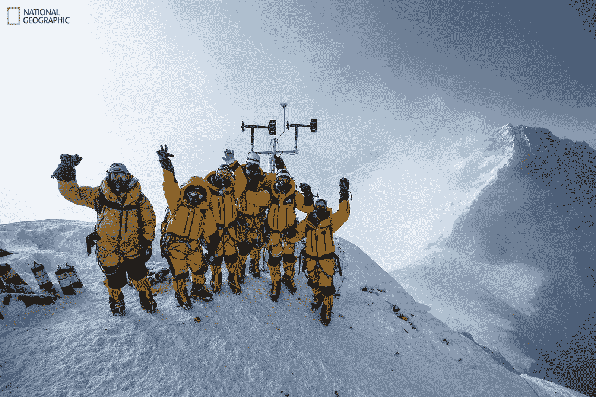

# 世界之巅的气象站

> 原文：<https://hackaday.com/2020/08/10/the-weather-station-at-the-top-of-the-world/>

地球山脉皇冠上的宝石——喜马拉雅山，以其无与伦比的美丽、高度和对专业和业余冒险家的致命吸引力而著称。喜马拉雅山的瑰宝当然是珠穆朗玛峰，尼泊尔人称之为*萨加尔玛塔*，西藏人称之为*珠穆朗玛峰*。海拔 8848 米(29029 英尺)——或者更高；这是一座地质学上年轻的山峰，仍在被构造活动向上推——这是一个如此令人生畏的地方，据我们所知，直到 1953 年才有人登顶，尽管此前至少有 30 年的尝试，其中许多都导致了死亡。

征服珠穆朗玛峰仍然是许多冒险者的遗愿清单挑战，尽管技术的进步使更多的人可以登上顶峰——或者正因为如此——300 多具尸体散落在山上，证明了当你把大自然的力量视为理所当然时会发生什么。

为了更好地了解世界屋脊上发生的事情，一支探险队最近试图在珠穆朗玛峰沿途的不同地点安装五个气象站，其中一个就在珠穆朗玛峰的顶峰。该计划具有挑战性，无论是从登山的角度来看，还是从建造能够承受地球上一些最恶劣条件并可靠地发回宝贵数据的东西所需的工程角度来看。它没有完全按照计划进行，但它仍然是一个关于科学和工程交叉的伟大故事。

## 那里的天气怎么样？

尽管经过 70 年的探索，已经有超过 5200 双靴子穿过峰顶，珠穆朗玛峰仍然是一个非常神秘的气候现象。峰会上从来没有一个永久性的气象站，部分原因是建造和安装这样一个设备需要面对技术挑战。我们对峰顶情况所知甚少，是通过探险队拖上来的便携式仪器，那里的致命条件使我们不可能停留足够长的时间来收集更多的风速、压力和温度读数。此外，几乎所有的珠穆朗玛峰尝试都发生在一个非常短暂的时间窗内，每年只有几个星期到几天。

在珠穆朗玛峰上建立永久气象站的需求不仅仅是探险爱好者的需求。喜马拉雅山处于一个独特的位置，可以充当气候变化的哨兵。根据一些估计，近四分之一的世界人口从喜马拉雅山及其周围的冰川获取饮用水，了解这些冰盖如何应对气温上升至关重要。但是，由于 5000 米以上的气象站非常少，气候学家不得不依靠遥感来构建一幅关于那里发生了什么的图片，而且是一幅扭曲的图片。

珠穆朗玛峰的顶峰还有一点意外之喜:它实际上达到了足够高的高度，可以穿透喷射流，即那些在全球范围内蜿蜒流动的高速气流。这部分解释了珠穆朗玛峰顶典型的恶劣天气和大风，这是大多数探险家的祸根。但是急流风也揭示了许多关于气团的情况，它们通常形成气团的边界，因此是研究气候的有价值的工具。急流风一般是通过使用气象气球来研究的，气象气球显然只能发回有限的数据。对于气候研究人员来说，拥有一个可以直接监测急流的永久性气象站将是无价的。

## 还不如是一艘飞船

在确定了珠穆朗玛峰气象站网络的需求后，[国家地理和劳力士永久行星珠穆朗玛峰探险队](https://www.nationalgeographic.com/adventure/2019/06/mount-everest-highest-weather-station/)承担了一项重要的任务，即设计能适应珠峰极端条件的设备。这将是一个与众不同的装置，更类似于为太空任务设计仪器，而不是监测地面天气。即使是最耐用的商用科学级气象站，与珠穆朗玛峰气象站的要求相比也相形见绌。

在许多层面上，与太空探索相提并论是恰当的。首先，重量是一个主要问题，因为用于建造空间站的每一克材料，加上安装它所需的所有工具和硬件，都必须用肌肉力量拖上 8800 米的高峰。这意味着空间站将不得不被分成几块，以便将负荷分散到多个登山者身上。此外，正如行星航天器要经过反复测试，以确保它能够经受发射和着陆的压力，空间站也必须经过测试，以确保它能够在这个星球可能出现的最恶劣的天气条件下生存。

气象站的工程与太空探索的另一个相似之处是在电力和通信方面。珠穆朗玛峰气象站需要完全自给自足，这实际上意味着太阳能。这就带来了特殊的挑战:太阳能电池板又大又平，而且有很大的迎风面积。此外，太阳能电池板是出了名的脆弱，众所周知，珠穆朗玛峰上的风在刮来刮去时会带走大块的砾石。需要建造一个太阳能系统才能在这种不断的岩石撞击中生存下来。此外，山顶上的天气可能会连续几周多云，因此还需要一个电池来储存能量。

为了通信，珠穆朗玛峰气象站从宇宙飞船工程师的剧本中又拿走了一页:冗余。空间站的数据必须通过无线传输，因此配备了冗余发射器。除了用于 400 MHz 仪器和科学测量(ISM)波段的突出的高增益八木天线(可与大本营的气象站进行通信)之外，summit station 还支持通过 M2M L 波段卫星终端进行数据传输。

 [https://www.youtube.com/embed/8ZGUbTjv3HQ?version=3&rel=1&showsearch=0&showinfo=1&iv_load_policy=1&fs=1&hl=en-US&autohide=2&wmode=transparent](https://www.youtube.com/embed/8ZGUbTjv3HQ?version=3&rel=1&showsearch=0&showinfo=1&iv_load_policy=1&fs=1&hl=en-US&autohide=2&wmode=transparent)

最后，在风速超过 290 公里/小时(180 英里/小时)的环境中，该站必须能够真正用螺栓固定。准确的安装位置不容易提前测量，所以空间站的腿和脚可以调整到 50 度。除了用螺栓将它的脚固定在岩石上之外，桅杆还配备了可调节的牵索，也是用螺栓固定在岩石上，以保持仪器桅杆的安全，并保持定向天线指向正确的方向。

## 够近了

制造商[坎贝尔科学仪器](https://www.campbellsci.com/)在新罕布什尔州的华盛顿山上进行了广泛的测试，那里记录了有史以来最高的风速(317 公里/小时，或 231 英里/小时)，这五个气象站被及时运往尼泊尔，供 2019 年春季登山季节使用。在尝试对山顶空间站进行最后的攻击之前，该团队在四个低海拔空间站上完善了他们的安装程序。

探险队并不孤单。尼泊尔政府在 2019 年发放了创纪录数量的登山许可证，导致 700 多名登山者在 2019 年的季节聚集在山上。当探险队到达传统上尝试登顶前的最后一站——南科尔营地时，他们正处在一个巨大的登山者交通堵塞的后面，他们渴望有机会站在峰顶上，无论多么短暂。

Climbers crowd the southeast ridge route in May 2019\. Source: [New York Times](https://www.nytimes.com/2019/05/23/world/asia/deadly-everest-traffic-jam.html)

在前往地球上最难到达的地方的途中，这种自相矛盾的拥挤给团队带来了巨大的风险。虽然排在他们前面的数百名登山者的目标是在峰顶上自拍几秒钟，但该团队需要大约三个小时来安装气象站。他们面临着一个艰难的选择:尝试登顶，并面临没有足够的氧气瓶和没有足够的工作空间的可能性，或者满足于在山下的一个较低的地方。他们选择了后者，并在东南山脊上选择了一个被称为阳台的地方，海拔 8430 米，这给了他们工作的时间和空间，而距离峰顶只有 450 米。

一旦这个小组选定了建站的地点，他们很快就遇到了麻烦。首先，他们带来的用来给无线锤钻供电的电池温度太低，无法工作，无线锤钻是用来将空间站固定在岩石上的。厚厚的登山夹克下温暖的腋窝使电池解冻，足以继续工作，但很快就发现，正是这一点使得将所有东西拖上山成为可能——将空间站分成独立部分的能力——也导致他们留下了一个关键部分。支撑风力传感器的桅杆——可以说是空间站中最重要的仪器——不见了。

## 在 8400 米高空进行黑客攻击

甚至在世界屋脊，黑客统治，很快就找到了探险结束问题的解决方案。令人难以置信的幸运是，该团队发现他们带来的轻型铝制雪铲的手柄与丢失的零件大小相同。一名夏尔巴人开始拆卸铁锹，并锤打手柄使其屈服，而通用的问题解决工具——管道胶带——被用来改善配合。修复工作做得很好，足以栓住所有东西，并在下山前给空间站通电，以确认它正在运行。

At 8,430 meters above sea level, the high-altitude expedition team celebrates after setting up the world’s highest operating automated weather station during the National Geographic and Rolex Perpetual Planet Everest Expedition. Learn more at [www.natgeo.com/everest](http://www.natgeo.com/everest). Photo by Mark Fisher, National Geographic.

阳台站向 NGS 发回数据大约九个月，然后发生了一些事情使它离线。尚不清楚失败的原因；剩下的低海拔站都还在[发回数据](https://www.nationalgeographic.org/earthpulse/everest/widget/16/)，所以是阳台站特有的东西。该站于 1 月份离线，因此可能是被黑客攻击的仪器桅杆无法承受冬季的强风，被扯掉了。或者太阳能电池板被风中的沙砾毁坏了，或者甚至被一些丢弃的攀爬装置弄脏了。毕竟，通往峰顶的路线[并不完全是原始的](https://www.indiatoday.in/india/story/mount-everest-swachh-bharat-mission-trash-garbage-indian-army-246604-2015-04-01)。

不幸的是，确定阳台站发生了什么的唯一方法是参观它，虽然这在 2020 年的登山季节应该是可能的，但新冠肺炎疫情有其他想法。尼泊尔在 2020 年取消了所有登山许可，中国方面的准入一直受到限制。一个中国勘测队在 2020 年 5 月登顶，但是他们沿着东北山脊接近，这条路线没有经过阳台附近的任何地方。

随着登山季节的结束，至少在 2021 年春天之前，世界上最高气象站的命运仍将是一个谜。希望它仍然在那里，并可以通过简单的修复重新上线。但事实上，它在第一时间到达那里，并工作了九个月，这是对整个努力工程的证明。