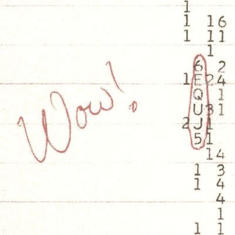

# 哇！信号重温:公民科学通知 SETI 的努力

> 原文：<https://hackaday.com/2022/11/08/the-wow-signal-revisited-citizen-science-informs-seti-effort/>

就有趣的问题而言，很少有人能真正与这个永恒的问题相提并论:“我们是孤独的吗？”了解银河系中是否存在其他形式的智慧生命的需求根深蒂固，确切了解任何一种方式都将产生巨大的影响。

但这是一个巨大的星系，知道在哪里寻找可能意味着我们并不孤独的信号是一项艰巨的任务。投入有限和昂贵的资源随机收听天空中的大块区域，希望听到一些显然是由技术文明制造的东西，这不太可能有结果。更好的办法是让明智的观察有所依据——某种有更好回报机会的目标。

幸运的是，近 50 年前的一次偶然观察提供了这一点。所谓哇！“信号”被广泛讨论，但只是偶尔和非正式地研究，它为天空提供了一个路标，这在一定程度上要归功于一位热衷于寻找系外行星的公民科学家。

## 不，真的——哇！

我们已经讲述了魔兽世界的故事！信号以及我们如何在故事中走到这一步，但总结一下:1977 年，俄亥俄州一架被称为“大耳”的射电望远镜探测到一个前所未有的信号，它来自人马座的大致方向。由于地球的旋转，固定天线扫过夜空，一股无线电噪声进入了仪器的双馈喇叭，信噪比达到了典型背景噪声的 30 倍以上。这个信号持续了 72 秒，后来被称为“哇！信号“感谢天文学家杰里·艾曼在 8 月 15 日晚上用红笔在扇面硬拷贝的空白处写下的激动的笔记。

 从那一夜起四十五年了，哇！信号一直处于科学好奇风暴的中心。在某些方面，它具有来自另一个科技文明的所有特征。信号的频率非常接近 1420 兆赫的氢线频率，任何有能力建造射电望远镜的人都很可能知道这个频率，并可能选择使用它来搜索银河系中的其他生命。鉴于地球在天线所在纬度的旋转速度，该信号的特征也非常符合人们对外星信标的预期。也有大量的努力来为这个信号提供其他的解释，但没有一个能排除外星信号。

话说回来，一直没有太多支持哇！信号作为外星名片的潜力。那天晚上没有其他观测站工作，没有收到任何类似的东西，多次试图监听这片天空以重复这一事件，都没有听到一点声音。四十五年过去了，哇！从科学角度来说，信号仍然是最糟糕的事件:一次性的、偶然的观察为更多的工作提供了诱人的线索，仅此而已。

## 公民科学指明了方向

然而，科学家们仍然在努力工作！信号，因为这似乎是我们目前为止找出谁可能在那里的最好机会。Alberto Caballero 就是这样一位科学家，他是一位来自西班牙的业余天文学家，作为可居住系外行星搜寻项目的负责人，他非常关注地外生命。该项目招募了专业和业余天文学家，将他们的望远镜转向恒星，寻找可能由行星从恒星前面经过引起的微弱变暗事件。该项目将重点放在距离地球 100 光年以内的一小组 G 型、K 型和红矮星上，并寻找每颗恒星周围可居住区内岩石系外行星的过境信号。

2MASS 19281982-2640123, a Sun-like star within the Wow! Signal footprint. Source: Alberto Caballero.

阿尔贝托对系外行星的兴趣有了不同的转变，他今年发表了一篇关于哇的潜在来源的论文。信号。这篇经过同行评议的论文表明，在 1977 年的那个晚上，在大耳喇叭的视野范围内的 66 颗恒星中，2MASS 19281982-2640123 可能是进一步研究的一个很好的候选星，因为它的亮度和大小。

哥伦比亚大学的 Karen Perez 领导的一组天文学家利用这一线索，最近对 2MASS 19281982-2640123 进行了第一次协调的多望远镜观测，具体目的是定位恒星的“技术特征”。使用西弗吉尼亚州的[格林班克望远镜](https://hackaday.com/2016/04/13/all-quiet-on-the-west-virginia-border-the-national-radio-quiet-zone/)和北加州 [SETI 研究所的艾伦望远镜阵列](https://www.seti.org/ata)。该团队协调观测，以便两台望远镜同时观察目标恒星，并以与原始 Wow 相同的 1420 MHz 频率进行观测！信号。

可悲的是，实验没有产生技术信号，这也许并不令人惊讶，因为两台望远镜对准这颗恒星的总时间只有 9 分钟左右。但这一努力仍然意义重大，主要是因为这是 45 年来第一次。听到信号说已经进行了协调的观察工作。这种努力只会让对虚假信号的观察变得更加容易，无论是在它们突然出现时还是事后。也暗示了除了 2MASS 19281982-2640123 之外的其他候选人——他们发现那晚大耳使用的观测窗中实际上有 8 颗类似太阳的恒星；放宽光度、质量和恒星类型的标准将候选恒星池大大扩展到 600 多颗。

肯定会有更多的 SETI 努力，虽然我们期待听到他们的结果，但现在我们很高兴一点公民科学被证明是一个更广泛努力的基础。

【特色图片来源:[北美天体物理天文台](http://www.bigear.org/Wow30th/wow30th.htm)。]