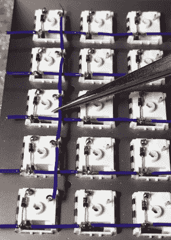

# 机械键盘布线的禅

> 原文：<https://hackaday.com/2019/09/27/the-zen-of-mechanical-keyboard-wiring/>

机械键盘现在非常流行，但是绝大多数都是通过商业途径购买的。只有最敬业的人才愿意投入必要的时间和精力来设计和组装他们自己的定制板，正如你可能想象的那样，我们过去在 Hackaday 上展示过许多这样的项目。

 但是让这款由【kentlamh】打造的机械键盘如此特别的并不是最终产品(尽管它确实非常漂亮)，而是[他在将所有开关](https://imgur.com/gallery/87LfDVI)手工连线到用作控制器的 Teensy 2.0 微控制器时所付出的心血。这款定制板内没有 PCB，只有彩虹色的电线、独立的二极管，以及用镊子将它们组装在一起的耐心。

[kentlamh]带领读者经历了布线过程的每一步，并提供了许多非常有用的提示，这些提示肯定会引起任何想要踏上类似旅程的人的兴趣。例如在桌子的边缘将二极管的脚一起弯曲，或者用牙签将它们缠绕起来，形成一个整齐的环，套在开关背面的引脚上。

他还使用烙铁融化电线中间的绝缘层，而不是通过数百根单独的跳线来忍受痛苦。我们以前在定制键盘上见过这种把戏，这是我们永远也看不够的东西之一。

毫无疑问，有些人会认为正确的方法是使用自动剥线钳，我们不一定不同意。但不可否认的是，在每个连接点用熨斗轻敲电线，给自己一点裸铜来工作，这种速度和便利性很有吸引力。

即使你不是一个机械键盘的狂热爱好者，也不会千里迢迢来到日本参加官方会议，或者在 Hackaday 超级会议上讨论他们设计的细节，这款定制板有着不可否认的魅力。在[kentlamh]的一点指导下，也许这将是你自己的手工杰作，为这些页面增色不少。

【感谢 Psybird 的提示。]