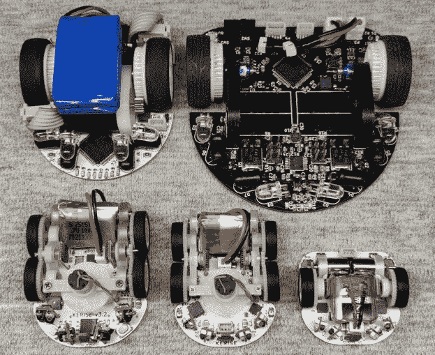
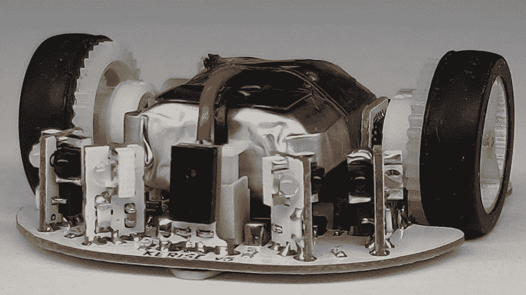

# 这些微型鼠标有宏观控制

> 原文：<https://hackaday.com/2020/12/06/these-micro-mice-have-macro-control/>

很少有东西像一个微型机器人一样吸引一个简单的黑客作家。我们已经看了一段时间[Keri]的完全迷人的微型鼠标构建，但是“机器人”的 KERISE 系列第五版 ( [机器翻译](https://translate.google.com/translate?sl=auto&tl=en&u=https://www.kerislab.jp/posts/2020-04-15-kerise-v5-coming/))将设计带到了新的高度。

A family of mice v1 (largest) to v5 (smallest)

举例来说， [micromouse](https://en.wikipedia.org/wiki/Micromouse) 是一项比赛，机器人在没有导航或机器人本身的计算的情况下，通过驾驶穿过迷宫来完成解决不同模式但标准大小的迷宫。历史上，迷宫是 3 米见方，由 16 x 16 的格子组成，每个格子边长 180 毫米，高 50 毫米，这就限制了机器人的大小。

一个[Keri]微型鼠标设计的标志是什么？这是一只小老鼠，所以一切都很小。但是[Keri]在用多氯联苯制造微型机械和 3D 结构方面对细节的关注非常突出。自 2016 年以来，他们一直在制造微型鼠标机器人，每次迭代都在测试新的设计功能。第三和第四版本有一个野吸风扇，以提高更快机动的牵引力，但 KERISE v5 取消了这一点，以强调重量轻和尺寸小。由此产生的车辆是一个令人震惊的 30 毫米 x32 毫米！我们正在进行英语翻译，但是我们推测[Keri]认为现在风扇已经不在了，主 PCBA 上还有很多空间。

The KERISE v5 front end

处理器是现在熟悉的 ESP32-PICO-D4，虽然无线无线电还没有使用。就环境传感而言，v5 的微型尺寸令人印象深刻。对于位置感测，有定制的磁编码器和一个 3 自由度 IMU。为了感应迷宫，有四个侧视红外发射器/接收器对和一个前视 VL6180X 激光测距仪，测量范围为 100 或 150 毫米。这些传感器大多安装在双面的小 PCB“刀片”上(查看 PCB 如何屏蔽 IR 发射器和接收器！)并焊接到垂直于构成主机箱的 PCBA 的插槽中。不用说，框架的其余部分是由定制的 3D 打印零件和变速箱组成的。

如果你想自己构建一个 KERISE，[Keri]在他们的 Github 上有看起来完整的机械、电气和固件资源，用于 [v1](https://github.com/kerikun11/micromouse-kerise-v1) 、 [v2](https://github.com/kerikun11/micromouse-kerise-v2) 和 [v3](https://github.com/kerikun11/micromouse-kerise-v3) 。要观看 KERISE v5 在旋转纸上的舞蹈，请在休息后观看视频。你不会想错过的！

> 新作 KERISE v5 宴会芸∞天啊！[pic . Twitter . com/vjzugyj 4w](https://t.co/vjZunGYJ4w)
> 
> –2020 年 11 月 22 日 t0(@ kerin 11)