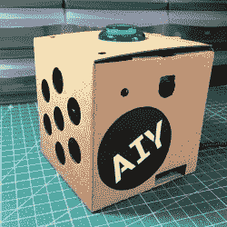

# 这个纸箱能告诉你它看到了什么

> 原文：<https://hackaday.com/2019/03/09/this-cardboard-box-can-tell-you-what-it-sees/>

不久前，与计算机对话还是电影和科幻小说的专利。慢慢地，语音识别得到了改善，现在它变得非常有用。这项技术已经超越了基本的关键词，现在可以解析自然语言的句子。[[Liz Meyers]一直在研究这项技术，创造出一种能告诉你它在看什么的人工智能。](https://www.hackster.io/elizmyers/add-vision-to-the-aiy-voice-kit-e9ff3d)

Adding a camera to Google’s AIY Voice Kit makes for a versatile object identification system.

该设备是围绕谷歌的 AIY 语音套件(T1)构建的，该套件由一个树莓 Pi 和一些额外的硬件和软件组成，使其能够处理语音查询。[Liz]结合了树莓 Pi 摄像头和谷歌云视觉 API。这使得 WhatIsThat 可以通过拍照来回应用户的提问，然后识别它在框架中看到的内容。

对于那些有工作视野的人来说，这可能看起来是一个无聊的项目，但是在可访问性领域，这项技术有着巨大的潜力。该设备不仅可以描述动物或其他物体，还可以大声朗读文本，甚至识别标志。该软件超越的能力令人印象深刻—[一个视频演示](https://www.youtube.com/watch?v=0DRTWML3XFA)显示人工智能正确识别了一只波士顿梗，并引用了阿尔伯特·爱因斯坦的话。

人工智能对语音识别的可行性产生了巨大的影响——因为理解单词是一回事，理解它们串在一起的意思是另一回事。休息后的视频。

【感谢 Baldpower 的提示！]

 [https://www.youtube.com/embed/0DRTWML3XFA?version=3&rel=1&showsearch=0&showinfo=1&iv_load_policy=1&fs=1&hl=en-US&autohide=2&wmode=transparent](https://www.youtube.com/embed/0DRTWML3XFA?version=3&rel=1&showsearch=0&showinfo=1&iv_load_policy=1&fs=1&hl=en-US&autohide=2&wmode=transparent)

