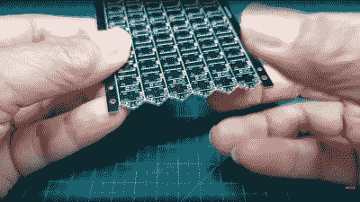
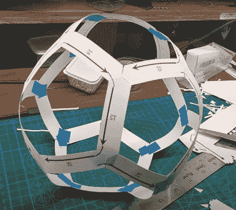

# 这个无限十二面体建筑展示了所有的技巧

> 原文：<https://hackaday.com/2022/10/12/this-infinity-dodecahedron-build-shows-all-the-tricks/>

无限十二面体是我们许多硬件黑客在“某一天建造”项目清单上的超级引人注目的建造之一。一想到实际上 *在做* 即使是最无畏的创造者也会感到一丝恐惧，一旦你开始考虑所有错综复杂的细节和相关的方式，它可能会变得非常糟糕。对我们来说幸运的是，[Hari Wiguna]有 [记录了他的最新构建，作为一个长视频构建日志](https://www.youtube.com/watch?v=YRvfHhS31sw) ，展示了许多整洁的技巧，并突出了许多问题。最终目标是消除许多使这种构建变得棘手的问题，[Hari]希望使它变得实际上*简单*。让我们看看结果如何！

HASL-finished castellated (half hole) edge contacts make butt-jointing a breeze

这种构建的常见路线依赖于适当形状的 3D 打印框架部件，12 个面使用某种透明塑料，30 个边缘的内部都贴有 LED 条。虽然这很有效，但[Hari]认为他可以做得更好，使用对接的 PCB 作为框架材料。

印刷电路板很容易折叠起来作为焊接发光二极管的东西(因为这是印刷电路板的主要用途！)以及以最小可见的方式在框架周围传递电力和数据信号的方式。从视频中冗长的讨论可以明显看出，要使这种策略奏效，这里或那里需要一些简单的技巧。随着最近使用堞形边缘进行端接的 PCB 模块的激增，通常的中国 PCB 工厂服务都开始为此功能提供非常超值的服务。PCB 的一个特性曾经是一种专业的(可以理解为“昂贵的”)产品，但现在在普通制造商的预算内已经相当便宜了。

Data path planning? Just use paper and tape!

一个迫在眉睫的实际问题是，假设每个顶点有三条边，如何从边到边传递数据连接。[Hari]提出的解决方案很简单，只需在 PCB 的每一端复制信号，因此可以根据需要从任何一端分接数据输出信号。

即使使用 3D 打印夹具将 PCB 固定在正确的角度，由于框架周围的累积误差，仍然会有一些摆动和边缘不完全对齐的风险。它最终确实走到了一起，带来了预期的壮观视觉效果。我们确信你们中的许多人将等待[Hari]向社区发布下一个版本的设计，希望更多的易于构建的问题得到解决，因为我们现在更想要一个。

自然，这决不是我们见过的第一个无限远的柏拉图立体，这里的 [只是其中较小的一个](https://hackaday.com/2021/01/31/dazzling-desktop-dodecahedron/) 。如果你去掉镜子和发光二极管，那么你只剩下一个普通的旧十二面体， [就像这个很酷的折叠项目](https://hackaday.com/2022/06/20/wonderful-foldable-printable-dodecahedron/) 。

 [https://www.youtube.com/embed/YRvfHhS31sw?version=3&rel=1&showsearch=0&showinfo=1&iv_load_policy=1&fs=1&hl=en-US&autohide=2&wmode=transparent](https://www.youtube.com/embed/YRvfHhS31sw?version=3&rel=1&showsearch=0&showinfo=1&iv_load_policy=1&fs=1&hl=en-US&autohide=2&wmode=transparent)

