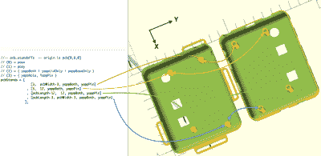
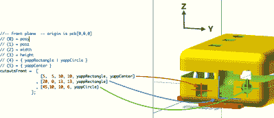

# 这个参数项目框生成器超级简单

> 原文：<https://hackaday.com/2022/01/31/this-parametric-project-box-generator-is-super-easy/>

当把一个想法从概念变成原型时，根据项目的类型，在这个过程中会有相当多的子任务。以你最新的电子产品设计为例。你已经完成了原理图，PCB 布局也是一件艺术品(如果你自己这么说的话)，但把它放在没有保护的桌子上晃来晃去并不是最终的结果。现在你要做一个某种形式的围栏，我不知道你怎么想，但这是这个抄写员要努力找到合适的东西的地方。即使你有最新的 3D 打印机，离完美只有一步之遥，你仍然需要拿出设计，这些尺寸需要非常精确。因此，对于我们这些擅长 PCB 但不擅长外壳的人来说，[Willem Aandewiel]正忙着为你制作工具，他的 [PCB 导向的另一个参数投影盒生成器(YAPP。)](https://willem.aandewiel.nl/index.php/2022/01/02/yet-another-parametric-projectbox-generator/)

Defining the PCB mounting points w.r.t. the PCB outline

你可以毫不犹豫地前往 [YAPP GitHub](https://github.com/mrWheel/YAPP_Box) ，获取可爱的 OpenSCAD 代码，并开始破解演示。为了方便起见，提供了一些包含一些常见项目的示例，如 Arduinos 和 ESP32 模块，因此您可以使用它们作为跳板来编写自己的代码。YAPP 的工作基于 PCB——通过编程指定(因为这是 OpenSCAD)——外部尺寸，首先是安装柱位置。接下来，你在盒子的六个面上定义开口，工具很高兴地吐出一个带有底座和盖子的浅盘，准备放入 Cura(或你选择的切片器)中。还有什么比这更简单的呢？

End face cutouts

在开始非矩形设计之前，这是一个用于矩形 PCB 的矩形盒生成器。这就是它的设计目的，据我们所知，它很好地完成了这一任务。

当然，这绝不是第一个美化这些页面的附件生成器，远非如此。这是第一个例子。如果你是来寻求帮助做出更好设计的建议的，[来看看这个](https://hackaday.com/2020/11/16/simple-tips-for-better-3d-printed-enclosures/)，最后 3d hubs[也为你准备了一份不错的指南](https://hackaday.com/2017/05/24/practical-enclosure-design-optimized-for-3d-printing/)。印刷快乐！