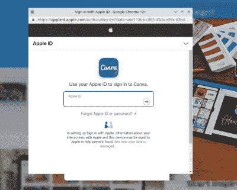

# 本周安全:浏览器中的浏览器、大规模域名抢注和/dev/随机升级

> 原文：<https://hackaday.com/2022/03/25/this-week-in-security-browser-in-the-browser-mass-typo-squatting-and-dev-random-upgrades/>

对于每一个保护人们安全的非常聪明的安全协议，[都有一个愚蠢的黑客以一种意想不到的方式击败它](https://mrd0x.com/browser-in-the-browser-phishing-attack/)。以 OAuth 为例。这是网站在提供“用脸书登录”时使用的技术。这是一个很好的协议，因为它允许你使用一个可信的第三方来证明你的身份。无论你想使用哪个网站，你都不需要使用密码，你只需要登录你的谷歌/脸书/苹果账户，点击按钮就可以访问。如果您没有登录，弹出窗口会提示您输入用户名和密码，这当然是网络钓鱼攻击试图窃取密码的一种方式。所以我们告诉人们看网址，并确保他们确实登录到正确的网站。

An OAuth pop-up window

这个愚蠢的方法并不愚蠢，因为它有效:用 HTML/CSS 重新创建浏览器窗口。是的，给你的站点添加一个`div`非常简单，并且把它装饰成浏览器窗口的样子，就像 OAuth 弹出窗口一样。在适当的地方会出现一个 iframe，指向真正的网络钓鱼表单。它看起来很有说服力，但是一旦你意识到这个游戏，就有一个致命的漏洞——尝试将 OAuth 窗口移到产生它的浏览器窗口之外。网站不能在浏览器窗口外或窗口装饰上绘图，因此这一限制很容易确认这种黑客行为是否在进行。另一个可取之处是，密码管理器根本不会被这种伎俩愚弄。

Via: [Ars Technica](https://arstechnica.com/information-technology/2022/03/behold-a-password-phishing-site-that-can-trick-even-savvy-users/)

## 错别字-在规模上擅自占用

NPM 正在进行一场[域名抢注运动，主要针对 Azure 用户。NPM 有一个打包特性叫做“作用域包”。范围以 at 符号开始，表示有意组合在一起的包。在这种情况下，范围是`@azure`，包括像`@azure/core-tracing`这样的包，每周下载超过 150 万次。错别字？放下瞄准镜。NPM 认为同时拥有`@azure/core-tracing`和`core-tracing`包是完全可以接受的——事实上，这是范围系统的一个特性。但是忘记包含范围，您可能会得到一个恶意的包。超过 200 个包裹以这种方式被锁定，但是已经被 NPM 撤回。](https://jfrog.com/blog/large-scale-npm-attack-targets-azure-developers-with-malicious-packages/)

有效载荷是严格的侦察，获取目录列表、IP 地址等等。这些信息很可能会被用来制作更多恶意的未来更新，尽管还没有观察到这样的行为。这很可能是因为这些包裹被发现和取走的速度非常快——仅仅过了大约两天。用于数据收集的域是`425a2.rt11.ml`，所以在某个地方的 DNS 日志中出现的字符串表示安装了这些包中的一个。

## Lapsus$再次出击，再次出击

被称为 Lapsus$的松散的黑客群体有可能在微软和 Okta 都取得了突破。 [KrebsonSecurity 有更多关于该组织和微软案件的信息。该组织似乎正在通过一个电报频道进行协调，该频道对任何人开放。该组织吹嘘他们在这个渠道上的利用，微软的受访者在数据泄露期间发现并切断了他们的访问。已经发布了一个 10 GB 的文件，其中包含 Bing 搜索、Bing 地图和 Cortana 的部分源代码。](https://krebsonsecurity.com/2022/03/a-closer-look-at-the-lapsus-data-extortion-group/)

Okta 的情况甚至更模糊，因为发布的截图显示在 1 月下旬访问。访问权限似乎仅限于管理门户，通过一个支持工程师的帐户。Okta 已经尽力向所有人保证没有实际的违规行为，流氓访问很快得到了处理。这似乎有点不真诚，因为 Lapsus$是在公司使用 Okta 服务之后，不需要进一步损害他们的系统。Okta 为其他公司提供访问管理，如 Cloudflare。在此事发生后的几个月里，很可能发生了一些悄悄的渗透。

## Linux 变得更加随机

内核黑客和 Wireguard 的主要开发者 Jason Donenfeld 最近在研究 Linux 随机数生成器。5.17 版本中有一些变化，5.18 版本中将有更多变化。他好心地为我们的教育写了一些有趣的变化。他认为自己最重要的贡献是文献。我可以肯定，程序员可能面临的最令人沮丧的问题是文档已经变得毫无用处。

面向用户的最大变化之一是试图统一`/dev/random`和`/dev/urandom`。我们之所以说尝试，是因为这一更改导致了内核测试设置的多次引导失败。显然，一些架构，特别是在虚拟化时，无法在引导期间生成高质量的随机性。下一个杀手级特性是新的`add_vmfork_randomness()`调用，它允许一个新克隆的虚拟机请求再生它的随机池。如果没有这样的调用，VM 分叉后内核生成的前几个随机数将是相同的——这显然是个问题。

在内部，随机性代码淘汰了古老的 SHA-1 算法，代之以更现代的 BLAKE2 哈希函数。一个有趣的优势是 BLAKE2 是一个非常快速的算法，所以内核在生成随机数时会获得一点性能。其余的变化深入到更复杂的加密考虑。如果你有兴趣，绝对值得一读。

## 西部数据 NAS RCE

我们已经报道了大量来自 QNAP 和 Synology 的 NAS 盒中的漏洞和攻击，但本周[西部数据开始行动](https://research.nccgroup.com/2022/03/24/remote-code-execution-on-western-digital-pr4100-nas-cve-2022-23121/)。谢天谢地，这是来自 NCC 集团的研究，[在 Pwn2Own 2021](https://www.youtube.com/watch?v=rY4phaf7KEU&t=730s) 上展示，并在一月份的更新中修复。这个远程代码执行(RCE)漏洞存在于 NAS 处理苹果文件协议(AFP)的方式中，实际上是 Netatalk 项目中的一个问题。为了兼容性，AFP 支持将文件元数据存储为单独的文件。这些文件是 AppleDouble 格式，以它们的父文件为名，前面加上一个`._`。有趣的是，这些文件也可以使用 Windows SMB 协议访问，允许直接操作元数据文件。解析元数据文件的函数确实检测到了格式错误的数据结构，并记录了相应的错误，但是失败了——它继续处理坏数据。

这种连续出错是主要缺陷，但实际上构建一个漏洞需要数据泄漏来破坏设备上的地址布局随机化。更简单的第一步是将内存位置写入 AppleDouble 文件，并使用 SMB 访问来读取它。有了泄露的地址在手，充分利用是容易的。这已经够糟糕的了，但是这些设备带有一个“公共”共享，可以通过 SMB 和 AFP 访问。此配置使其成为预授权 RCE。这证明了 Pwn2Own 的目的——它被发现，让研究人员赚了一点钱，并在细节公开之前被修复。