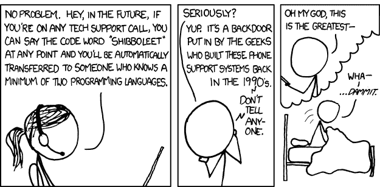

# 本周安全:不会消失的 Log4j、WebOS 等等

> 原文：<https://hackaday.com/2021/12/31/this-week-in-security-the-log4j-that-wont-go-away-webos-and-more/>

在过去的两周里，Log4j 继续推动安全新闻，更多易受攻击的平台被发现，更多的 CVE 出现。首先是趋势科技的工作，[关注电动汽车和充电器](https://www.trendmicro.com/en_us/research/21/l/examining-log4j-vulnerabilities-in-connected-cars.html)。他们在一个已公布的充电器框架中发现了 log4j 攻击，并设法观察到特斯拉车载信息娱乐系统中存在漏洞的证据。不难想象一款恶意软件既可以在充电器上运行，也可以在电动汽车上运行。由于这些系统相互交流，它们可以通过汽车充电器之间的移动来传播病毒。

Log4j 现在[达到 2.17.1](https://logging.apache.org/log4j/2.x/security.html) ，因为[还有另一个 RCE 要修正](https://thehackernews.com/2021/12/new-apache-log4j-update-released-to.html)，CVE-2021-44832。这部电影在 CVSS 量表上只得了 6.6 分，而原作的评分是 10 分。44832 要求攻击者首先控制 Log4j 配置，这使得攻击更加困难。这一系列后续漏洞展示了一种众所周知的模式，即一个引人注目的漏洞会引起研究人员的注意，他们会在同一代码中发现其他问题。

现在有报道称 Log4j 被用于 Conti 勒索软件活动。此外，还发现了一个基于 Marai 的[蠕虫](https://twitter.com/vxunderground/status/1472782879931473921)。这种自我传播的攻击似乎是针对 Tomcat 服务器等。

## WebOS 陷入快照

[大卫·布坎南]承认，虽然这是一个有趣的利用，但在这一点上没有多大用处。这可能会改变，但现在让我们看看这个缺陷。快照是 V8 JavaScript 引擎中一个很酷的特性。当您导航到一个 web 页面时，该页面的 JavaScript 上下文必须在内存中生成，包括加载该页面调用的所有库。这在桌面上不会花费太长时间，但是在加载本地界面的嵌入式设备或手机上，这个初始化步骤可能会占用绘制所请求页面所需时间的很大一部分。快照是一个很好的技巧，它初始化上下文，然后保存。当稍后打开界面时，可以使用该文件调用 V8 引擎，并且上下文被预先初始化，使得应用或界面的启动明显更快。唯一的问题是 V8 希望快照只能从可信的来源加载。

WebOS 平台本身。单个应用程序是沙箱化的，但是 web 应用程序在基于 Chromium/V8 的浏览器 WebAppMgr (WAM)的上下文中运行它们的代码。虽然单个应用程序是沙盒化的，但 WAM 没有。有趣的是，web 应用程序可以指定自己的快照加载到 V8 中。加载一个损坏的快照给[David]造成了 JS 类型混乱，结果是一个任意的读/写原语。从那里，脱离运行 JS 并进入实际的外壳代码是相当容易的。这个 RCE 以“wam”用户的身份运行，但是这是一个有轻微特权的帐户。值得注意的是，wam 可以访问`/dev/mem`——直接访问系统内存。升级到根几乎是微不足道的。

[David]发布了完整的 PoC，指出 LG 支付的 bug 奖金少得可怜。我不同意他的说法，即这种攻击完全依赖于侧加载恶意应用程序，原因很简单，LG 确实为这个平台运行了他们的内容商店。恶意开发者可能能够绕过 LG 用来审查应用程序的任何恶意软件检测例程。毕竟，app store 上的恶意应用肯定不是什么新鲜事。这种利用最糟糕的部分是很难指出漏洞在哪里。

## 团队中的四只虫子

[FABIAN brun lein]在微软团队的链接预览功能中发现了一些[有趣的意外行为。第一个问题是服务器端请求伪造。链接预览是在 Teams 服务器端生成的，根据定义，需要打开页面来生成预览。问题是缺少过滤——链接到 127.0.0.1:80 会生成位于 Teams 服务器的本地主机上的内容的预览。](https://positive.security/blog/ms-teams-1-feature-4-vulns)

接下来是一个简单的链接欺骗技术。这一个使用像 Burp 这样的工具来改变团队客户机发送的数据。嵌入链接时发送的消息的一部分是调用预览生成的 URL。不需要做进一步的验证，所以可以从一个良性的 URL 生成一个预览，而实际的链接指向一个任意的页面。第三个问题是相关的，因为缩略图本身的链接也在该消息中，并且可以被篡改。这里有趣的用例是，攻击者可以将其设置为他们控制的 URL，并从目标(即公共 IP 地址)提取信息。现在这在大多数平台上被目标的客户端屏蔽了，但是在 Android 上，检查是缺失的。

最后，也是 Android 特有的问题，攻击者可以发送“死亡消息”，本质上是一条畸形的消息，仅通过尝试呈现预览就使应用程序崩溃。每当用户试图访问聊天时，这个应用程序就会崩溃，实际上将用户完全锁定在应用程序之外。现在这些都不是惊天动地的问题，但是微软的集体耸肩回应是…令人印象深刻。他们已经秘密修补了 IP 地址泄露，但显然仍然有可能欺骗链接预览，以及使 Android 应用程序崩溃。

## PBX 后门

RedTeam Pentesting 的研究人员研究了德国电信设备制造商 Auerswald 设计的 PBX。吸引他们眼球的是一项广告服务，在这项服务中，Auerswald 可以为被锁定在设备外的客户重置管理员密码。这是教科书式的后门，[绝对值得调查](https://blog.redteam-pentesting.de/2021/inside-a-pbx/)。

If only it was this kind of backdoor: [https://xkcd.com/806/](https://xkcd.com/806/)

他们的方法不是直接攻击硬件，而是从 Auerswald 的网站上获取最新的固件包，并对其进行分析。使用`file`、`gunzip`和`dumpimage`实用程序给了他们所需的根文件系统。他们通过配置文件的网络工作，选定了可能包含密码重置后门的 webserver 二进制文件。注意，对于嵌入式设备来说，在一个 httpd 二进制文件中包含所有的用户界面和配置逻辑是非常典型的。

给定一个二进制，他们转向已经迅速成为各地安全研究人员最喜欢的工具，Ghidra。他们还有一个提示，即“子管理员”用户，所以使用 Ghidra 搜索该字符串。财源滚滚。通过函数向下钻取，硬编码的用户名“Schandelah”就在那里。密码功能带来了更多的探索。对于这些 PBX 中的每一个，后门密码是的 MD5 散列的前 7 个字符，即设备的序列号+“r2d 2”+当前日期。

只是为了好玩，研究人员使用 Ghidra 来搜索后门密码功能的其他用途。结果是，如果指定了 admin 用户，并且密码与用户配置的密码不匹配，就会与该算法进行比较。如果匹配呢？您以管理员身份登录硬件。这显然比重置管理员密码更有用，因为它允许在不对系统进行任何明显更改的情况下进行访问。[整篇文章](https://blog.redteam-pentesting.de/2021/inside-a-pbx/)是关于使用 Ghidra 进行这类研究的很好的教程。

Auerswald 很快推出了固件更改，以纠正所发现的问题。像这种公开披露的后门，不像我们在这里讨论的其他一些后门那样是法律和道德上的地雷。这种实现仍然存在一个问题——密码重置还应该将设备重置为出厂设置，并删除用户数据。任何不足都会导致重大数据泄露。

## 山姆欺骗

这个 Windows 活动目录[权限提升漏洞](https://www.secureworks.com/blog/nopac-a-tale-of-two-vulnerabilities-that-could-end-in-ransomware)因其简单性而引人入胜。这是 CVE 2021-42287 和 CVE 2021-42278 的组合。Windows active directory 有两种不同的帐户，即用户帐户和计算机帐户。机器帐户用于将特定硬件引入域中，通常以美元符号(MyMachine1$)结尾。默认情况下，用户可以创建机器帐户，也可以重命名这些帐户。第一个问题是，用户可以创建一个机器帐户，然后将其重命名为与域控制器相同的帐户，只是没有最后的美元符号。例如，我可以创建`MyMachine1$`，然后将其重命名为`DomainController1`。`DomainController1$`将仍然存在，并且该域将这些视为独立的机器帐户。

现代的 Windows 域在幕后使用 Kerberos，Kerberos 使用票证范例。帐户可以请求充当临时身份验证令牌的票证授予票证(TGT)。可以把它想象成一个密码替换，可以自动发送请求。攻击是为重命名的机器帐户请求一个 TGT，然后再次重命名该帐户，回到`MyMachine1`。关键是攻击者仍然拥有一个针对`DomainController1`帐户的有效票据，即使该帐户已经不存在。接下来，攻击者使用这个 TGT 向密钥分发中心(KDC)请求一个会话密钥。KDC 注意到请求的帐户不存在，并很有帮助地附加了美元符号，再次运行检查。它看到了`DomainController1`的有效 TGT，并返回一个会话密钥授权攻击者为`DomainController1$`，这恰好是一个域管理帐户。

## Chrome 的老化之痛

据说我们没有获得 Windows 9，因为太多的旧应用程序是用 regex 编写的，这会阻止执行，抱怨应用程序不能在 Windows 95 或 98 上运行。Chrome 正试图防止类似的问题，因为谷歌的开发者看到了即将到来的第 100 版。这种事情以前也曾困扰过网络浏览器，特别是在 Opera 发布版本 10 时的[，在这个过程中进一步打破了用户代理的束缚。](https://maqentaer.com/devopera-static-backup/http/dev.opera.com/articles/view/opera-ua-string-changes/index.html) [Firefox 也加入了乐趣](https://www.otsukare.info/2021/04/20/ua-three-digits-get-ready)，这两种浏览器的开发者都对你有一个要求:用一个伪造的用户代理字符串浏览网页，并让他们知道 100 版本的结果是什么。这也是测试你自己网站的好机会。如果你看到任何特别奇怪的结果，请告诉我们。