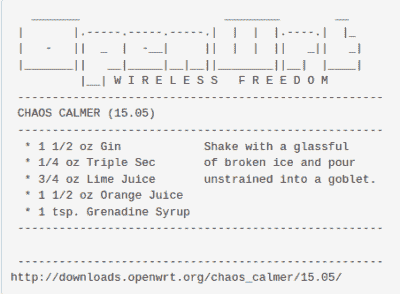

# 本周安全:UClibc 和 DNS 中毒，加密很难，山羊

> 原文：<https://hackaday.com/2022/05/06/this-week-in-security-uclibc-and-dns-poisoning-encryption-is-hard-and-the-goat/>

DNS 欺骗/中毒是由[Dan Kaminski]在 2008 年发现的攻击，这种攻击一直没有消失。本周[uClibc 和 uClibc-ng](https://www.nozominetworks.com/blog/nozomi-networks-discovers-unpatched-dns-bug-in-popular-c-standard-library-putting-iot-at-risk/) 标准库中公布了一个漏洞，使得 DNS 中毒攻击再次成为现实。

因此，快速回顾一下，DNS 查找通常发生在未加密的 UDP 连接上，UDP 是一种无状态连接，更容易被欺骗。DNS 最初只是使用 16 位事务 ID (TXID)来验证 DNS 响应，但[【kamin ski】意识到，当与产生大量 DNS 流量的技术结合时，这是不够的](https://duo.com/blog/the-great-dns-vulnerability-of-2008-by-dan-kaminsky)。这种攻击可能会毒害公共 DNS 服务器缓存的 DNS 记录，从而极大地放大这种影响。解决方案是随机选择发送 UDP 请求时使用的 UDP 源端口，使得用欺骗的数据包“赢得彩票”更加困难，因为 TXID 和源端口必须匹配，欺骗才能起作用。

和 uClibc-ng 是 C 标准库的微型实现，旨在用于嵌入式系统。这个标准库提供的功能之一是 DNS 查找功能，这个功能有一些奇怪的行为。当生成 DNS 请求时，TXID 是递增的——它是可预测的，而不是随机的。此外，TXID 会定期重置回初始值，因此甚至不会使用整个 16 位密钥空间。不太好。

Your OpenWRT must be this old to be vulnerable.

当我们回顾加州大学伦敦分校的历史时，情况发生了转折。它最初是为μClinux 编写的，μClinux 是微控制器的 linux 端口。当 Linksys 发布 WRT54G 的源代码时，围绕该代码的一些项目将源代码与 uClibc 库和 buildroot 结合起来。OpenWRT 是值得注意的用户之一，当 uClibc 开发停滞时，OpenWRT devs 将其分叉为 uClibc-ng。OpenWRT 开始流行起来，像高通这样的一些供应商已经采用它作为他们的 SDK。这就是我们如何在 Starlink 路由器上运行类似 [OpenWRT 15.05 的东西。](https://forum.openwrt.org/t/starlink-router-chaos-calmer-upgrade/114105)

漏洞披露(第一个链接，在^上面)点名检查 OpenWRT 使用了 uClibc-ng。直到 2017 年 LEDE 版本转移到维护更好的 musl 标准库之前都是如此。OpenWRT 的任何维护版本都没有此漏洞。问题是像 Starlink 路由器这样的设备可能容易受到攻击，因为它运行的是 OpenWRT 的一个古老分支。

## 艰难的代码评审

来自 Dolos 集团的研究人员受雇完成一项简单的任务，对机器人代码进行[代码审查。这里的机器人是指来自 Automation Anywhere 的 RPA 机器人——机器人流程自动化代码片段。这些是带有 GUI 的脚本，用于自动化一个过程，比如将数据从一个表单复制到另一个表单。问题是这些脚本不太容易审计。它是一个 zip 文件，包含 XML 文件，包含 Base64 编码的数据。解码 base64 数据，结果是…随机噪声。有可能它实际上是二进制数据，是压缩的，或者是加密的。使用](https://dolosgroup.io/blog/2022/4/28/anatomy-of-a-zero-day-how-to-decrypt-a-robot)`[ent](https://github.com/Fourmilab/ent_random_sequence_tester)`的一个快速测试显示它几乎是完全随机的——它是加密的。你如何着手审计加密代码？更好的问题可能是，应用程序如何运行加密代码？

答案很简单:框架安装程序包含硬编码的 AES 密钥。我们可能会问，当密钥公开时，预共享密钥加密的意义何在。如果我们允许自己有点厌倦，那么我们可能会得出结论，这些脚本被加密只是为了让公司可以在他们的网站上宣传“银行级加密”——这肯定没有安全优势。Dolos 小组的研究人员更仁慈一些，他们只是观察到管理密钥是一个比加密本身更难的问题。

## 银行黑客变得容易了

Assetnote 的[Hussein Daher]和[Shubham Shah]接受了一个银行 bug bounty 项目的挑战，并发现 dotCMS 是[阅读](https://blog.assetnote.io/2022/05/03/hacking-a-bank-using-dotcms-rce/)最有趣的途径。为什么？它是开源的，所以他们做的是代码审计，而不是黑箱调查。审计确实发现了一些有趣的东西。DotCMS 的文件上传功能存在目录遍历缺陷。这在理论上意味着一个简单的 RCE——只需上传一个 web shell，然后打开 url。在真实系统中，情况要复杂一些。首先，他们必须映射目标系统的目录结构，这不是一项容易的任务。即使使用了一个巧妙的技巧，`/proc/self/cwd/`来获得正确的目录，实际的 webroot 还是被紧紧地锁定了。实际起作用的 PoC 是攻击 JavaScript 位置，因为这些脚本可能会被覆盖。这是一个发现相当严重问题的有趣故事。听起来他们在这次虫子赏金搜索中表现不错。

## 库柏人

了解平台安全性的最佳方式是深入了解并亲自动手。这显然是 Madhu Akula 的观点，他建造了 Kubernetes 山羊作为 Kubernetes 故意不安全的游乐场。Docker 映像集群附带了一系列场景引导的漏洞，供您探索和学习。如果 Docker 或 Kubernetes 安全听起来很有趣，抓住山羊的角，一头扎进去。

## 谁是 UNC3524

Mandiant 发现了一个特别狡猾的 APT 组织，将他们命名为 UNC3524。把这当成一个占位符，因为这很有可能是我们的一个老朋友，就像 Fancy Bear 和 Cozy Bear 一样，都是俄罗斯的团体。没有足够的赠品来进行积极的识别，它可能是一个完全不同的群体，因为所有的指标都是众所周知的技术——如使用 [reGeorg](https://github.com/sensepost/reGeorg) 进行代理连接。那是开源软件，也是开源智能。

不管怎样，这些家伙取得了一些令人印象深刻的成就，比如在某些情况下，在一个网络中呆了 18 个月而没有被发现。一种独特的技术是破坏网络上的物联网设备，如 IP 摄像头，并将其用作本地命令和控制服务器。正如他们所说，IoT 中的 S 代表安全。网络隔离是你的朋友。

一旦站稳脚跟，该组织就瞄准 IT 和高管，试图进入他们的电子邮件账户。它推测，It 帐户是有针对性的，以了解何时发现感染。对高管账户的访问显示，攻击者正在寻找公司新闻的预先通知，如合并和收购。提前知道这些计划可以给投资者带来巨大的交易优势，但是先进的技术意味着政府资助的演员。也许俄罗斯或其他国家正在开发一种新的收入来源。有一些妥协的迹象需要注意。最容易发现的是非标准端口上的 SSH 流量。也有一些已知的 DNS 名称。

[通过 Ars Technica](https://arstechnica.com/information-technology/2022/05/how-hackers-used-smarts-and-a-novel-iot-botnet-to-plunder-email-for-months/)