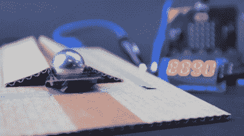

# 探测银球的三种方法

> 原文：<https://hackaday.com/2021/04/16/three-ways-to-detect-the-silver-ball/>

当我们说制造弹球目标比你想象的要困难时，我们是从经验中说的。球接触部分的表面积非常小，你真的需要重力来达到最佳效果。幸运的是，[TechnoChic]为我们做了这项工作，并提出了这些[三种多功能传感器设计](https://www.instructables.com/3-Ways-to-Make-Cardboard-PinBall-Sensors/)，它们适用于任何游戏，而不仅仅是弹球。他们都使用来自贝索斯谷仓的新鲜、原始的纸板和一种由布朗狗公司  制造的导电织物带，他们称之为制造者带。

除了不可焊(你能焊接吗？我们的还没有出现)，maker 胶带似乎优于铜带，因为它被设计成在 Z 方向上导电，如果你曾经布置过铜带电路，你就会知道胶带重叠是很正常的。

首先是轨道开关，我们认为这是非常必要的。毕竟，没有至少一对轨道可以骑的弹球机有什么乐趣呢？还不如同时得几分。这个看起来是最棘手的，因为轨道必须保持一致的间距，否则球会掉下来。吊桥目标使用纸板铰链和球的重量迫使两片胶带在一起以完成回路。

flappy hole 目标可能是我们最喜欢的，因为它的适应性最强。你可以用它来做各种事情，比如让球进入弹球游戏的地下室，或者如果你想变得邪恶，把它放在排水区，每次丢球时扣分，或者只是用它来触发下一个球落下。这一个对类似 Skee-Ball 的东西来说也是非常好的，并且与 IR 光束中断目标或[投币口开关](https://hackaday.com/2020/07/20/skee-ball-scoring-with-coin-slot-switches/)相比，可以降低 BoM 成本。

休息之后，你可以在一个简短的演示中检查这些传感器，然后看看[TechnoChic]如何将这些想法应用到我们几周前向你展示的这个[冬季主题弹球机](https://hackaday.com/2021/02/24/microbit-makes-cardboard-pinball-more-legit/)中。

 [https://www.youtube.com/embed/jkplTFMUzrQ?version=3&rel=1&showsearch=0&showinfo=1&iv_load_policy=1&fs=1&hl=en-US&autohide=2&wmode=transparent](https://www.youtube.com/embed/jkplTFMUzrQ?version=3&rel=1&showsearch=0&showinfo=1&iv_load_policy=1&fs=1&hl=en-US&autohide=2&wmode=transparent)

