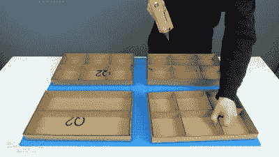

# 扔掉那个盒子？不，建造一个搁架单元

> 原文：<https://hackaday.com/2022/06/09/throw-out-that-box-no-build-a-shelving-unit/>

你是那种囤积纸板以备将来某一天使用的人吗，然后周期性地把它分解并拿出来回收，因为你还没有用它做任何事情？好吧，在美工刀里装上一个新刀片，点燃那把热胶枪，因为【纸板忍者】将向你展示如何用你收藏的最大盒子制作一个搁板单元。

 【纸板忍者】相当潇洒地着手建造，从纸板上已经存在的四个长弯处切下腿。这种情况在架子上重复出现，架子是由盒子的侧面制成的——[纸板忍者]在切割架子时利用了弯曲，并用金属尺的边缘创造了另外三个。纸板的其余部分用来支撑搁板和桌腿。

虽然你可以用这个单元来容纳你周围的所有其他更小的盒子，但这将是一个严重的利用不足。你看，这种方式放在一起，它可以容纳总共 133 磅(60 公斤)以上，只要遵守重量分配的规则，最重的东西放在底部的架子上。

这看起来确实很重，但考虑到这是由一个为他们的美工刀准备了一个皮套并自称[纸板忍者]的人建造的，我认为我们可以相信他们的压力测试，就这样做吧。考虑到这一点，将搁板单元固定在墙上总是个好主意。

你知道，这将是进入今年 Hackaday 奖第二项挑战的一个很好的机会。记住:这是最后一个周末，窗口将于太平洋时间周日早上 7 点[关闭，所以赶快行动吧！](https://www.timeanddate.com/countdown/generic?iso=20220612T07&p0=871&msg=Round+2+of+the+2022+Hackaday+Prize+ends%21&font=slab&csz=1)

 [https://www.youtube.com/embed/7ArqiIy2lp4?version=3&rel=1&showsearch=0&showinfo=1&iv_load_policy=1&fs=1&hl=en-US&autohide=2&wmode=transparent](https://www.youtube.com/embed/7ArqiIy2lp4?version=3&rel=1&showsearch=0&showinfo=1&iv_load_policy=1&fs=1&hl=en-US&autohide=2&wmode=transparent)

