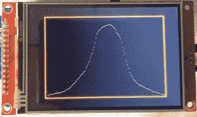

# 触摸屏是一个简洁的波表合成器

> 原文：<https://hackaday.com/2021/08/15/touchscreen-makes-for-a-neat-wavetable-synth/>

chiptune 软件中的一个流行工具，如 LSDJ，允许用户绘制波形，并将其用作波表合成器的基础。这很有趣，它可以产生一些伟大的哔哔声和 bloops。[[Kevin]使用 Arduino 和触摸屏开发了一个类似的工具。](https://diyelectromusic.wordpress.com/2021/08/09/arduino-touchscreen-pwm-sound-output/)

You can draw the waveform! That’s neat.

该版本基于 Arduino Uno，Arduino 系列的主要产品。它连接到一个 ILI9488 彩色触摸屏显示器，作为主要的用户界面。用户可以使用手写笔，或者可能是手指，直接在屏幕上画出合成器要产生的波形。Arduino 读取所绘制波形的逐步振幅值，并根据通过其串行端口接收的 MIDI 消息使用它们来合成音频。音频输出通过 PWM 实现，这在低成本微控制器项目中很常见。

这是一个有趣的构建，我们确信[Kevin]在这个过程中学到了很多波表合成。[我们之前也看过他在其他 Arduino 合成项目上的工作](https://hackaday.com/2021/02/19/12-note-polyphony-on-an-arduino-synth/)！休息后的视频。

 [https://www.youtube.com/embed/AbL5x0P905Y?version=3&rel=1&showsearch=0&showinfo=1&iv_load_policy=1&fs=1&hl=en-US&autohide=2&wmode=transparent](https://www.youtube.com/embed/AbL5x0P905Y?version=3&rel=1&showsearch=0&showinfo=1&iv_load_policy=1&fs=1&hl=en-US&autohide=2&wmode=transparent)

