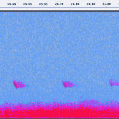
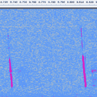
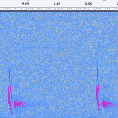
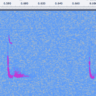
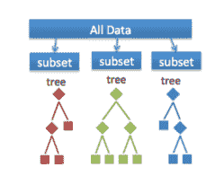
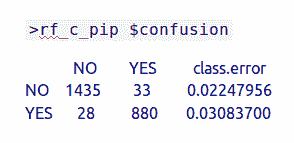

# 用混淆矩阵训练随机森林中的蝙蝠

> 原文：<https://hackaday.com/2019/11/21/training-bats-in-the-random-forest-with-the-confusion-matrix/>

当探索机器学习领域时，拥有一些真实而有趣的数据总是很好的。这就是蝙蝠的用武之地——它们是迷人的动物，发出非常特殊的超声波叫声，可以用计算机软件记录和分析，以便很好地了解它们是什么物种。当用 FFT 频谱图分析时，我们可以非常清楚地看到单个呼叫的形状。

  Nyctalus noctula (noctule bat)  Myotis nattereri (natterera’s bat)  Plecotus auritus (brown long eared)  Pipistrellus pipistrellus (common pipistrelle)

为蝙蝠创建一个开源分类器对机器学习之外的世界也有潜在的用处，因为它不仅可以让我们更容易地监控蝙蝠本身，还可以监控现代农业方法对自然环境的影响。蝙蝠以飞蛾和其他夜间飞行的昆虫为食，而这些昆虫本身的数量已经大量减少。即使在英国的乡村深处，这些昆虫也只是 30 年前数量的一小部分，但似乎没有人注意到这种下降。

所以回到我们的光谱图，将这些图像扔给卷积神经网络(CNN)并使用图像特征识别策略是完全合理的。但我想探索神秘的随机森林的深处。

到底什么是随机森林？正如所料，森林是由树和决策树组成的。这就像玩一个二十个问题的游戏。做出连续的决策，每一个决策都排除了一些可能的分类。如果每个二十个问题的游戏是一棵树，下面例子中的随机森林(RF)由 4000 棵树组成，就像让 4000 个人为你玩这个游戏。我们应用某种平均公式将所有的答案整理在一起，得到一种做出最终决定的方法，这种方法比我们单独做要好得多。

当你玩“20 个问题”时，你问的是这个问题的定义特征。最明显的起点是通话中声音最大的那一点(在左图中以黑色显示)，这将为我们提供一个频率。所以在棕耳蝠的例子中，这个数字大约是 30 千赫。我们甚至不需要给它取别的名字——这些树会盲目地处理一列数据中的所有数字，不需要知道它们在现实世界中的含义。然而，作为有知觉的生物，如果我们愿意，我们实际上可以看到数据，甚至可以看到光谱图的哪些特征是最重要的。也许最大振幅频率也很重要？我们还不知道——我们将让决策树自己决定。左边图像中的红线显示了鹨回声定位呼叫的独特形状，经过软件过滤后产生了一条漂亮的细线，我们现在可以从中推导出向上的斜率和陡度等值。

像这样提取相关特征非常重要。数据科学家与蝙蝠叫声专家合作，现在可以观察整个蝙蝠叫声范围，并做出有根据的猜测，看看哪些特征值得观察——也许是叫声倾斜的方式，或者它是否以“砰”的幅度开始？他们可能会为数据集生成数百个不同的列，然后将它们删减到大约 20 列，丢弃所有那些树自己决定不经常使用的列。

## 请蝙蝠专家来

经过几次失败的尝试，我最终选定了由让·马沙尔、弗朗索瓦·法比安内克和克里斯多夫·斯科特创作的《T2》这套系统。它基本上是一个用`R`编写的特征提取包，专门针对蝙蝠和鸟的叫声。有一个简单易懂的教程可以下载鸟类数据并对一只鸟进行分类，作为一个完全没有使用过`R`的人，我可以很容易地用它来拼凑一个多类版本，对生活在我家附近的所有六种蝙蝠进行分类。我确信在 Random Forest 中有更好的实现方式，但我只是将每个物种分别分类，然后将结果组合起来。请随意改进我的方法，但它似乎确实很有效。

该系统最好在 Windows 10 上的`Rstudio`中运行，整个系统从头到尾无缝安装。我也让它在 Ubuntu 18 中工作，但只能从命令行使用' $ Rscript Train_bats。r’。我从来没有真正完成官方教程，并发现数据结构相当混乱。谢天谢地，事实证明这非常简单。我创建的系统似乎是一系列“二元分类器”，为每个物种吐出一个新的混淆矩阵，该矩阵是针对“数据”目录中的所有其他物种进行训练的。

被调查的物种是常见的伏翼。在自动训练和测试过程中，1435 个实际上不是“c_pip”的数据点被正确地预测为“不是 c _ pip”…这很好！此外，880 个实际上是 c_pip 的标签被正确地预测为 c_pip，这也是好的。不幸的是，33 只真正的 c_pip 蝙蝠被错误地预测为不是那个物种，更糟糕的是，28 只实际上不是 c_pip 的蝙蝠被错误地预测为 c _ pip——该死！令人欣慰的是，错误预测的百分比相当低——分别为 2.2%和 3.1%，尽管只有 320 MB 的蝙蝠数据。

通过处理更多的数据，结果可能会得到改善，所以如果你有任何关于 17 种英国蝙蝠的全谱文件，请发给我！记录需要在每秒 384 千赫兹(192 千赫兹)的数量级，并且不能失真/削波。微弱的录音是可以的，因为它们代表真实的生活条件。另一件要提到的事情是，同一物种的蝙蝠在不同的地理位置可能会有不同的叫声，因此将自己在当地的蝙蝠叫声添加到数据中以获得良好的结果是很重要的。

我自己的数据从 Google Drive [这里](https://github.com/paddygoat/bioacoustics/blob/master/Train_and_deploy_bats/readme)免费获得许可。用你认为合适的任何方式使用它！该物种是在脸书小组的蝙蝠回声定位专家的帮助下鉴定的:[蝙蝠叫声分析研讨会。](https://www.facebook.com/groups/437808079587006/)(谢谢伙计们！)

因此，我们已经有了大约 320 MB 的训练数据，`Rstudio`中的一个工作分类器和前一天晚上使用 [UltraMic384K](https://www.dodotronic.com/product/ultramic-384k-ble/?v=79cba1185463) 麦克风录制的一只蝙蝠。现在只需要找到目录 bio acoustics/unknown _ bat _ audio/，删除任何现有的文件并粘贴到我们的未知 bat 中。简单！点击“运行”按钮……..

这很可能是一只耳蝠，一种非常可爱的棕色长耳蝙蝠！有时分类器确实会出现问题——特别是当记录不清晰时。此外，鼠耳蝠属中的蝙蝠彼此的叫声非常相似，而且实际上是重叠的，所以如果不亲自捕捉这种生物并提取 DNA 等，通常是不可能对其进行分类的。我不建议这样做，如果你真的必须这样做，检查是否需要联邦政府的许可，不要被咬——蝙蝠可以携带一些致命的疾病。

那么下一步是什么？也许将分类器移植到 Raspberry Pi，并通过 LoRa 连接发送结果？或者有 2G 手机信号就通过 HTTP 发？或说出蝙蝠名字的手持蝙蝠探测器。“嗨，伙计们。棕耳蝙蝠巴里来了，他有心情参加派对！”