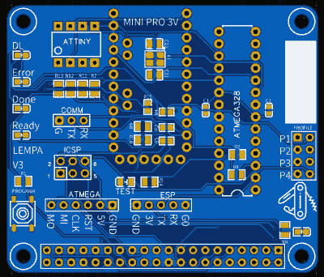

# 将 Raspberry Pi 变成 MCU 编程器

> 原文：<https://hackaday.com/2020/09/05/turning-the-raspberry-pi-into-a-mcu-programmer/>

一旦你从 Arduino 或 Wemos D1 这样的开发板毕业，你会发现自己在市场上需要一个专门的程序员。在大多数情况下，一个比闪存盘大不了多少的廉价 USB 转串行适配器就能满足你的需求。唯一的缺点是你必须手动连接到你选择的微控制器上。

 除非你是【罗伊·贝纳莫茨】，那是。[他最近创造了精益平均编程机器(LEMPA)，](https://github.com/rbenamotz/LEMPA)这是一个用于 Raspberry Pi 的附加板，包括所有你需要的插座、跳线和指示灯 led，以成功闪烁一整套流行的 MCU。此外，他还编写了一个 Python 工具，可以处理写出固件的所有细微差别。

在用关于硬件目标和固件文件的信息配置了 JSON 文件之后，通过提供一个用户定义的 ID 名称，可以很容易地再次调用它们。如果你只是偶尔烧烧 hex，这可能看起来有点过了，但是如果你正在做小规模生产，需要闪存几十个芯片，你会很快欣赏你的过程中的一点自动化。

当然，如果你只是想在紧要关头闪存一些代码，还有一些更方便的选择。我们特别喜欢使用开发板对裸 MCU 进行编程。

 [https://www.youtube.com/embed/8qee_lv31-o?version=3&rel=1&showsearch=0&showinfo=1&iv_load_policy=1&fs=1&hl=en-US&autohide=2&wmode=transparent](https://www.youtube.com/embed/8qee_lv31-o?version=3&rel=1&showsearch=0&showinfo=1&iv_load_policy=1&fs=1&hl=en-US&autohide=2&wmode=transparent)

