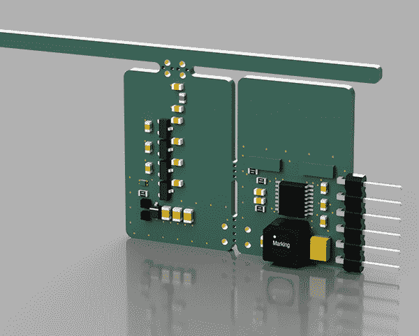
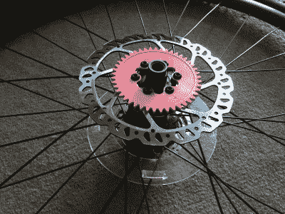
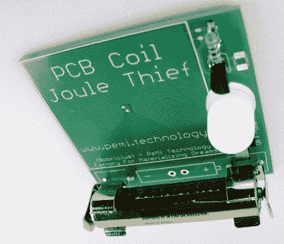

# 20 个电力采集项目进入 Hackaday 奖决赛

> 原文：<https://hackaday.com/2018/07/24/twenty-power-harvesting-projects-headed-to-the-hackaday-prize-finals/>

硬件创作学院奖正在进行中！[hack aday 奖](https://hackaday.io/prize)是对你的一个挑战——是的，就是你——去创造下一个伟大的开放硬件。这是其他任何东西都无法比拟的，我们有项目可以展示它。

上周，我们完成了 Hackaday 奖的[能量收集挑战](https://hackaday.io/prize/details#three)部分。现在，我们很高兴地宣布，其中 20 个项目已被选中进入最后一轮，并获得了 1000 美元的现金奖励。祝贺黑客日大奖*能量采集* *挑战赛*部分的获胜者。以下是获奖者，排名不分先后:

*   [吸血鬼充电器](https://hackaday.io/project/159752)
*   [门户点生成器](https://hackaday.io/project/159568)
*   [布莱恩盒](https://hackaday.io/project/94963)
*   [高效 MPPT 太阳能充电器](https://hackaday.io/project/158859)
*   [PTPM 能量清道夫](https://hackaday.io/project/159484)
*   [流体位移热致动器](https://hackaday.io/project/159753)
*   [微型太阳能模块](https://hackaday.io/project/159139)
*   [胃酸驱动的智能药丸](https://hackaday.io/project/159098)
*   [尿素电能收集装置](https://hackaday.io/project/159520)
*   [m essenger](https://hackaday.io/project/159319)

*   [体热手电筒](https://hackaday.io/project/158857)
*   [电子桶](https://hackaday.io/project/159691)
*   [超低功率脂肪充电器](https://hackaday.io/project/158837)
*   [发电模块](https://hackaday.io/project/159573)
*   [PCB 线圈焦耳盗](https://hackaday.io/project/159611)
*   [通向花园的排水沟](https://hackaday.io/project/94611)
*   [小型垂直风力发电机](https://hackaday.io/project/87345)
*   [冲动](https://hackaday.io/project/159305)
*   [一个世纪的时钟](https://hackaday.io/project/159663)
*   [浮游植物动力](https://hackaday.io/project/159232)

## 有趣的能量收集

有三件事我们永远无法逃避:死亡、税收和宇宙中熵的增加。你不能欺骗死亡，也不能逃避税务员，但是这些设备——这些*能量收集*设备——允许我们在一个小区域内减少熵。他们维护宇宙的秩序。这些项目是唯一阻止我们陷入存在主义抑郁的东西。他们很棒。

让我们来看看这些 *项目中的一些*。

The mWessenger harvests power from leaky microwaves

如果你想在你的房子里收获随机的能量波动，你会从哪里开始？你可能会考虑在窗户旁边放一块太阳能电池板，或者在你的屋顶上放一个风车，但是你错了。你的微波是一个充满愤怒光子的泄漏法拉第笼。你可以收获这种力量，这正是[法学家]在他的项目中所做的。

mWessenger 是一个设计用于安装在微波炉前门的微型电路板。船上有一个小天线，可以收集离开法拉第笼的微波光子，还有一个升压电路可以将这些光子转化为可用的能量。这样的设备有什么用？有的是！[法学家]有一个想法，创造一个微波通知互联网，由泄漏的微波辐射供电，它会告诉你什么时候你的爆米花做好了。当然，你可以把 mWessenger 放在你的 WiFi 路由器旁边，当网络瘫痪时，你会收到通知。

 但是也许你不想从微波炉中收获能量。也许你想捕捉一些你产生的熵？看看[【Javier betan cor】的 imPulse](https://hackaday.io/project/159305) ，这是一个在你骑自行车时收集能量的装置。

在自行车行驶时从自行车上获取能量的通常体验是一个压在车轮上的小型发电机，表面上是为了给自行车灯供电。这些很糟糕，不仅仅是因为它们工作不好——如果你想用现代电子设备做任何事情，比如运行 LED 灯或给智能手机充电，你将需要一些电源处理电路。

这就是[哈维尔]的项目的用武之地。他使用现成的无刷电机和链条直接从后轮获取动力。把它想象成一个小规模的再生制动系统，所有这些都被捆绑到一个令人敬畏的项目中。[哈维尔]使用的马达可以轻松产生几十瓦的功率，这对于运行一些高效照明或给一些电子设备充电来说绰绰有余。

 有太多的方法可以从电池中获取最大的能量，但是我们最喜欢的是焦耳窃贼。这是一个简单的电路，由一个晶体管和一个大电感组成，可以让电池完全没电。如果你在电路上安装一个 LED，这是一个很棒的方法，可以让那些“没电”的电池持续使用好几个月。

[bobricius]研究 PCB 线圈已经有一段时间了，如果说 PCB 线圈有什么问题的话，那就是它为电路制造了非常大、非常低效的电感。它们的设计也非常有趣。这就是为什么[bobricius]发明了印刷电路板 Joule Theif。它很庞大，不切实际，但它是一个奇妙的教育工具。在这里，呈现在铜迹线和玻璃纤维基板是一个电感器和一个完整的电路在那里检查。太牛逼了。

* * *

## 这是你参加黑客日大奖的机会

这 20 名参加 Power Harvesting Challenge 的参赛者已经赢得了 1000 美元，他们即将进入 Hackaday 奖的最后一轮，争夺 50，000 美元的大奖。

然而，Hackaday 奖还没有结束，现在我们正在进行人机界面挑战。我们正在寻找令人惊讶的创新设备，作为人类与机器对话或机器与人类对话的界面。本次挑战将持续到 8 月 27 日，来自本次挑战的 20 名参赛者将分别赢得 1000 美元和一次大奖。你还有时间在硬件大师中赢得一席之地，所以[现在就开始你的 Hackaday 奖励活动](https://hackaday.io/project/add?light&tag=2018HackadayPrize)。

The [HackadayPrize2018](https://hackaday.io/prize) is Sponsored by:     