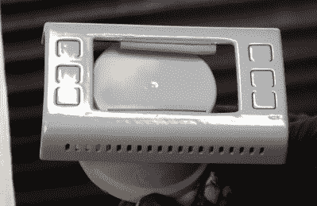

# 罐装两部分底漆是 DIY 梦想成真

> 原文：<https://hackaday.com/2021/08/21/two-part-primer-in-a-can-is-a-diy-dream-come-true/>

当组装一个家庭工作室时，可用的地板空间通常是选择工具和设备的决定性因素。这最终会导致一些非常困难的决定，我们敢打赌，没有一个黑客或制造商在阅读这篇文章时，不会因为没有地方放置新设备而不得不传递它。

例如，一般的家庭游戏玩家没有喷漆室和喷涂设备，所以他们不得不在后院安一个拨浪鼓罐。传统上，这限制了你可以实际应用的产品种类，但正如[Eric Strebel]在他的最新视频中展示的那样，喷雾罐技术似乎开始赶上来了。

The finish after two coats of primer.

具体来说，他一直在使用罐装的两部分底漆，不需要任何复杂的混合或特殊的设备来应用。撞击底部的活塞后，装有活化剂的小隔间破裂，反应开始。从那时起，在它固化之前，你只有 24 小时的时间来使用罐子里的东西。但是因为你只需要在外套之间等待大约 10 分钟，这应该给你足够的时间来完成这个项目。

在视频中，[Eric]演示了这种高成膜性底漆如何快速消除 3D 打印的层线。虽然你仍然需要打磨，并可能打破现场填料，以实现完美的完成，很明显，底漆比我们习惯看到的任何东西都好得多。即使只涂了两层，效果也非常显著。

如果有不好的一面，那就是一罐这种底漆将花费你大约 25 美元。这大约是 DIY 圈子里通常推荐的[防锈油填充底漆的五倍，但结果似乎真的不言自明。我们不一定会在每个项目上使用这种方法，但是如果你有一些需要特别精细加工的东西，你至少有一个选择，不需要借用别人的压缩机和喷枪。](https://hackaday.com/2017/11/15/visual-3d-print-finishing-guide/)

如果你需要在喷涂前摇动油漆的帮助，一定要看看这个 [3D 打印的油漆摇动器](https://hackaday.com/2020/08/31/a-3d-printed-paint-mixer/)！

 [https://www.youtube.com/embed/yiu5sCmv6M0?version=3&rel=1&showsearch=0&showinfo=1&iv_load_policy=1&fs=1&hl=en-US&autohide=2&wmode=transparent](https://www.youtube.com/embed/yiu5sCmv6M0?version=3&rel=1&showsearch=0&showinfo=1&iv_load_policy=1&fs=1&hl=en-US&autohide=2&wmode=transparent)

