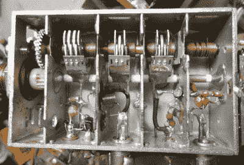
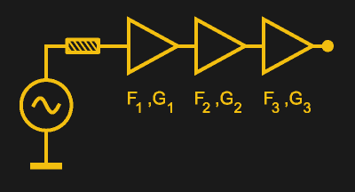

# 了解一点关于噪音的知识会对你大有帮助

> 原文：<https://hackaday.com/2020/05/12/understanding-a-bit-about-noise-can-help-you-go-a-long-way/>

一个人的青春可以被浪费掉的方式有很多，其中大部分都是人们希望当他们变老并回顾自己相对无聊的成长岁月时已经完成的事情。我把青春浪费在把电视机从垃圾箱里拖出来修理或者在我的项目中使用它们的零件上。事后我意识到，我本可以用更多的街头信誉做一些事情，但对我来说，那是坏电视。

## 不仅仅是这条路上的电视画面

The internals of a typical UHF cavity TV tuner.

作为当时的无线电爱好者，我会专注于电路的 RF 端。在英国，这是一个超高频调谐器和 36 兆赫中频带。我会不断地调整和修改它们，制造天线放大器、超高频发射机、70 厘米业余电视设备，甚至令人难忘的是，一个基本的频谱分析仪，它可以在我的示波器屏幕上显示当地电视发射机的图形。

特别是我被 DXTV 迷住了，这个想法是在一个足够重要的大气“升力”期间，我可能会从几英里以外的地方，也许是这个国家的一个遥远的地方，甚至是从欧洲大陆捕捉电台。在这方面，除了不时看到诺里奇当地新闻的一个非常多雪的版本之外，我基本上没有成功，但在这个过程中，我学到了大量关于无线电如何工作的知识，特别是关于电噪声对接收器性能的影响。

当观看现代数字电视时，很容易忘记噪音，因为如果屏幕上没有电视频道，总会有节目指南或其他图形代替。当模拟电视没有频道显示时，它会向你显示它的接收器可以分辨的任何随机噪声，屏幕上的“雪”伴随着扬声器上白噪音的嗖嗖声。如果电视机被调谐到一个远远超出其正常范围的发射机上，那么噪声水平将与信号的幅度相似，图像和声音将会存在，但带有可见的雪和可听见的噪声。

我很快了解到，如果我在天线和电视之间增加一个放大器，我可以得到更强的信号，但结果令人失望。我很快就离开了更好的天线放大器设计的兔子洞，调整腔体调谐器以制作可调放大器，并看到了当时特别珍贵的 MOSFET 调谐器捐赠其双栅极 BF981 晶体管。在没有意识到这一点的情况下，我学习了噪声及其对接收机性能的影响，几年后，当我还是一名电子工程学生时，我将学习它背后的一些理论和数学。

## 链中的第一个放大器影响所有后续放大器

A chain of amplifiers, each with their own noise factor F and gain G. Leyo ([Public domain](https://en.wikipedia.org/wiki/File:Frijs-Kette.svg))

我学到的是弗里斯噪声方程，它是以丹麦出生的工程师哈拉尔德·弗里斯命名的，他在 20 世纪中叶的大部分时间里为贝尔实验室工作。它采用噪声系数，即放大器链的输出与输入噪声之比，并从各器件的噪声系数和增益中得出。这样做的目的是让工程师新手了解每一级的增益在放大前一级的噪声以及将自身噪声添加到叠加噪声中的效果。因此，链中第一个放大器贡献的噪声被所有其他放大器放大，并且对最终结果贡献最大。

从公式中可以看出，F1 是第一个放大器的噪声系数，它是级数中唯一不是分数的成员。因此，它对整个系统的整体噪声系数影响最大，这也是我在 DXTV 时代发现优质前置放大器价值的地方。作为我的停播信号遇到的第一个分量，它的噪声系数对系统其余部分的性能影响最大，因此对我的低信号图像中的雪影响也最大。我的可调谐腔 BF981 MOSFET 前置放大器使用起来可能很烦人，因为它需要随着电视的每次频道转换进行重新调谐，但它比电视调谐器中的双极性晶体管性能更好，大大降低了系统噪声。

如果你的工作是在微控制器和数字电路领域，你可能比我更少使用这个等式，但由于它适用于比我十几岁的 DXTV 设置更多的情况，所以了解它仍然是非常有用的。毕竟，每个模拟系统都可能受到噪声的困扰！

标题图片:Mysid / [公共域](https://commons.wikimedia.org/wiki/File:TV_noise.jpg)