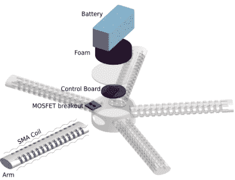

# 水下爬行软机器人保持形状

> 原文：<https://hackaday.com/2020/04/23/underwater-crawling-soft-robot-stays-in-shape/>

当你想到以动物为原型的机器人时，脆性恒星可能不是第一个想到的物种。然而，正是这种动物启发了卡内基梅隆大学的扎克·j·帕特森和他的研究同事们设计出了水下爬行机器人帕特里克。

帕特里克是一个由模制硅胶制成的柔软机器人。他的五个肢体中的每一个都包含几个形状记忆合金(SMA)弹簧，这些弹簧可以通过焦耳加热收缩，从而导致肢体弯曲。机器人的控制板通过蓝牙低能量从附近的计算机发送和接收命令。为了控制帕特里克的运动，研究人员构建了一个闭环系统，其中一个基于 OpenCV 的场外摄像系统不断跟踪机器人。如下面的视频所示，平均速度为 1 厘米/秒，PATRICK 的移动有点缓慢，但该系统应该对环境中的不确定性非常鲁棒。

将来[Zach J. Patterson 等人]希望通过赋予机器人抓取物体的能力来改进他们的设计。最终，非车载摄像头也应该被车载传感器取代，这样帕特里克就可以自主导航了。

像人造水母这样的软体机器人在水下特别有用，有时 T2 几乎跨越了有机生命的界限。

 [https://www.youtube.com/embed/j18NgpCnn3c?version=3&rel=1&showsearch=0&showinfo=1&iv_load_policy=1&fs=1&hl=en-US&autohide=2&wmode=transparent](https://www.youtube.com/embed/j18NgpCnn3c?version=3&rel=1&showsearch=0&showinfo=1&iv_load_policy=1&fs=1&hl=en-US&autohide=2&wmode=transparent)

