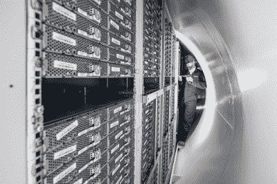
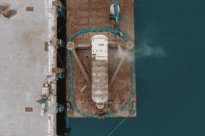

# 水下数据中心证明是成功的

> 原文：<https://hackaday.com/2020/09/17/underwater-datacenter-proves-to-be-a-success/>

早在 2018 年，微软就开始了 Natick 项目，在苏格兰海岸的海底部署了一个定制设计的数据中心。为了确定水下环境是否会给能源效率、可靠性和性能带来好处，该项目在 2014 年 ThinkWeek 期间诞生，think week 是一项旨在分享和探索非传统想法的活动。

本周，微软报告称该项目取得了成功。在为期一天的作业中，北岛数据中心最近被从海底吊起，团队迅速进入分析硬件，项目产生的结果令人惊讶。

## 一帆风顺

Deploying and retrieving the Northern Isles data center took about a day each, respectively.

也许这个项目得出的最有趣的统计数据是硬件的绝对可靠性。水下服务器比建立在陆地上的复制数据中心可靠八倍。这一惊人数字背后的主要假设是水下吊舱中干燥的氮气氛围的好处，减少了腐蚀，以及没有多管闲事的人，他们可能会在常规的陆地操作中意外碰撞或损坏硬件。

该小组还收集了管道内的大气样本，旨在确定电缆和其他内部设备除气的影响。随着对导致可靠性如此大幅度提高的因素的更好理解，Natick 项目团队也希望提高传统数据中心的可靠性。

Servers in the data center are retrieved for further study to determine the beneficial effects of underwater operation.

但是你可以在任何地方用氮气密封服务器机架，为什么要把它们沉入海底呢？冷却成本可以大大降低，因为地下海水的低温提供了充足的冷却能力，这是陆地上根本无法提供的。

[地面数据中心使用大量的水](https://davidmytton.blog/how-much-water-do-data-centers-use/)，间接用于发电，直接用于冷却应用。水下概念有望大大减少这种情况，降低服务器冷却所需的能量。这一概念还允许服务器靠近沿海城市，以实现低延迟和高性能，而不需要昂贵的市中心房地产，这一趋势我们在其他公用事业[中已经看到，如正在布鲁克林](https://hackaday.com/2019/10/03/floating-power-plants-the-coastal-city-solution-sure-to-be-increasingly-popular/)进行的浮动发电。

The Project Natick data center was power washed to remove the layer of algae, barnacles and other detritus that built up over its two year stint underwater.

水下概念也有缺点。实际维护根本不可能，这意味着任何出现故障的服务器都必须保持离线。此外，部署水下数据中心可能比在陆地上建造设施更加困难。工程师还必须考虑洋流和海洋生物或航运的潜在损害，这些问题在陆地上根本不存在。随着时间的推移，水下吊舱上藤壶或其他海洋碎屑的积累也可能会降低冷却效率。虽然微软的 2 年实验只有一层薄薄的藻类和藤壶，但这将随着部署地点和时间的不同而有很大差异。

从根本上来说，可靠性的巨大提高和能源成本的降低大大证明了水下数据中心概念的合理性。吸取的经验教训也将有益于陆地上的数据中心。最终，我们是否会看到更多的服务器部署在海浪之下还有待决定。土地的可用性与水下位置的可用性，以及可靠性优势是否可以应用于传统的数据中心，将是这项技术如何进一步发展的决定性因素。