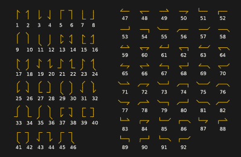
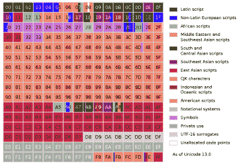

# Unicode:构建一个字符集来管理所有字符集

> 原文：<https://hackaday.com/2021/03/17/unicode-on-building-the-one-character-set-to-rule-them-all/>

大多数读者对“Unicode”和“UTF-8”这两个术语至少有一点熟悉，但它们背后真正的含义是什么呢？其核心是指字符编码方案，也称为字符集。这个概念可以追溯到远远超出电子计算机的时代，追溯到光电报及其前身的出现。早在 18 世纪，人们就需要远距离快速传输信息，这是通过使用所谓的电报代码来实现的。这些编码信息使用光、电和其他手段。

自第一个电报代码发明以来的数百年间，没有人真正努力建立这种编码方案的国际标准化，甚至电传打字机和家用电脑时代的头几十年也没有带来什么变化。尽管 EBCDIC (IBM 的 8 位字符编码在上面的穿孔卡中演示过)和最终的 ASCII 取得了一些进展，但在不花费大量存储空间的情况下对不断增长的不同字符集合进行编码的需求被优雅的解决方案所抑制。

Unicode 的开发始于 20 世纪 80 年代末，当时全球范围内数字信息交换的增加使得对单一编码系统的需求比以前更加迫切。如今，Unicode 不仅允许我们对从基本英语文本到繁体中文、越南语甚至玛雅语的所有内容使用单一编码方案，还允许我们对被称为“[表情符号](https://en.wikipedia.org/wiki/Emoji)”的小象形文字使用单一编码方案，这些象形文字来自日语“e”(絵)和《莫吉》(文字)，字面意思是‘图片词’。

## 从代码簿到字素

早在罗马帝国时代，众所周知，在全国范围内快速获取信息至关重要。在很长一段时间里，这意味着有骑马或类似的信使，他们可以远距离传递信息。尽管早在公元前 4 世纪，古希腊人就设想对这一系统进行改进，发明液压电报和使用信号火，但直到 18 世纪，远距离快速传输信息才变得普遍。

The French Chappe optical telegraph code from around 1809

在我们最近一篇关于光通信历史的文章中，我们深入讨论了光电报(也称为“信号量”)。它由一排中继站组成，每个中继站都配备了一个旋转指示器臂的高架系统(或其等效物),用于显示[电报代码](https://en.wikipedia.org/wiki/Telegraph_code)字符编码。法国 Chappe 系统在 1795 年至 19 世纪 50 年代间被法国军方使用，它是基于一个带有两个活动端(臂)的木制横杆，每个活动端都可以移动到七个位置中的一个。加上纵横制的四个位置，理论上有 196 个符号(4x7x7)。实际上，这被削减到 92 或 94 个位置。

这些代码点不仅用于字符的直接编码，而且主要用于指示[代码簿](https://en.wikipedia.org/wiki/Codebook)中的特定行。后一种方法意味着几个传输的代码点可能需要整个消息，这加快了传输速度，使得在没有代码簿的情况下截取代码点变得毫无用处。

## 提高产量

随着光学电报被逐渐淘汰，取而代之的是电子电报，这意味着突然之间，人们不再局限于编码，在可以接受的天气里，人们可以通过望远镜观察附近的中继塔。随着两台电报设备通过一根金属线连接起来，交流媒介突然变成了电压和电流。这一变化导致了一系列新的电报代码，自 1848 年在德国发明以来，[国际莫尔斯电码](https://en.wikipedia.org/wiki/Morse_code#International_Morse_Code)最终成为国际标准(除了美国，美国一直在使用美国莫尔斯电码，T4 无线电报)除外。

国际摩尔斯电码比美国电码有优势，因为它使用的破折号比点多，这降低了传输速度，但也改善了线路另一端的信息接收。当不同技能水平的操作员通过数千米的非屏蔽电线传输长消息时，这一点至关重要。

The ITA 2 standard, with the two characters per code point. A shift character would indicate which of the two would be used for the following characters.

随着技术的进步，手动电报在西方被自动电报所取代，自动电报使用 5 位的博多码及其派生的默里码，后者基于使用纸带打孔。默里的系统允许预先准备好信息带，然后将信息带送入磁带阅读器进行自动传输。博多电码形成了国际电报字母表版本 1 (ITA 1)的基础，修改后的博多-默里电码形成了 ITA 2 的基础，该电码一直使用到 20 世纪 60 年代。

到了 20 世纪 60 年代，每个字符 5 位的限制不再需要或可取，这导致了美国 7 位 [ASCII](https://en.wikipedia.org/wiki/ASCII) 和亚洲 [JIS X 0201](https://en.wikipedia.org/wiki/JIS_X_0201) (日语片假名字符)等标准的发展。结合当时普遍使用的[电传打字机](https://en.wikipedia.org/wiki/Teleprinter)，这使得相当复杂的文本信息，包括大写和小写字符，以及一系列要传输的符号成为可能。

The full character set of 7-bit ASCII.

在 20 世纪 70 年代和 80 年代初，扩展 ASCII(例如 [ISO 8859-1](https://en.wikipedia.org/wiki/ISO/IEC_8859-1) 或拉丁 1)等 7 位和 8 位编码的限制足以满足基本的家庭计算和办公需求。尽管如此，改进的需求是显而易见的，因为像在欧洲内部交换数字文档和文本这样的普通任务经常会因为其众多的 [ISO 8859](https://en.wikipedia.org/wiki/ISO/IEC_8859) 编码而导致混乱。1991 年，以 16 位 [Unicode](https://en.wikipedia.org/wiki/Unicode) 1.0 的形式迈出了解决这个问题的第一步。

## 超过 16 位

令人惊奇的是，在仅仅 16 位中，Unicode 不仅设法覆盖了所有的西方书写系统，而且还覆盖了许多汉字和各种专门的符号，如数学中使用的符号。16 位允许 2 ^(16) = 65，536 个代码点，Unicode 1.0 的 7，129 个字符很容易适应，但是到 2001 年 Unicode 3.1 推出时，Unicode 在 41 个脚本中包含了不少于 94，140 个字符。

目前，在版本 13 中，Unicode 总共包含 143，859 个字符，其中不包括控制字符。虽然最初设想统一码只对当前使用的书写系统进行编码，但是到 1996 年统一码 2.0 发布时，人们意识到这一目标必须改变，甚至允许对罕见的历史字符进行编码。为了实现这一点，而不必要求每个字符都以 32 位编码，Unicode 不仅直接对字符进行编码，还使用字符的组成部分，即[字形](https://en.wikipedia.org/wiki/Grapheme)。

这个概念有点类似于矢量图，其中不指定每一个像素，而是描述组成图形的元素。因此，Unicode Transformation Format 8(UTF-8)编码支持 2 个 ^(31 个)代码点，当前 Unicode 字符集中的大多数字符通常每个需要一个或两个字节。

## Unicode 的多种风格

Overview of the Unicode Basic Multilingual Plane, the first Unicode plane with almost all modern languages.

此时，当谈到 Unicode 时，相当多的人可能会对不同的术语感到困惑。因此，这里需要注意的是， *Unicode* 指的是标准，不同的 Unicode 转换格式(UTF)是实现。UCS-2 和 USC-4 分别是较早的 2 字节和 4 字节 Unicode 实现，UCS-4 与 UTF-32 相同，而 UCS-2 已被 UTF-16 取代。

UCS-2 作为 Unicode 的最早形式，进入了 90 年代的许多操作系统，这使得向 UTF-16 的迁移成为破坏性最小的选择。这就是为什么 Windows，以及 MacOS，像 KDE 和 Java 和。NET 运行时环境使用 UTF-16 内部表示。

顾名思义，UTF-32 将每个字符编码为四个字节。虽然有些浪费，但它也是直接和可预测的。在 UTF 8 中，一个字符可以是 1 到 4 个字节，而在 UTF-32 中，确定一个字符串中的字符数就像计算字节数并除以 4 一样简单。这导致编译器和 Python 等语言(可选)允许使用 UTF-32 来表示 Unicode 字符串。

在所有的 Unicode 格式中，UTF 8 是目前最流行的。这在很大程度上是由互联网的万维网驱动的，大多数网站都以 UTF-8 编码提供 HTML 文档。由于 UTF-8 中不同的[代码点平面](https://en.wikipedia.org/wiki/Plane_(Unicode))的布局，西方和许多其他常见的书写系统适合两个字节。与旧的 JIS(8 到 16 位)[和 ISO 8859](https://en.wikipedia.org/wiki/Shift_JIS)编码相比，这意味着 UTF-8 中的相同文本实际上不会占用比以前更多的空间。

## 从中继塔到互联网

自从人类历史的早期以来，通信技术已经走过了漫长的道路。信使、中继塔和小电报局都不见了。甚至电传打字机在世界各地的办公室里随处可见的日子现在也成了褪色的记忆。然而，在每一步中，对编码、存储和传输信息的需求一直是一个中心主题，它无情地驱使我们现在可以用一种无论生活在哪里都可以解码和理解的字符编码向世界各地即时传输信息。

对于那些喜欢在电子邮件客户端和 web 浏览器中切换 ISO 8859 编码以获得接近原始文本表示的人来说，一致的 Unicode 支持是一种福气。我可以想象，那些还记得只有 7 位 ASCII(或 EBCDIC)的人，或者喜欢从欧洲或美国办公室接收数字文档，却苦于字符集混乱的人，也会有类似的感受。

即使 Unicode 并不是没有问题，但很难不回顾过去，觉得它至少是对以前的一个不错的改进。为下一个三十年的 Unicode 干杯。

(标题图像:带有以 EBCDIC 编码的西方字母的穿孔卡)