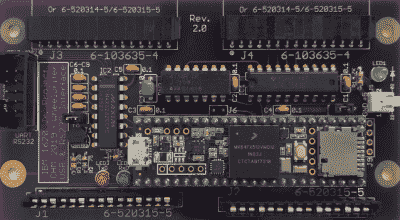

# 升级板将打字机变成电传打字机

> 原文：<https://hackaday.com/2019/11/14/upgrade-board-turns-typewriter-into-a-teletype/>

发现 Hackaday 并不经常主持打字机项目，这一点也不奇怪。虽然这些标志性的机器有其独特的魅力，但它们通常不允许对硬件进行太多的修改。但是，IBM Wheelwriter 1000 并不完全是一台传统的打字机，这使得其最近在 T2 向全功能计算机终端的转变成为可能。

 计算机历史博物馆【IBM 1620 Jr. Team】的产品，这种修改采用串行接口板的形式，可以在家里构建并安装到 Wheelwriter 中。该板允许老式电子打字机使用 RS-232 和 USB，因此它可以连接到任何你可以想象的老式(或不那么老式)计算机。该项目的文档给出了 150 美元的粗略成本，尽管这确实假设您已经有了一台 Wheelwriter 1000。

GitHub 库包含了创建自己的开发板所需的一切，甚至还有一个非常详细的安装指南，介绍了安装新硬件所需的案例修改。它还解释了如果你执行这个修改，你将需要为你的 Wheelwriter 获得一个新的键帽集，因为原来的板没有所有的 ASCII 字符。

那么，为什么要把一台旧的电动打字机改装成电传打字机呢？正如[IBM 1620 Jr .团队]所解释的，有一些项目正在寻求重现真实的 20 世纪 60 年代的计算体验，这需要一个(相对)负担得起的纸终端。原版在现代娱乐中很少使用，但是通过它们的适配器板，这些稍微不那么古老的输入设备可以用在它们的位置上。

一旦你建立了你的新电传打字机，或者在有些不太可能的情况下，你已经准备好了一台，[我们已经看到了几个项目，](https://hackaday.com/2019/04/23/texting-with-a-teletype/)你可能会有兴趣把它用于。