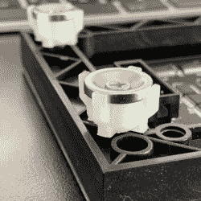

# 制作 LED 面板框架的实用制作技巧

> 原文：<https://hackaday.com/2021/02/23/useful-build-tips-for-making-led-panel-frames/>

[notlikealeafonthend]创造了许多基于 LED 的显示项目，[分享了他制作有吸引力的 LED 面板框架和支架的方法](https://www.instructables.com/Simple-Extruded-Aluminum-Frame-for-LED-Panels/)。乍一看，似乎只需要在显示器周围拍打一个矩形的铝挤压件，还有布线、电源的安装和管理，可能还有一个树莓皮要处理。建立一个有吸引力的框架的过程也有一些隐藏的陷阱，通过一点仔细的计划可以避免。

Magnetic feet on the LED panels makes mounting much easier and more flexible.

这里有一个会引起一些读者共鸣的提示:不要依赖零件的特定尺寸；自己测量实际零件。数据手册所说的预期尺寸与实际器件尺寸之间可能会有微小差异。它可能不多，但它可能是理想的适合和看起来有点像黑客工作的区别。

[NotLikeALeafOnTheWind]提供了一些基本的框架布局，并建议使用两个或三个通道的拉伸，以便根据需要在显示器边缘周围提供平面边框。安装 LED 面板本身是通过磁性支脚完成的，并提供一段钢条，显示器可以连接到钢条上。这可以提供齐平的安装，同时避免用螺钉安装显示面板本身或将其滑入通道的整个问题。为了安装所有其他硬件，一个 DIN 导轨和一些 3D 打印的零件就可以做到这一点。

结果看起来既光滑又结实，即使整个过程没有被应用，一些技巧也肯定是有用的。我们喜欢基本设计的缩放方式，并对 LED 面板本身的厚度和尺寸具有灵活性，这使得它成为一种有前途的方式，可以容纳最终被扔进垃圾桶的功能完善的古怪面板。