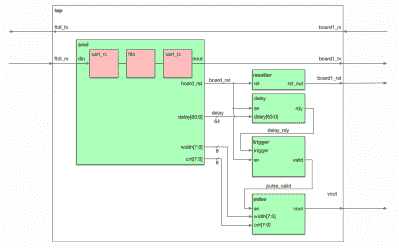
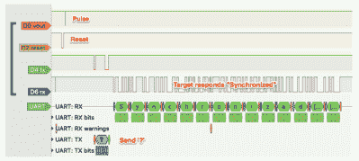

# 使用 FPGA 对 Olimex LPC-P1343 进行故障检测

> 原文：<https://hackaday.com/2020/04/30/using-an-fpga-to-glitch-the-olimex-lpc-p1343/>

在尝试了使用 FPGA 与目标硬件接口的硬件黑客之后，[Grazfather]受到启发，尝试使用破冰者(最近充斥市场的众多业余爱好者 FPGA 之一)为 Olimex LPC-P1343 构建 UART 可控的 [glitcher](http://grazfather.github.io/re/pwn/electronics/fpga/2019/12/08/Glitcher.html) 。

FPGA Modules (The **cmd** module intercepts what the host computer sends over UART, the **resetter** holds the reset line until the target is reset, the **delay** starts counting on reset and waits for a configured number of cycles before sending its signal, the **trigger** waits for the delay to finish before telling the pulse module to send a pulse, and the **pulse** works similar to the delay module and outputs to the power multiplexer.)

当目标板启动时，bootROM 读取闪存，并确定 UART 是否转到 shell，以及 shell 是否可用于读取闪存。这是为了开发固件并在引导装载程序中调试它，只有当固件可以生产时才刷新版本。该漏洞是，只有从地址 0x2FC 读取的特定值和几个引脚的状态才能以预期的方式锁定引导加载程序，该地址的任何其他值都会导致 bootROM 认为设备已解锁。本质上，这种机制与锁的工作方式相反。

目标是让 CPU 在应该读取特定值的精确时刻误读闪存，然后在解锁状态下跳转到引导加载程序。FPGA 可以用作主机和目标板之间的工具，通过 UART 进行通信。FGPA 可以支持配置重置目标板和脉冲“毛刺电压”之间的延迟，以及重置目标板和激活毛刺。在不同的微控制器上使用 FPGA 的主要原因是 FPGA 允许精确的时序(83.3ns 精度)，并消除了对抖动的担忧(Raspberry Pi 可能会对操作系统调度和其他进程产生副作用，微控制器可能会有中断打乱时序)。

The logic analyzer view

为了模拟各种模块，[Grazfather]使用 Icarus Verilog 和 GTKWave 来观察生成的波形。一个独立的逻辑分析器观察对实际硬件的影响。

只要有足够的时间，就有可能强行破解延迟和宽度的任意组合，直到得到一个你不想读的闪存转储。您可以检查脉冲宽度如何变宽，直到达到最大值，此时延迟增加，再次尝试宽度值。

 [https://www.youtube.com/embed/KfGC689I9c0?version=3&rel=1&showsearch=0&showinfo=1&iv_load_policy=1&fs=1&hl=en-US&autohide=2&wmode=transparent](https://www.youtube.com/embed/KfGC689I9c0?version=3&rel=1&showsearch=0&showinfo=1&iv_load_policy=1&fs=1&hl=en-US&autohide=2&wmode=transparent)

