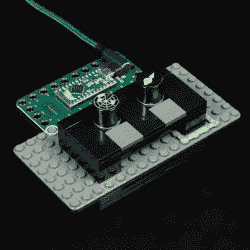

# 使用 MIDI 解决键盘快捷键问题

> 原文：<https://hackaday.com/2021/02/16/using-midi-to-solve-a-keyboard-shortcut-problem/>

[Pete]承认，他的基于 MIDI 的幻灯片提前警告系统绝对是针对特定问题的特定解决方案，但它是使用可用工具来满足特定需求的一个很好的例子。问题是这样的:[Pete]参与了许多视频流演示，需要一种简单有效的方式让演示者通知制作人(负责视频流和摄像机切换的人)根据提示谨慎地播放幻灯片。

 对我们大多数人来说，这是一个很容易解决的问题。为演示者提供一个 USB 宏键盘来触发幻灯片前进的快捷键，工作就完成了。但这对皮特来说不太合适。在他们的情况下，制片人不仅要管理幻灯片，还要在摄像机之间切换、观看聊天窗口以及管理视频流本身。只有当按钮被按下时演示软件处于焦点中，通过键盘快捷键触发幻灯片前进才有效，但这并不保证。

[Pete]的解决方案是制作一个小型双按钮设备(一个按钮用于下一张幻灯片，一个按钮用于上一张幻灯片)，该设备使用 MIDI 与制作人机器上的小型自定义应用程序进行通信，并且不关心应用程序焦点。按下幻灯片前进按钮会在制作人的耳机中播放不同的音调，并且自定义应用程序会根据演示者按钮的状态在窗口中显示“前进”、“后退”或“等待”。这个设计可以在 Instructables 上找到，任何人都可以近距离观看。

[Pete]报告说，这种方法很有效，而且比每次演示说“请下一张幻灯片”20 次或更多次要谨慎得多。你可能会从照片中注意到乐高积木在设备中起着重要的作用，如果你想看到更多类似的东西，请确保查看[这些其他可安装在砖块上的 PCB 设计](https://hackaday.com/2021/02/03/brilliant-brick-prototyping/)。