# 使用移印机为艺术印刷电路板添加色彩

> 原文：<https://hackaday.com/2018/07/19/using-pad-printers-to-add-color-to-artistic-pcbs/>

我做过几个给印刷电路板上色的实验。[这些实验使用了一种称为移印的工艺](https://hackaday.com/2018/02/26/successful-experiments-in-multicolor-circuit-boards/)，到目前为止，所有迹象表明移印是一种真正多色艺术 PCB 的可行工艺。对于今年的 DEF CON，我将加快步伐，让它们有一个合理的结论。我正在用橙色和蓝色墨水制作真正的多色印刷电路板。我相信，这是第一次对印刷电路板艺术进行这样的处理，当然也是第一次被记录下来。

你可能想知道为什么我的板上需要更多的颜色。又到了一年中的这个时候，世界各地的 PCB 工匠都在为 badgecon DEF CON 做准备。在过去的几年里，独立的徽章制造商聚集在一起，形成了硬件创作的演示。今年，[徽章插件是一件事](https://hackaday.com/2018/06/21/this-is-the-year-conference-badges-get-their-own-badges/)，每个人都在加入这个游戏。 [Tindie 充满了令人惊叹的电子徽章](https://www.tindie.com/browse/electronic-badges/)和将在今年的 DEF CON 上发现的附件。有来自 *Rick 和 Morty* 的 Cromulon，来自 *Futurama* 的婴儿御术师，皮卡丘和发光的玉米卷的徽章。

这都是关于徽章艺术，但当涉及到渲染玻璃纤维和阻焊图像时，每个人都在使用有限的调色板。是的，你可以买到粉红色和橙色的阻焊膜，但是我找不到便宜的地方。对于任何 PCB，你的颜色选择只有绿色、红色、黄色、蓝色、紫色、黑色、*或*白色。不，你不能把它们混在一起。

但是我希望橙色和蓝色都在同一块板上，既便宜又容易——下面是我是如何做到的。

## 潮汐舱附件背后的想法

T2 如果有一样东西是千禧一代喜欢的，那就是鳄梨吐司。和学生贷款债务。还有智能手机，他们没法把脸从那些该死的智能手机里拿出来。最重要的是，千禧一代无法获得足够的潮荚。[潮荚挑战](https://en.wikipedia.org/wiki/Consumption_of_Tide_Pods)是过去几年最大的时尚，甚至超过了坐立不安的纺纱工，成为这十年最具文化相关性的潮流。

为了今年的 DEF CON，我决定把潮汐舱挑战变成一个游戏。目标是尽可能多地吃掉潮荚。你可以通过将一个 Tide Pod 插入一个支持[低劣附加规范](https://hackaday.io/project/52950-defcon-26-shitty-add-ons)的徽章来实现这一点。每个 Tide Pod 都焊接有一个 EPROM，这个存储芯片存储了一个唯一的序列号。当您将 Tide Pod 插入徽章时，此序列号存储在一个链表中，其中列表中的每个项目都包含序列号和列表中所有先前项目的散列。顺便说一下，这是一个区块链。我做了一个吃海潮豆荚的区块链。

由于低劣的附加规范提供电源、接地和 I2C 总线，因此实现非常简单。我只需要一个小的 I2C EPROM。这是一个 24C32，多家制造商以 0.20 美元的价格出售，非常接近于一个软糖零件。唯一需要的其他部分是 PCB 本身。我很快在 Illustrator 中完成了一个设计，小心翼翼地确保潮汐舱的蓝色和橙色“漩涡”是相同的，并且彼此旋转了 180 度:

[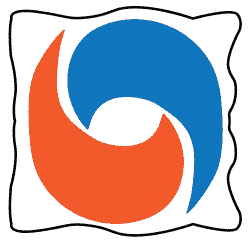](https://hackaday.com/wp-content/uploads/2018/07/tidepodillustrator.png)

The Illustrator mock-up. Note the blue and orange swirls are identical shapes.

[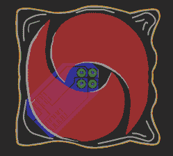](https://hackaday.com/wp-content/uploads/2018/07/tidepodeagle.png)

The board in Eagle. A copper pad was placed under the swirls, and the rest of the circuit easily fits on the bottom layer.

[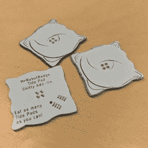](https://hackaday.com/wp-content/uploads/2018/07/blanktidepods.jpg)

The blank Tide Pods

有了 Illustrator 中的潮汐舱草图，用 Eagle 变成了一个简单的 PCB，以及一个板房的快速订单，我有了几百个空白的潮汐舱。剩下唯一要做的就是添加一些颜色。

## 如何选购和操作手动移印机

在之前，我已经写了关于移印机的使用和它们在 PCB 艺术中的应用，但是关于移印机是什么和做什么的解释非常不完整。也没有使用移印机的“指南”，我希望通过这篇文章纠正这一点。我花了大约 600 美元从[全美制造&供应](https://screenprintsupply.com/)订购了我的 pad 打印机作为“启动包”。这不是对这家公司的认可，如果有人能找到，我真的想推荐一家为他们的移印机提供说明书的公司。

也就是说，这就是移印机，它是如何工作的，以及如何使用它。

[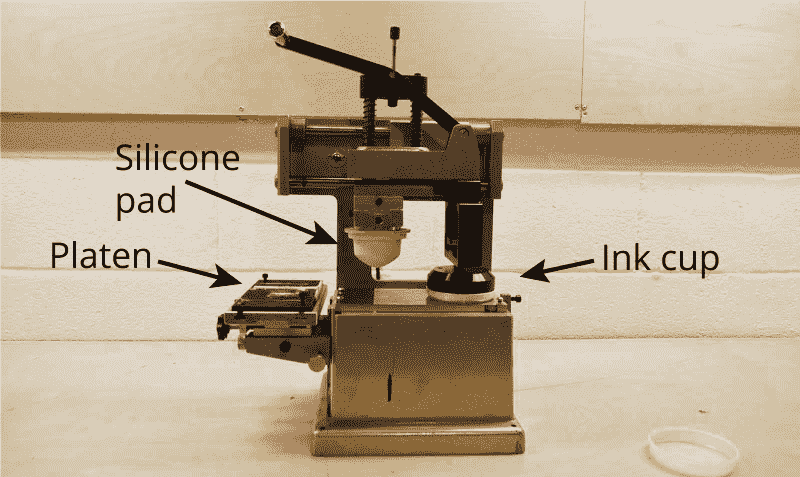](https://hackaday.com/wp-content/uploads/2018/07/padprinterannotate_bright.png)

A basic, hand-operated pad printer.

我买的移印机是基本的手动操作系统。有四个主要部分——压印板、油墨杯、硅胶垫和印刷板——都由大量的铸铝固定在一起。

*   墨杯:一个带有陶瓷唇的钢杯，用来盛放印版上的墨水。
*   **印版:**虽然上图中没有显示，但它只是一个感光聚合物印版，上面印着想要的图像。
*   **硅胶垫:**转移油墨的柔性垫
*   **压纸卷筒:**放置要打印的项目的平台

这是一台巧妙而简单的机器。墨水杯连接到一个移动臂上，该移动臂也固定着一个硅胶垫。当油墨杯在印版上滑动时，油墨就会沉积下来。然后，硅胶垫压在印版上，吸收墨水，并移动到压印盘上，压在要印刷的物体上。

## 步骤 1:创建印刷版

印版，或“铅版”在移印的说法，是一个钢板涂有紫外线敏感的光聚合物树脂。有两种类型的移印板可从我的供应商:水洗和酒精清洗。水洗版用水洗掉未曝光的光聚合物。酒精板在酒精中清洗，以去除未曝光的光聚合物。

简单地为了便于开发，我使用水洗板，尽管这也有一些缺点:根据一些文档，水洗板比酒精洗板更容易划伤。此外，水洗板不会持续很长时间；它们只适用于数万次展示，而酒精洗碟适用于十万次展示。在你的家庭作坊里，你的手臂会比水洗盘子先磨损。

 [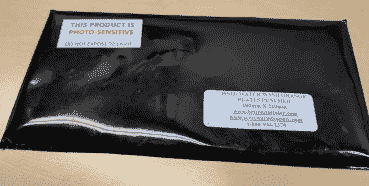](https://i0.wp.com/hackaday.com/wp-content/uploads/2018/07/1padplates.jpg?ssl=1) The water wash plates, in lightproof bag [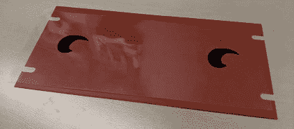](https://i0.wp.com/hackaday.com/wp-content/uploads/2018/07/2transparen.jpg?ssl=1) Laser printed transparency mask on a water wash plate [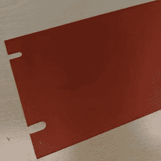](https://i0.wp.com/hackaday.com/wp-content/uploads/2018/07/4post-impression.jpg?ssl=1) The plate immediately after exposure [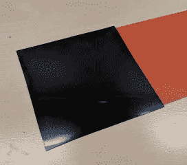](https://i0.wp.com/hackaday.com/wp-content/uploads/2018/07/5halftone.jpg?ssl=1) The halftone screen [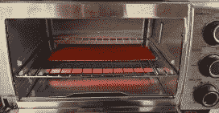](https://i0.wp.com/hackaday.com/wp-content/uploads/2018/07/6drying.jpg?ssl=1) Drying the plate in a toaster oven [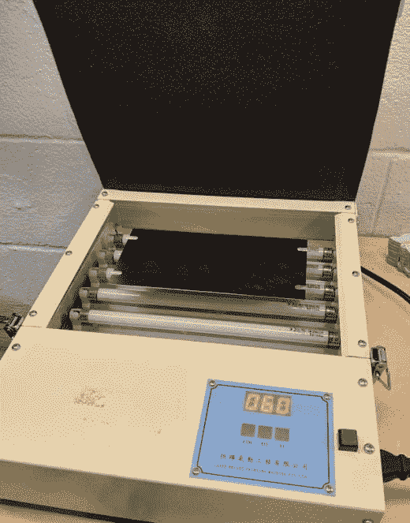](https://i0.wp.com/hackaday.com/wp-content/uploads/2018/07/3uvexposure.jpg?ssl=1) Plate in a UV exposure unit

为了将设计印到印版上，我首先在[激光透明胶片](https://www.amazon.com/gp/product/B0013L7U30)上印上想要的图像。我在我的激光打印机上运行了三次，以确保它足够暗。在这之后，我剥掉感光聚合物板上的保护片，放下激光印刷的掩模，并将其放入 UV 板曝光装置中 120 秒。这种印版曝光装置只是一个装有计时器的盒子里的几个紫外线荧光灯泡；我肯定你也可以用几个紫外线发光二极管曝光一个盘子。

我在互联网上找到的说明告诉我，然后用半色调图案片曝光板。我没有光刻或印刷技术的经验，所以我只是把半色调网放在板上，然后放回曝光单元 30 秒。

在半色调筛选后，将该板在温暖的流动水中洗涤 2-3 分钟。然后将该板在设定为“低”的烤箱中干燥，并放回紫外线曝光装置中再曝光 15 分钟。结果是我用这种装置做过的最好的盘子，足以做几个潮汐舱。

[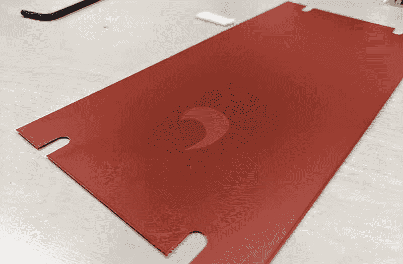](https://hackaday.com/wp-content/uploads/2018/07/exposedplate_bright.png)

## 第二步:用衬垫打印

盘子做好了，是时候混合一些墨水，装满墨水杯了。我用的墨水是 Marabu Tampastar TPR。这种墨水有各种各样的颜色，为了将来的实验，我可以得到青色、品红色、黄色和黑色的墨水。我也计划尝试混色，我只需要弄清楚我想在 PCB 上打印什么。

混合墨水很简单——Tampastar TPR 墨水是一种“单组分”墨水，只需要稀释剂。我拿出秤和纸杯，将 25 克墨水和 3 克稀释剂混合。这对一千个潮汐舱来说已经足够了。

 [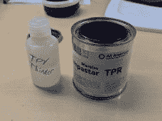](https://i0.wp.com/hackaday.com/wp-content/uploads/2018/07/tampastar.jpg?ssl=1) Tampastar TPR ink [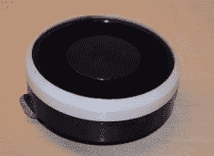](https://i0.wp.com/hackaday.com/wp-content/uploads/2018/07/inkcup.jpg?ssl=1) The ink cup, inverted [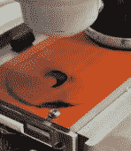](https://i0.wp.com/hackaday.com/wp-content/uploads/2018/07/printingplate.jpg?ssl=1) The ink on the plate [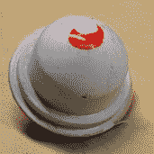](https://i0.wp.com/hackaday.com/wp-content/uploads/2018/07/pad.jpg?ssl=1) What ink looks like on a pad

有了蚀刻到适当深度的印刷版，印刷进行得很顺利。必须对印版上的印垫压力、潮箱上的印垫压力进行多项调整，但这是一个能够轻松将油墨转移到 PCB 上的系统。

 [https://www.youtube.com/embed/UVEVuFOpK3g?version=3&rel=1&showsearch=0&showinfo=1&iv_load_policy=1&fs=1&hl=en-US&autohide=2&wmode=transparent](https://www.youtube.com/embed/UVEVuFOpK3g?version=3&rel=1&showsearch=0&showinfo=1&iv_load_policy=1&fs=1&hl=en-US&autohide=2&wmode=transparent)

## 移印是多色印刷电路板的发展方向吗？

这不是一个快速的过程。我最终得到了大约 250 个印有这两种颜色的潮荚，还有大约 50 个我只印了蓝色的潮荚。完成 300 次蓝色印刷的总时间约为 3 小时，即每块 PCB 约 30 秒。因为我做了两种颜色，总时间增加了一倍，我*应该*让蓝色墨水固化至少 24 小时。当然，这是一台手动机器，大多数移印机都是自动的。如果你把这个承包出去，他们肯定会用自动机器。

对于小批量生产来说，这是制造多色 PCB 问题的可行解决方案。这仅仅是我第二次通过移印给多氯联苯添加颜色，尽管我可以看到错误——我没有让蓝色干燥足够长的时间，我应该把衬垫蚀刻得更深一点，我应该把这些潮汐豆荚拿出来晾干，而不是扔在桶里——我可以看到这里的前景。如果你正在寻找一种可行的方法来增加印刷电路板的颜色，移印可以做到这一点，而且单位成本非常低。