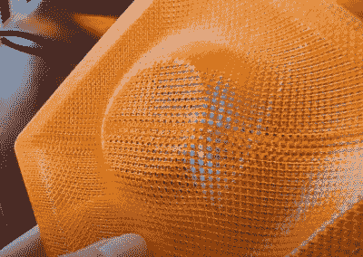

# 3D 打印机细丝真空成型

> 原文：<https://hackaday.com/2021/12/11/vacuum-forming-with-3d-printer-filament/>

即使他们自己没有，我们敢打赌，普通的黑客读者至少模糊地知道真空成型器是如何基本工作的。你加热塑料片直到它变软，然后用真空泵把这种有延展性的材料拉到一个物体上，并在它冷却的时候保持住。很容易建立一个自己的真空成型钻机，但小型商业单位足够便宜，它可能不值得你的时间。如果一切按计划进行，这项技术是在家里和商店复制物品的快速有效的方法。

但是我们最近被告知这种经典技术的一种变体，这当然值得进一步研究。在最近的一段视频中， [[Nathan Martinez]展示了如何使用 3D 打印片来代替他的进口真空成型机设计使用的 5”x 5”正方形的热塑性薄膜](https://www.youtube.com/watch?v=z4D92gxziZY)。这很容易做到:只需在你选择的 CAD 软件包中用合适的 2D 尺寸建模一个正方形，并将其挤压到大约 0.5 毫米的高度

A printed mesh pattern could be used to form custom shaped filters or strainers.

那么有什么好处呢？首先，它更便宜。虽然不可否认，不是很多。亚马逊上的实际价格似乎是每张 90 美分，信封背面的一些数学计算显示，给定名义灯丝成本，印刷版本的价格约为 30 美分。这些节省是否值得额外的努力当然是有争议的。

但这还不是最有趣的部分。将打印好的纸张放入真空成型器中，您可以接触到更多的材料。例如，[内森]展示了一些非常有趣的灵活的作品，他能够用 TPU 的纸来制作。你也可以尝试不同的表面纹理。这些不仅可以用来给你的真空成型件增加一点有趣的视觉效果，而且实际上有一些实际的应用。在视频中，我们看到了如何在一块材料上形成印刷网格，以创建保形通风口或过滤器。

可以肯定的是，这里还有一些改进的空间。并不是所有的拉动都是成功的，而且[Nathan]说将打印好的纸张加热到合适的温度可能会很棘手。但是当它工作时，它工作得很好，我们认为在这种新的和旧的在家塑料生产方法的意想不到的融合中可能有一些未开发的潜力。

 [https://www.youtube.com/embed/z4D92gxziZY?version=3&rel=1&showsearch=0&showinfo=1&iv_load_policy=1&fs=1&hl=en-US&autohide=2&wmode=transparent](https://www.youtube.com/embed/z4D92gxziZY?version=3&rel=1&showsearch=0&showinfo=1&iv_load_policy=1&fs=1&hl=en-US&autohide=2&wmode=transparent)

【感谢 Japanfan50 的提示。]