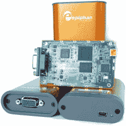

# 由于逆向工程，浏览器窗口中的 VGA 信号

> 原文：<https://hackaday.com/2019/12/30/vga-signal-in-a-browser-window-thanks-to-reverse-engineering/>

Epiphan VGA2USB LR VGA-to-USB devices

[Ben Cox]在易贝上发现了一些有趣的 USB 设备。Epiphan VGA2USB LR 一端接受 VGA 视频，另一端将其作为类似 USB 网络摄像头的视频信号呈现。再也不用拿出 VGA 显示器了？听起来不错！这些设备是旧的和废弃的硬件，但它们声称支持 Linux，所以后来有人购买了 button mash later 在邮件中耐心地等待它们。

但是当它们到达时，这些设备并没有像预期的那样被列为 USB UVC 视频设备。供应商有一个定制的驱动程序，对它的支持在 Linux 4.9 中终止了——这意味着没有一台[Ben]的机器会运行它。现在[Ben]对这一切是如何工作的感到好奇，并开始挖掘，[旨在为设备](https://blog.benjojo.co.uk/post/userspace-usb-drivers)创建一个用户空间驱动程序。他很成功，并且用他一贯的细节[Ben]不仅解释了他解决问题的过程，还解释了这些设备(和他的驱动程序)是如何工作的。跳到项目页的末尾看总结，但整件事都值得一读。

产生的驱动程序没有优化，但将做大约 7 fps。[Ben]甚至在驱动程序中安装了一个小型网络服务器，在必要时为视频提供一个简单的界面。它甚至可以将其输出记录到视频文件中，这非常方便。代码可以在他的 GitHub 库上找到[，所以看看吧，也许你可以去易贝淘点便宜货。](https://github.com/benjojo/userspace-vga2usb/)