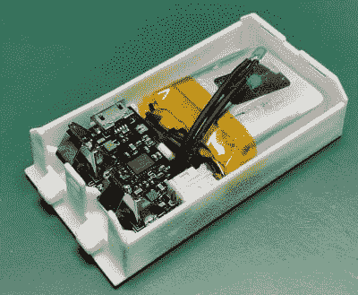

# 老式 HP-25 计算器获得无线充电

> 原文：<https://hackaday.com/2021/05/15/vintage-hp-25-calculator-gets-wireless-charging/>

[Jan Rychter]非常喜欢他的多个 HP-25C 计算器，但原来的电池组设计粗糙过时。没问题— [他使用 Fusion 360 设计了一个外壳，在他的 SLS 3D 打印机上打印了一些，并用 LiPo 电池和 Qi/WPC 无线充电电路将它们打包，从而快速制造出一个替代品](https://partsbox.com/blog/wireless-charging-for-a-hp-25-calculator-05-2021.html)。

在他的博客文章中，他解释了目标和各种设计决策以及他一路走来所做的妥协。我们喜欢[简]在评论我们都曾经犯过的错误时的坦率和诚实:

> 最终，我选择了可能不是最佳的设计方案，但在这种情况下(低功耗要求)提供了可接受的性能。换句话说，我给它装了翅膀。

一个被证明难以解决的问题是如何提供低电量指示器。由于 LiPo 上的低电压不同于最初的 HP-25 的 NiCad 电池，这并不简单，特别是因为[Jan]挑战自己在不使用微控制器的情况下构建这一电池。他发现 HP-25 的内部低电量电池电路是由 2.1 伏或更低的电压触发的。

 在一次非常聪明的黑客行动中，【Jan】想出了使用 MCU 复位管理芯片的主意，该芯片具有 3.0 伏的低电压阈值，这与他正在使用的 LiPo 电池的低电压阈值相对应。然后，来自监控芯片的复位信号驱动 TPS62740 可编程降压转换器的一个引脚，将其输出从 2.5 伏变为 2.1 伏。

这个项目在几个层面上都很有趣——延长一个有用但已寿终正寝的计算器的寿命，改进原始电池设计，并引入 20 世纪 70 年代初没有的新充电技术，这是一个业余爱好者可以在家庭电子实验室中完成的事情。我们确实想知道，这样的改装会不会把 HP-25 变成 HP-25C？

我们以前写过电池组更换项目，包括一个用于[索尼随身听](https://hackaday.com/2019/06/27/replacement-batteries-for-the-sony-discman/)和一个用于[电钻](https://hackaday.com/2018/01/29/3d-printed-battery-pack-keeps-old-drill-spinning/)的项目。如果你有任何电池组更换成功(或失败)的故事，请在下面的评论中告诉我们。