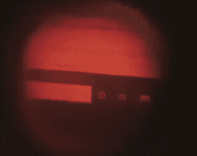

# 老式单色仪机械地制造单色光

> 原文：<https://hackaday.com/2021/07/27/vintage-monochromator-makes-monochromatic-light-mechanically/>

单色仪是一种光学仪器，它只允许从光源传输的波长的狭窄选择，并且[获得的特定模型【Doug】通过机械调节的反射镜和衍射光栅系统呈现可见光单色](http://www.vk1zdj.net/?p=384)，该系统只允许选择的波长通过。大转盘是操作者选择所需波长的方式，并标有“mu”(或毫微)，但[道格]指出更现代的术语是纳米。

LCD monitor viewed through a monochromator set to pass red wavelength only, showing that images remain intact.

它是如何工作的？光通过底部的开口进入设备，只有选定的波长从顶部射出。刻度盘的范围是从 450 纳米到 640 纳米(代表紫蓝色到红色)，[Doug]通过将白色 LED 手电筒照进装置中来演示，并显示如何根据刻度盘的设置仅绿色、红色或蓝色从顶部出来。

一个有趣的附带说明是，使用这种特殊的设备，图像可以呈现单色，但在其他方面保持完整。[Doug]通过设备查看他的 LCD 监视器的一小部分来演示这一点，如他设法捕捉到的照片所示。

这是一件有趣的老式设备，展示了无源光学组件和巧妙的机械设计的可能性。因此，这些设备完全是手动操作的工具(至少在有人将步进电机粘到调节盘上以创建自动扫描仪之前是这样)。)