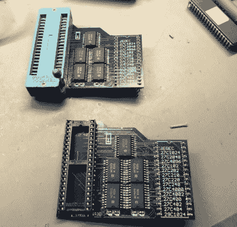

# 老式程序员获得现代芯片适配器

> 原文：<https://hackaday.com/2019/01/08/vintage-programmer-gets-modern-chip-adapter/>

在试图恢复一个大金刚街机游戏板的时候，[Jelmer Bruijn]发现自己在寻找一个 EPROM 程序员，并自豪地成为一个 20 世纪 90 年代的数据人 S4 的主人。尽管它很老了，但它是一个相当好的工具，可以让你读写不同类型的 EPROM，而不需要依赖电脑。唯一的问题是，一些类型的芯片需要一个适配器才能在 Dataman S4 中工作，其中一些不出所料地不再可用。

 在 Dataman 现有工作人员的大力支持下，他走上了正轨，【杰尔默】决定尝试[逆向工程旧适配器的工作原理，这样他就可以建造自己的](http://www.jelmerbruijn.nl/dataman-s4-1640-eprom-adapter/)。他的最终目标是在 32 针 Dataman S4 上读取 40 针 EPROMs，但最后他说，如果你发现自己需要这样的东西，他收集的信息应该适用于构建其他适配器。

正如您所料，这个项目不仅仅是一个简单的 pin 适配器。[Jelmer]假设需要某种移位寄存器或锁存装置来弥补数据人 S4 的 ZIF 插座上引脚的短缺。只是要弄清楚这一切是如何进行的。

幸运的是，[Jelmer]发现程序员会很乐意尝试在 16 位 EPROM 上执行操作，即使实际上没有适配器。这给了他一个用逻辑分析仪四处探查的机会，以弄清楚它试图完成什么。这个技巧原来是把 16 位总线分成两个 8 位总线，它们被顺序地请求。

通过仔细观察、仔细研究 16 位芯片数据手册和深入研究，他最终能够[提出一个使用五个 74xx573 锁存器的设计，并在 Eagle](https://github.com/jjwbruijn/Dataman-S4-1640) 中将原理图放在一起。当电路板最终到达时，有一些问题需要解决，但最终设计在第一次尝试中就成功了。[Jelmer]说，同样的技术应该适用于 42 针 EPROMs，但由于 Dataman 实际上仍然销售适配器，他决定不提供它的原理图。

[Jelmer]告诉我们，他在阅读了我们自己的[[埃利奥特·威廉姆斯]最近如何花了很长时间擦除了几个 UV EPROMs 后，受到了启发，将这个成功的故事发送给我们](https://hackaday.com/2019/01/02/fail-of-the-week-eproms-rats-nests-tanning-lamps-and-cardboard-on-fire/)虽然这不是第一次[我们看到有人不得不将对 16 位 eprom 的支持植入他们的程序员](https://hackaday.com/2013/03/31/add-features-that-should-have-already-been-there-to-an-eprom-programmer/)，但很高兴看到制造商至少在这种情况下支持了客户。