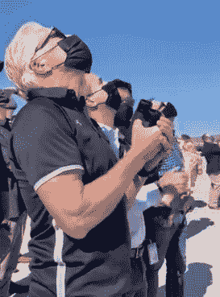
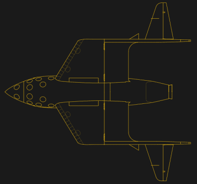
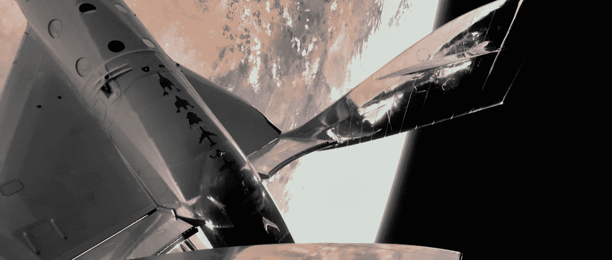
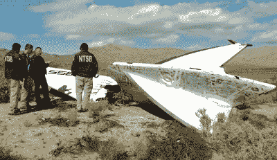
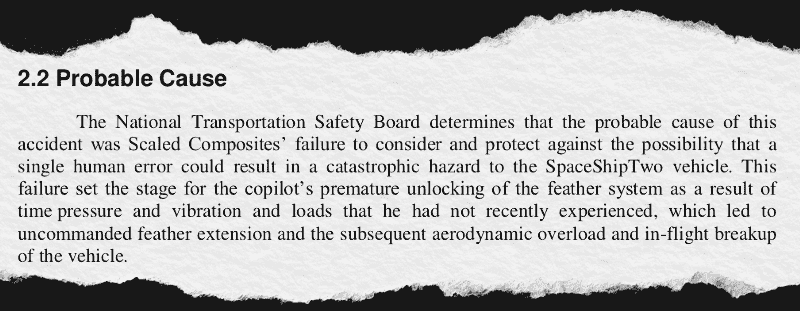
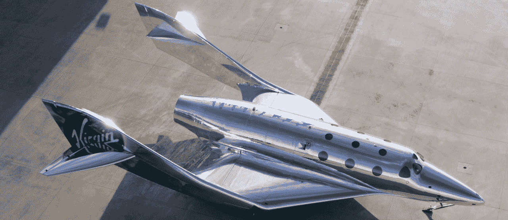

# 维珍银河漫长的商业航天之路

> 原文：<https://hackaday.com/2021/06/01/virgin-galactics-long-road-to-commercial-spaceflight/>

听创始人理查德·布兰森说，至少从 2008 年开始，维珍银河的“太空飞船二号”已经进行了 18 个月的首次飞行。但是一系列的延迟、技术故障和几起悲惨的事故不断地将日期推回到许多人怀疑它是否会发生的时间点。与 SpaceX 和蓝色起源等商业航天领域的竞争对手相比，该公司的缓慢步伐变得更加明显，这些竞争对手在过去十年中取得了令人难以置信的飞跃。

Richard Branson watching *Unity’s* test flight.

但现在，终于，布兰森的亚轨道太空飞机似乎终于开始为这家羽翼未丰的公司创造一些收入。他们最近成功的试飞，虽然从技术上来说是该公司第三次到达太空，但代表了商业服务道路上的一个重要里程碑。它不仅证明了针对去年流产的飞行中发现的问题对维珍飞船(VSS *) Unity* 所做的改变是成功的，而且这是第一次从 Spaceport America(该公司在新墨西哥的新运营基地)起飞的完整持续时间任务。

这次飞行将飞行员弗雷德里克“CJ”斯特科夫和戴夫·马凯带到 89.23 公里(55.45 英里)的高度，从这次飞行中收集的数据将由联邦航空管理局彻底审查，作为获得商业服务许可的过程的一部分。下一次飞行将有四名维珍银河员工加入飞行员，测试飞机满载乘客时的性能。最后，布兰森本人将乘坐联合航空公司的最后一次试飞到达太空边缘，作为他对该飞行器信心的公开展示。

如果一切按计划进行，整个过程应该在年底前结束。到那时，加上维珍银河已经获得的测试设备和在失重环境下训练宇航员的政府合同，以及积压的 600 多名付费乘客，该公司每次飞行应该会带来数百万美元的收入。

## 有前途的前任

毫无疑问，航空航天工程是一项困难而严格的工作，尤其是当你的目的地是真空的太空时。但即使如此，人们还是认为维珍银河会比它的竞争对手有优势，因为“太空船二号”太空飞机及其运载飞机是 2004 年赢得安萨里 X 奖的运载工具的直接后续产品。

SpaceShipOne Diagram by Kaboldy

“太空船二号”的体积大约是可搭载三名乘客的“太空船一号”的两倍，它的设计更时尚，让人想起未来的私人飞机，但除此之外，这两艘飞船非常相似。两者都是从专门建造的“母舰”上空中发射的，在混合火箭发动机的动力下加速到大约 3 马赫，在接近垂直的上升过程中，混合火箭发动机燃烧固体燃料和一氧化二氮大约 70 秒。由于缺乏到达轨道所需的速度，飞船沿着远地点至少为 80 公里(50 英里)的亚轨道弹道滑行，在此期间，乘客会经历大约 4 分钟的微重力。

到目前为止的飞行剖面与 20 世纪 60 年代的北美 X-15 没有什么不同，尽管最大速度要慢得多。但现在棘手的部分来了，重返大气层。即使在亚轨道飞行相对较低的速度下，这也是一个危险的操作，可能会发生灾难性的错误。这种风险就是为什么伯特·鲁坦给了太空飞船一号一个秘密武器:所谓的“羽毛配置”，即飞行器的后半部分向上折叠。这创造了一个高阻力，空气动力学稳定的布局，经常被比作羽毛球，并基本上使再入成为一个自动过程。增加的阻力使速度保持较低，而折叠的形状确保飞行器保持适当的姿态。在减速到亚音速后，机翼向下折叠，飞行器像航天飞机一样滑行到跑道上着陆。

VSS *Unity* reenters the atmosphere in its feathered configuration.

羽毛再入的优雅简单可以说是太空飞船一号赢得安萨里 X 奖的原因，其固有的可靠性使其非常适合商业航天。难怪“太空飞船一号”的成熟设计被视为开发亚轨道太空旅游实用太空飞机的捷径。发生了什么事？

## 发动机故障

悲剧在太空船二号公开亮相之前就已经开始了。2007 年，在测试车辆更大更强的发动机所需的新氧化剂系统时，一个装有 4500 公斤(9900 磅)一氧化二氮的储罐[爆炸，导致 Burt Rutan 的 Scaled Composites](https://www.latimes.com/archives/la-xpm-2007-jul-27-me-explode27-story.html) 的三名员工死亡。

混合火箭发动机的设计将继续给团队带来多年的问题，尽管谢天谢地没有进一步的生命损失。它最初燃烧的是与太空飞船一号上使用的原始 88 kN (20，000 磅)推力发动机相同的固体端羟基聚丁二烯(HTPB)和一氧化二氮混合物，但这种组合在长期燃烧过程中被发现不稳定。尽管使用这种发动机进行了几次飞行，但在 2014 年，维珍银河宣布他们正在开发一种新的发动机，可以燃烧不同的燃料。这需要在“太空飞船二号”的机翼上增加氦气和甲烷罐，这是一个原始设计根本没有考虑到的相当大的改动。

VSS *Unity’s* engine [being installed in November 2020](https://www.youtube.com/watch?v=WYsdrBSAytk).

在尝试了不同的燃料和引擎改进后，维珍银河最终回到使用 HTPB 作为燃料。据报道，这种新型发动机是内部制造的，而不是通过分包商制造的，能够产生 310 kN (70，000 磅)的推力，并且完全可以重复使用。不幸的是，与接下来发生的事情相比，花在发动机开发困难上的时间就相形见绌了。

## 阿斯佩拉的广告

在 2014 年 10 月 31 日的一次试飞中， [VSS *Enterprise* 在莫哈韦沙漠上空发动机点火后几秒钟](https://www.space.com/27618-virgin-galactic-spaceshiptwo-crash-kills-pilot.html)在大约 15 公里(5 万英尺)的高度解体。虽然身受重伤，飞行员彼得·西博尔德还是跳伞逃生。不幸的是，副驾驶迈克尔·阿尔斯伯里在事故中丧生。

Wreckage of the VSS *Enterprise* in 2014.

由于这是新燃料混合物的首次飞行测试，业内人士的早期理论将责任归咎于发动机。但这个想法很快就被搁置了，因为美国国家运输安全委员会(NTSB)对一次飞船上的致命事故进行了有史以来第一次调查，发现发动机和相关的油箱基本完好无损。在飞行器遥测技术、驾驶舱录音和来自残骸本身的证据的帮助下，NTSB 号最终查明了企业号的主要特征:羽状再入系统。

NTSB 的结论是，阿尔斯伯里，可能是由于压力或混乱，解锁了飞行器的顺桨装置，远远早于飞行清单上显示的时间。随着机械锁不再就位，大气层中超音速动力飞行的空气动力学压倒了致动器，导致机翼自行折叠。以超过 1 马赫的速度飞行时，切换到这种高阻力配置就像撞上了一堵墙；对飞行数据的分析确定，在阿尔斯伯里解锁羽毛机构的 1.7 秒内，*企业号*在半空中被撕成碎片。

## 向前和向上

在*企业*的致命解体后，维珍银河对当时正在建设中的*联合*进行了多项变革。其中最主要的是物理和操作措施，以防止羽毛机构解锁或过早展开。NTSB 建议对紧急情况下的机组人员进行更全面的培训，特别是在自动降落伞和补充氧气系统的使用方面，但最终认为该飞行器的设计和操作令人满意。

截至 2020 年 1 月，目前还未命名的第三艘和第四艘太空船仍在建造中，前者接近最终集成和地面测试开始的点。[考虑到新冠肺炎·疫情](https://hackaday.com/2020/04/06/getting-to-space-is-even-harder-during-a-pandemic/)的深远影响，很可能从那时起这些飞行器的工作被大大减缓了。因此，假设商业运营在 2022 年开始，主要的瓶颈将是在航班之间周转 *Unity* 所需的时间。

为此，维珍银河在三月份宣布，他们正在同时研发一种被称为“太空船三号”的新型飞行器。从表面上看，下一代 VSS *Imagine* 和 VSS *Inspire* 与“太空飞船二号”非常相似，它们的设计考虑到了模块化和易于维护。随着航班之间周转时间的减少和至少五架太空飞机的机群，该公司希望最终每年仅从美国太空港就能执行多达 400 次商业飞行。

The first SpaceShip III class vehicle, VSS *Imagine*.

这是一个大胆的目标，但考虑到经过十多年的研发，该公司还没有搭载一名付费乘客，它可能应该有所保留。也就是说，如果维珍银河的历史教会了我们什么，那就是他们肯定不会不战而降。