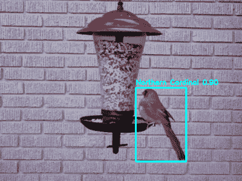
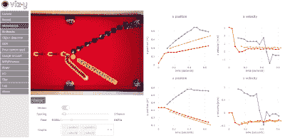

# vizy“AI 相机”想让机器视觉不那么复杂

> 原文：<https://hackaday.com/2020/10/04/vizy-ai-camera-wants-to-make-machine-vision-less-complex/>

来自 Charmed Labs 的新机器视觉相机 vizy[已经实现了他们的众筹目标](https://www.kickstarter.com/projects/charmedlabs/vizy)，承诺使机器视觉项目部署起来更加容易和简单。这款相机的起价约为 250 美元，集成了内置电源和关机管理的 Raspberry Pi 4，并配有各种预装应用程序，因此人们可以直接进入。

索尼 IMX477 相机传感器与[Raspberry Pi 高质量相机](https://hackaday.com/2020/05/01/new-part-day-raspberry-pi-camera-gets-serious-with-12-megapixels-proper-lenses/)中的传感器相同，支持高达每秒 300 帧的捕捉速率(无论如何，在正确的条件下。)与大多数人面临的通常情况不同，当涉及到 Raspberry Pi 时，没有必要担心添加实时时钟、外壳或确保关机正常发生；一切都搞定了。

‘Birdfeeder’ application can automatically identify and upload images of visitors.

Charmed Labs 是 Pixy 和 Pixy 2 的幕后推手，Vizy 走得更远，因为机器视觉项目所需的一切都已安装在板上，易于使用和部署，甚至视觉处理功能也在本地工作，不需要无线数据连接(尽管自动上传或共享等功能需要无线数据连接)。)对于户外或远程应用，有一个防风雨的外壳选项，在没有 WiFi 的地区，可以通过插入 USB 蜂窝调制解调器获得无线连接。

一些对黑客更友好的硬件功能包括高电流 I/O 接头和对 C/CS 和 M12 镜头的支持，以实现最大的灵活性。红外滤光器也可以通过软件启用或禁用，因此不再需要将相机模块更换为移除了红外滤光器的模块。软件方面，应用全部用 Python 编写，使用 Tensorflow、OpenCV 等开放软件进行处理。

功能列表看起来不错，但 Vizy 似乎也有明确的重点。它看起来最适合支持具有以下结构的项目:

**检测事物**(人、动物、汽车、文本、昆虫等)和/或**测量事物**(大小、速度、持续时间、颜色、数量、角度、亮度等)。)

**执行动作**(例如，推送通知或启用高电流 I/O)和/或**记录**(本地或远程保存图像、视频或其他数据。)

The Motionscope application tracking balls on a pool table. (Click to enlarge)

这种结构的一个很好的例子是预装的 *Birdfeeder* 应用程序。当摄像机对准喂鸟器时，就能探测到来吃零食的动物。如果访客是一只鸟，Vizy 会识别其种类并上传图像。如果动物不是鸟(例如松鼠)，那么 Vizy 也可以检测到这一点，并使用 I/O 头，可以短暂地打开一个洒水器来驱逐饥饿的派对不速之客。[谷歌照片上的*喂鸟器*照片流样本在这里](https://photos.google.com/share/AF1QipNU0N-W_CcAa3n5KF2-fHX1LhrCSRTxgMIXrjLISNBGRBpAv1ocMI40qSJDL75vLw?key=OTVQbTJ1Z05WMFlDOGJIeG13b2FQVzVmMmxKNFBn)。

*Motionscope* 是一个更不寻常但看起来非常有趣的应用程序，它的目的是捕捉移动的物体并测量每个物体的位置、速度和加速度。一张图片更好地解释了 *Motionscope* 的功能，所以这里有一张观看一些台球的结果截图，展示了它的功能。