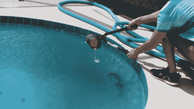
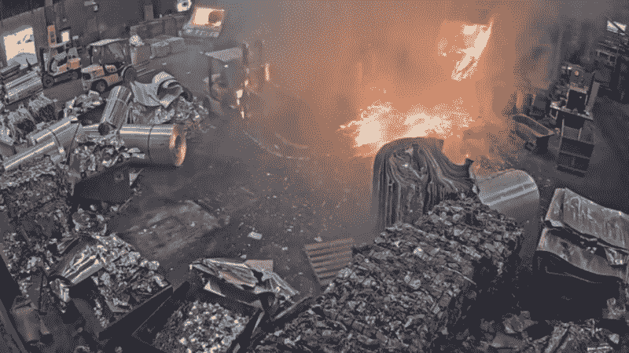
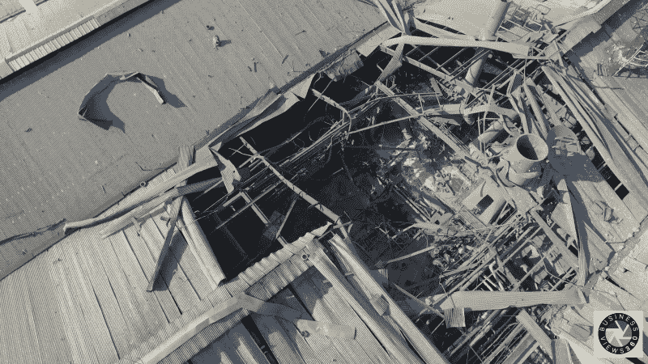
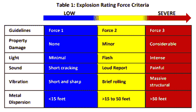

# 水和熔融铝是一种危险的组合

> 原文：<https://hackaday.com/2020/12/30/water-and-molten-aluminium-is-a-dangerous-combination/>

对于一个黑客作家来说，浏览一篇给定文章的评论部分，寻找见解或学习新东西并不罕见。通常，那些在不同领域有经验的人会分享知识的核心或就某个特定的话题提出问题。最近，鉴于我自己在这一领域的经验，我碰巧对一篇关于铝铸造的文章感兴趣。有一条评论特别引起了我的注意。

> 不，水不会引起蒸汽爆炸。youtube 上有一个家伙(我想是我的福特情人)用铁水反驳了那个神话，把铁倒进水里，把水倒进一勺铁水里等等。如果需要，我们很乐意用铝做一个视频演示。

在一家铝压铸厂工作了一段时间后，我真诚地希望[约翰]没有尝试这一壮举。虽然有许多 YouTube 视频显示这可以在没有灾难的情况下实现，但也有许多视频显示情况恰恰相反。熔化的铝和水的混合通常很差，会在工作场所造成严重伤害甚至死亡。让我们深入探究一下这是为什么。

## 氧化层的魔力

Many use such demonstrations as a “proof” that aluminium/water explosions are a “myth”. It’s risky, and ignores the very real examples that crop up in industry every year.

铝作为一种材料如此珍贵的原因之一是它的抗腐蚀性。当暴露在空气中时，生铝容易形成坚硬的氧化层，保护金属免受进一步腐蚀或与许多化学物质反应。这种氧化层可以非常迅速地形成，这也是为什么许多 YouTubers 成功地将熔融铝倒入水中而没有受伤的原因之一。在适当的条件下，铝在空气中从一个勺子到一桶水的过程中会形成一层氧化层。许多人用这种危险、冒险的演示来“证明”铝和水的大爆炸是一个“神话”。

当然，在铸造厂找份工作，你会很快意识到问题有多严重。设施完全禁止一次性水容器和软饮料并不罕见，因为担心废弃的容器可能会被扔进垃圾箱，并将水分带入熔炉。在我作为一名铸造工程师的工作中，带一瓶或一罐软饮料到工地上，第一次违规会受到警告，第二次会被立即解雇。就安全而言，采取不彻底的措施危险太大了。[铸造作业通常要求所有员工在铸造车间工作前观看安全视频，明确风险](https://www.youtube.com/watch?v=EstAmVY4RVM)。

这种危险的例子随处可见。通常，当熔融铝被倒入含有水分的模具中时会发生意外。另一个危险区域是将废料装入熔炉时。废铝本身可能是湿的，或者装有液体的瓶子可能会意外地混入材料中。当废钢加入熔炉中的熔融金属时，[会发生巨大的喷发](https://www.youtube.com/watch?v=sIJmwF1Qs7M)。

## 爆炸原因

[The aftermath of a molten metal explosion](https://www.youtube.com/watch?v=sIJmwF1Qs7M) in an aluminium furnace. Note the forklift on fire and the molten metal sprayed over a great distance on the floor.

由于多种因素，当熔融铝和水在适当的条件下混合时，会发生剧烈的爆炸。第一个是最明显的:温度超过 660 摄氏度的水与熔融金属接触时，几乎会瞬间蒸发成蒸汽。蒸汽的体积迅速增大，将熔化的金属抛到很远的地方，仅此一点就能造成严重的伤害和破坏。这也打破了熔融铝，被称为分裂。这具有在熔融金属、水和蒸汽之间引起更大混合的效果。这进一步增加了向流体的热传递速率，并且由于蒸汽和铝之间接触的表面积更大，增加了两者之间的反应速率。

The Bonnell aluminium plant was severely damaged, and five workers injured, [by an explosion in 2016.](https://www.ajc.com/news/local/one-still-critical-after-explosion-coweta-bonnell-aluminum-plant/kZXmuNfChUrd6B9X82JhLO/)

此外，水和铝之间的化学反应只会增加爆炸的强度。在这种情况下，铝原子与水分子反应，形成氧化铝和氢气。这是一个放热反应，释放出大量的热量——是等量硝化甘油产生的热量的 2.5 倍以上。自然地，产生的氢气随后在周围大气中与氧气自由燃烧。此外，任何被爆炸雾化的熔融铝也会在空气中迅速氧化，在这个过程中释放出更多的热量。

所有这些因素的结合会导致难以置信的剧烈爆炸。在最恶劣的条件下，仅仅一个放错位置的水瓶就能炸掉整个铸造厂。

## 描述事件特征

Categories for classifying molten aluminium explosion incidents.

当然，并不是每个事件都以同样的方式发展。各种各样的因素会影响这种爆炸的严重性，从轻微到灾难性的。根据爆炸的严重程度，美国铝业协会将事故分为三类。1 级事件是次要的，通常涉及熔融金属飞溅到 15 英尺的距离。2 级地震更加严重，金属喷射到 50 英尺远的地方，伴随着巨大的爆炸和光的释放。最后，三级地震的声音往往大到足以造成严重疼痛，金属被抛出 50 英尺以上，通常会造成主要结构损坏。令人欣慰的是，三级地震很少发生，但通常会摧毁发生地震的大部分设施。[铝协会的年度报告指出，2019 年只有 1 起事件，幸好没有人员伤亡。](https://www.aluminum.org/sites/default/files/2020%20Molten%20Metal%20Incident%20Annual%20Summary%20Report%20092120.pdf)

总的来说，这篇文章的目的是强调轶事证据不能用来宣布某事是安全的。在尝试可能伤害自己或他人的事情之前，做自己的研究并从专业人士那里获得信息是值得的。祝你在那里愉快，并保证它的安全！