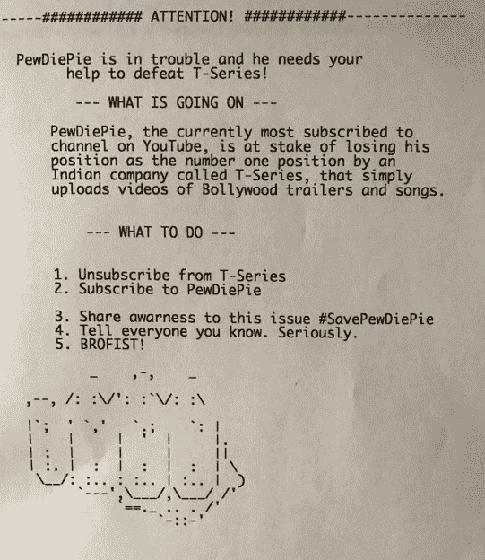

# 武器化的网络印刷已经成为现实

> 原文：<https://hackaday.com/2018/12/07/weaponized-networked-printing-is-now-a-thing/>

很有可能 Hackaday 读者和那些密切关注 YouTube 超级明星职业生涯的人的维恩图没有太多重叠，所以你可能很幸运地不知道这个自称[PewDiePie]的人。因此，你可能不知道他和另一个上传宝莱坞音乐视频的 YouTube 频道之间的斗争已经达到了如此激烈的程度，以至于他的粉丝们已经诉诸游击黑客来试图将公众舆论转向他们一边。这也许不是我们想象中的反乌托邦式的未来，但却可能是我们应得的未来。

[](https://hackaday.com/wp-content/uploads/2018/12/printerspam_payload.png) 简单总结一下情况，一个只知道名字的黑客【TheHackerGiraffe】决定通过[对 5 万台联网打印机](https://www.zdnet.com/article/twitter-user-hacks-50000-printers-to-tell-people-to-subscribe-to-pewdiepie/)发起自动攻击来帮助亲爱的领袖。当黑客攻击成功时，打印机会吐出一页数字宣传，包括第一手 ASCII 艺术，敦促收件人去 YouTube 并保证他们对[PewDiePie]的支持。关于[TheHackerGiraffe]瞄准的打印机中有多少真正交付了有效载荷，还存在一些争议，但从整个社交媒体的反应来看，这足以将信息传递出去。

虽然特技本身可能令人惊讶，但方法却并非如此。事实上，对参与这种情况的安全研究人员来说，唯一令人惊讶的是，这种情况并没有更频繁地发生。这当然不是第一次有人这样做，但事实上，这一次它与这样一个高调的网络名人有关，这使得更多的人关注这个问题。既然众所周知的秘密已经泄露，甚至出现了声称提供“打印机广告”的网站。很有可能这不会是最后一次有人的打印机开始运行超过 TPS 报告。

我们 Hackaday 对争夺 YouTube 霸主地位不感兴趣。我们正在争取达夫·琼斯的 EEVBlog 频道加入 ave 的行列，突破 100 万用户。但我们对使这种攻击成为可能的技术非常感兴趣，我们将看到更多人利用它的可能性有多大，现在我们应该做些什么，即使我们自己的打印机也可以反对我们？

## 比你想象的要容易

根据[TheHackerGiraffe]的描述，Shodan(被称为“世界上第一个互联网连接设备的搜索引擎”)被用来搜索面向互联网的 IP 地址，这些地址具有与网络打印协议相关的开放端口，如 IPP、LPD 和 JetDirect。搜索结果显示，超过 80 万台设备正在监听传入的打印命令，其中前 5 万台设备被选为攻击目标，并保存到一个文本文件中。

有了等待命令的潜在打印机列表，下一步就是找出如何与它们对话。为此，我们无畏的【长颈鹿】[使用了开源打印机开发工具包(PRET)](https://github.com/RUB-NDS/PRET) 。PRET 由一套 Python 脚本组成，面向在联网打印机上执行安全审计的研究人员，可以执行多种功能。不仅限于简单地打印到目标，它还可以访问其内部存储上的文件，捕获传入的打印作业，禁用打印机，甚至有一个功能声称会对打印机的 NVRAM 造成永久损坏。

有了目标列表和命令它们的工具套件，拼图的最后一部分是一个快速脚本，将它们绑定在一起。[TheHackerGiraffe]在 Twitter 上发布了一份 Bash 脚本的副本，据说这份脚本引起了所有的骚动，它非常简单:

```

#!/bin/bash
while read -r line; do
    ip=&quot;$line&quot;
    torify ./PRET/pret.py $ip pjl -q -i ./commands.txt
done &lt; &quot;./potential_bros.txt&quot;

```

该脚本从一个名为“potential_bros.txt”的文件中加载潜在易受攻击的打印机列表，并为文件中的每个 IP 地址运行`pret.py`命令来传递有效负载。PRET 的每个实例都通过`torify`工具运行，该工具将命令包装在 Tor 会话中，试图匿名化活动。就每行代码的知名度而言，这个脚本必须排在相当高的位置。

总的来说，一个不需要的只有几行文字的打印工作可以说是这种特技最无害的结果，它甚至没有用那么多墨水。事实上，[TheHackerGiraffe]现在表示，显示对[PewDiePie]的支持实际上是一个次要目标；真正的目标是提高人们对许多联网打印机的脆弱性的认识。不管你相信这个说法是真实的，还是在事后制造借口，我们不能否认它已经引起了人们的议论。

## 这属于传真机法的范畴吗？

有人会认为，连接到数千台打印机并使用它们发送未经请求的消息肯定是非法的。但是一些人提出，由于这些打印机是公众可以使用的，宣传一种可用的服务，并且没有认证限制，它可能会陷入法律的灰色地带。人们可能会认为，连接到一个开放的打印机与连接到一个公共 web 服务器没有太大的不同。

由于[TheHackerGiraffe]没有做任何通常会与美国的*计算机欺诈和滥用法案*相冲突的事情，例如收集数据、故意破坏系统或勒索受害者，目前还不清楚法律是否真的准备好应对这种特殊的威胁。当然，事情很复杂，因为被攻击的打印机可能位于世界各地，可能会受到不同黑客法律的管辖。在一些国家，简单地连接到你知道你不应该访问的网络是非法的，即使你没有造成任何损害。

具有讽刺意味的是，最适用的法律(至少在美国)可能是 2005 年[的*垃圾传真预防*对*电话消费者保护法*](https://www.fcc.gov/general/fax-advertising-policy) 的修正案，其中禁止发送未经请求的传真。这里的比较似乎很清楚:一台等待接收传输的传真机相当类似于互联网上一台不安全的打印机。在这一点上，未来的修正案也将这些保护扩展到互联网连接的打印机似乎是一个放弃的结论。

## 我们将何去何从

不管是好是坏，现在世界上的每个人都知道把不想要的印刷品强行塞进成千上万的打印机是多么容易。无论[TheHackerGiraffe]的实际目标是什么，在这一点上真的无关紧要，最终结果是一样的。有人~~一个名叫~~ [~~西蒙·史密斯~~的安全研究员已经启动了 PrinterAdvertising.com](https://printeradvertising.com/)，它承诺开发自己的内部框架，如果有商业利益的话，可以向全世界的打印机推送广告。假设它真的上线了，不难想象这样一个系统是如何容易被滥用的。

[编者按:西蒙·史密斯联系了我们，声称他与该网站无关，这是一次试图欺骗他的尝试。PrinterAdvertising.com 似乎要倒下了。]

就像最近关于互联网连接的 Octoprint 服务器可能允许恶意使用 3D 打印机的争议一样，保护 2D 打印机的最佳行动似乎是相同的:从一开始就让它们远离互联网。现实情况是，绝大多数这些打印机从未打算在本地网络之外被访问，但由于草率的路由和错误配置的防火墙，它们不知何故设法进入了更广泛的互联网。

如果这一事件实现了什么，除了确保[PewDiePie]继续在 YouTube 上赚钱，希望它将减少错误配置的打印机，并加深对“物联网”内在风险的理解。但如果历史有任何迹象表明，这可能不会是最后一次有人传播他们的信息，无论无辜与否，通过那些在全球各地办公室里积满灰尘的低级网络打印机。

【影片主图*办公空间*