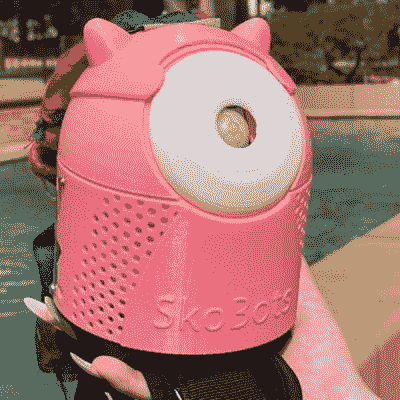

# 充满蒸汽和消失的土著语言的可穿戴机器人

> 原文：<https://hackaday.com/2023/01/03/wearable-skobots-full-of-steam-and-vanishing-indigenous-languages/>

[Danielle Boyer]是 Ojibwe: Sault Ste Marie 部落的成员，热衷于保护正在消失的土著语言。她发明了一种肩扛式谈话伴侣，称为 SkoBot，通过建造编程有土著语言课程的机器人来教孩子们 STEAM，并建立了 STEAM Connection 来分发它们。

 通过她的[每个孩子得到一个机器人](https://www.steamconnection.org/ekgar)计划，超过 8000 个基于 ESP32 的工具包已经分发给学生。总成本不到 20 美元，3D 打印机器人有助于普及机器人技术。由于许多农村地区缺乏高速互联网接入，它们被设计为通过学生的手机进行本地控制。

在波士顿 WBUR 电视台的一次采访中，[Danielle]回忆起她的一个学生曾经说过她是他们在机器人领域见到的第一个本地人，她鼓励他们投身其中。“这真的让我很感动，也让我看到了我们做自己的力量，对我们自己和我们的社区真实，我认为这是一件非常美好的事情。”

了解更多关于【丹妮尔】在[STEAM Connection](https://www.steamconnection.org/)所做的有影响力和有趣的工作，这使她获得了白宫的邀请，在休息后观看 GMA 视频的预览，并观看她今年晚些时候将在[推出的植物生物机器人](https://www.steamconnection.org/biobotz)。

这并不是我们第一次看到机器人入侵教室:[从学生建造的“战斗机器人”](https://hackaday.com/2019/05/21/bringing-battle-bots-into-the-modern-classroom/)到[模块化 3D 打印 SimpleSumo 项目](https://hackaday.com/2017/10/28/simplesumo-bots-teach-more-than-fighting/)，这些教育举措可以帮助以一种更具吸引力的方式教授电子和软件开发的基础知识，而不是简单地从教科书上阅读理论。

 [https://www.youtube.com/embed/boLg6manH1k?version=3&rel=1&showsearch=0&showinfo=1&iv_load_policy=1&fs=1&hl=en-US&autohide=2&wmode=transparent](https://www.youtube.com/embed/boLg6manH1k?version=3&rel=1&showsearch=0&showinfo=1&iv_load_policy=1&fs=1&hl=en-US&autohide=2&wmode=transparent)

