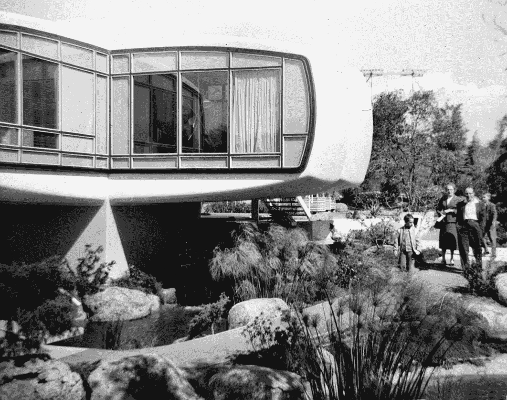
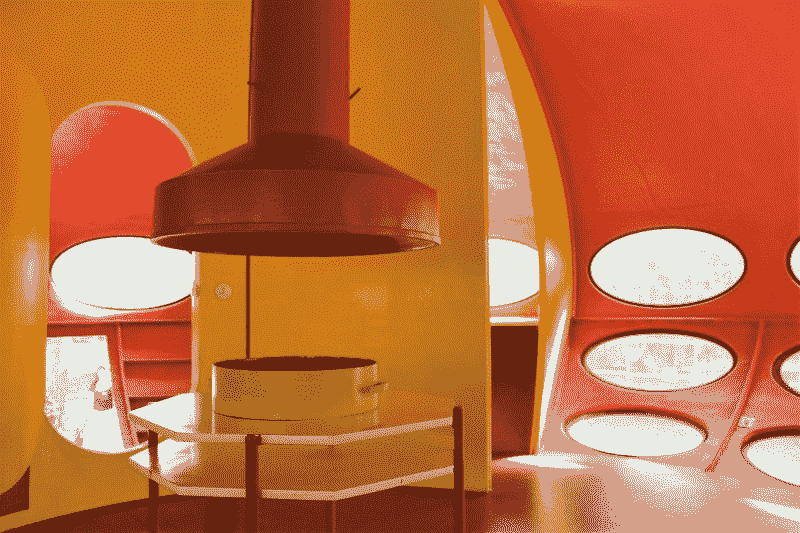

# 我们将来不是应该住在塑料房子里吗？

> 原文：<https://hackaday.com/2021/04/13/werent-we-supposed-to-live-in-plastic-houses-in-the-future/>

未来主义已死。至少，20 世纪中叶那种极度乐观的基于技术的未来主义，在我们的版本中，已经被一种更加悲观的环境挑战和经济灾难模式所取代。我们的飞行汽车将不再把我们从太空时代的神奇家园带到单轨铁路，单轨铁路将带我们穿过闪闪发光的干净城市，到达我们的机器人化工作场所，相反，尽管我们可能拥有全球计算机网络和声控助手，但我们仍然生活在与几十年前几乎相同的过时风格中。我们的房子是用木头和砖块建造的，用的是铁锹，而不是用机器人预制的，几分钟就能送到。我们的家具对一个 20 世纪 50 年代的人来说就像对我们一样熟悉。

## 一个从未发生过的塑料未来

曾几何时，房地产的未来看起来截然不同。就像今天我们在 Hackaday 上报道的故事类型中忙于试验新材料和技术一样，在 20 世纪 50 年代，工程师和建筑师可以使用塑料这种令人着迷的新材料。第二次世界大战催生了一个巨大的产业，需要重新用于和平时期的生产，所以几乎所有的东西都被考虑用于塑料处理，包括房子。我们 21 世纪的房子将是太空时代的豆荚，而不是从上个世纪继承下来的斜屋顶房子，这似乎是一种自然的发展，所以还有什么比使用新的神奇材料更好的方法来建造它们呢？在那个时期出现了各种各样的塑料房子设计，这些设计至今仍是图标，但五六十年后的今天，我们仍然没有住在里面。为了找出原因，有必要看一看其中的一些，部分是因为这是对可能发生的事情的迷人一瞥，但更主要的是为了事后的利益来审视它们。

Disneyland’s Monsanto House Of The Future. Orange County Archives from Orange County, California, United States of America, [CC BY 2.0](https://commons.wikimedia.org/wiki/File:Monsanto_Plastics_Home_of_the_Future,_Disneyland,_1958_(15364290924).jpg).

最著名的塑料房屋设计是 20 世纪 60 年代末由芬兰建筑师 Matti Suuronen 设计的 Futuro，最初是一个滑雪小屋，但后来在全球范围内少量商业化。这是一个截面玻璃纤维增强塑料设计，类似飞碟，周围是椭圆形的窗户，入口是里尔喷射式折叠楼梯。它竖立在一个管状框架上，框架上有四个混凝土垫，这使得它能够放置在几乎任何地形上。在内部，它有几个房间和家具融入其弯曲的形状。

它不是那个时代唯一著名的塑料房子，尽管它是商业化程度最高的一个，除了 Suuronen 的较小的 [Venturo](https://en.wikipedia.org/wiki/Venturo) 设计之外，还有一些建筑，如 Jean-Benjamin Maneval 的[泡泡屋](https://www.inexhibit.com/case-studies/the-bubble-house-by-jean-benjamin-maneval-1963/)和迪士尼公司广受欢迎的迪士尼乐园景点[孟山都未来之家](https://en.wikipedia.org/wiki/Monsanto_House_of_the_Future)，它碰巧是由麻省理工学院设计的[从 20 世纪 50 年代末到 60 年代末有数百万人参观。这两种设计都比 Futuro 更实用，在 Futuro 中，玻璃纤维模块将由各种配置的中央结构组装而成。迪士尼之家的模块有钢架从包含建筑设施的中央混凝土塔悬臂伸出，是为典型的美国家庭建造房屋的一次认真尝试。它所有的内部家具和功能也是由塑料制成的，作为新材料的展示，尽管它从未有人居住，但有历史电影显示公园演员扮演居民的角色。(顺便说一句，据说中央塔楼的地基在公园里作为一个种植园保存至今。)](http://museum.mit.edu/150/131)

## 那么，到底哪里出了问题？

The interior of a Futuro house. Ilkka Jukarainen ([CC BY-ND 2.0](https://www.flickr.com/photos/130333033@N08/28911258803/in/photolist-L3MKZn-2hcmQqC-7DtjCV-7DCRqQ-AXcKtP-7Dz4uz-fJBFfk-7DCNbu-7Dx8SJ-7Dx7eu-7Dx9p5-7Dx9V7-e1H3VT-7Dtj5z-7DCQT7-e1NHgm-7DCRKm-7Dz3Gi-7Dz1Ap-7Dz3h4-7Dz45T-7DyZ16-7Dz2AH-7DCPKU-7DCP9m-7DyZoZ-7DCSxj-7DCSgq-7DCSas-ibXEpV-7DCQpq-7DyZHn-7DCR4y-7DCRTq-7Dz24r-7DCNY5-7DyZhX-7Dz2hK-7DyZPT-7DCMVy-7Dz2Gc-7DyYK4-7DCSFC-7Dz1pv-7DCNz1-7DCSNE-7Dz1TK-7Dz1gH-2ehhMp5-7Dz156))

考虑到这种技术已经被 Futuro 的连续生产所证明，最终被幸存下来的房子的寿命所证明，并且被迪士尼之家在数百万游客的压力下的恢复力所证明，这显然不是缺乏实用性导致它们没有流行起来。也许你们的品味不同，但就我个人而言，如果我对它的消防安全感到满意，我会很乐意住在一个克隆的迪士尼房子里，如果有人给我一把未来之门的钥匙，我会在一天之内安装好我的长凳。但也许令人惊讶的是，鉴于我们对这个时代的普遍看法是新的爆炸，当它们被放置在现实世界中时，它们很难获得认可。

事实上，尽管它对后来几十年的影响是巨大的，但像奥斯汀·鲍尔斯(Austin Powers)电影这样的流行神话中展示的 20 世纪 60 年代的现代仙境实际上仅限于相对少数的地方和选定的年龄组，街道尽头未来的出现对于更保守的居民来说可能会太多，他们的品味可能会在几十年前形成。那些为数不多的已建成的 Futuros 及其同类建筑面临着来自邻居的敌意，并被规划条例和住宅金融公司排除在外。20 世纪 70 年代初的石油危机敲响了丧钟，推高了原材料价格，到了 20 世纪 80 年代，这种未来只是一个遥远的记忆。

## 原来你不能从亚马逊订购所有的东西

也许更令人惊讶的是，今天我们中相对较少的人住在真正的预制房屋中(相对于现场建造的成套房屋)，即使它们不是由塑料制成的。在发达国家，我们对经济适用房有着巨大的需求，加上建筑业仍在使用另一个世纪完善的密集技术，这些条件应该是预制房屋的完美环境。

从苏联的公寓楼到西欧的高层建筑，再到日本和美国的模块化住宅，房屋单元的预制制造在许多国家都有着悠久的历史。但是他们仍然会遇到当地规划部门、建筑法规的抵制，有时甚至会遇到潜在客户自己的抵制。在某些方面，这是由建筑业的利益驱动的，如果成千上万的湿贸易工人需要结束，建筑业将面临破产，但在其他方面，这似乎是由持续的痴迷于使房屋看起来像是几个世纪前建造的。也许如果我们要解决我们的住房危机，我们需要再次复兴未来主义。毕竟，我们的孩子可能需要它。

标题图片:南 Futuro house([CC BY 2.0](https://www.flickr.com/photos/nanpalmero/9400949816/in/photolist-fjJjRE-fjb6i7-V8qb5b-TXx8Nt-2foejET-24LFpbn-Tf2bEm-2fiAhyN-24LGtZP-Tf1Nfw-2ehhMqC-RBRb2R-RBRaZX-2ehhuTE-2foeykt-2ehhaqG-2ehh8SG-e1NDSL-e1NG5h-e1H3sH-e1H4yg-e1H4oD-e1H2Hv-e1H2je-e1H1Aa-e1NH2b-e1H4mc-e1H4fp-e1H3ZB-e1NGif-e1H3Gk-e1NFZW-e1NFHo-e1NFrW-e1NFkU-e1H2t6-e1NERs-e1H2nr-e1H26D-e1H1RP-e1H1Hi-e1H1v8-e1NHnY-e1H4rv-e1H3nX-e1NFDW-e1NFyy-e1H2Pv-e1H4Ei-e1H4vH))。