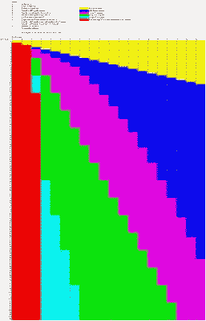

# 扫描大量按钮最便宜的方法是什么？

> 原文：<https://hackaday.com/2018/09/30/whats-the-cheapest-way-to-scan-lots-of-buttons/>

 所以你在制造一种新的机械键盘。或者在树莓馅饼上扣几个扣子。或者制作世界上最大的 MIDI 网格控制器。太好了！第一个也是最重要的工程问题是:你怎么看懂那些按钮的？Pi 上的几个按钮可能会一对一地直接连接到 GPIO 引脚。一个机械键盘需要更多的针脚，可能还需要某种矩阵扫描仪。但是电网控制器不太清楚。也许是外部 I/O 扩展器或更大的矩阵？每个按钮上还需要二极管吗？为了帮助回答这些问题，[openmusiclabs]的人员生成了[一张坦率地说令人震惊的地图](http://www.openmusiclabs.com/learning/digital/input-matrix-scanning/index.html)，它显示了给定的要扫描的输入和可用引脚的数量，哪种拓扑结构是有意义的，以及大概要花多少钱。最重要的是，它们链接到可读性很强的描述中，描述了每一个可能是如何实现的。数据可能是在 2011 年收集的，但这里的基本面没有任何变化。

你怎么看这个图表？X 轴是控制器上空闲管脚的数量，Y 轴是要扫描的 I/o 的数量。请看顶部的黄色带，如果您需要扫描一个输入，直接使用单个 pin 总是最有意义的(非常直观，对吧？).向下滚动，如果您需要读取 *110* 输入，但微处理器只有 8 个空闲引脚，有几个选择，按键 E 和 F。检查顶部的图例 E 是“[并行输出移位寄存器与 uC](http://www.openmusiclabs.com/learning/digital/input-scanning-matrix/shift-out-mux/index.html) 混合”，F 是“[并行输入移位寄存器与 uC](http://www.openmusiclabs.com/learning/digital/input-scanning-matrix/shift-in-mux/index.html) 混合”。那些是什么意思？查看原始帖子中的表格或点击链接，我们会看到一个方便的描述性页面。看起来“并行输出移位寄存器”是指使用移位寄存器来驱动扫描矩阵的一侧，“并行输入移位寄存器”是指相反的情况。

当我们在这里时，我们认为有必要全文复制帖子底部的脚注:

> 本教程的动机是这样一个事实，当我们戴上工程帽时，我们经常会重新发明轮子。尽管这非常有趣和有益，但在某种程度上，它确实阻碍了我们项目的前进，以及总体的艺术水平。因此，当我们解决自己的小问题时，我们越能记录下我们所学到的东西，别人做同样的事情就越少，世界上就有越多酷的事情。

一个雄辩的方式来表达为什么我们如此喜欢写 Hackaday。继续这些令人敬畏的项目！