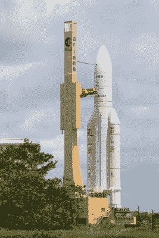
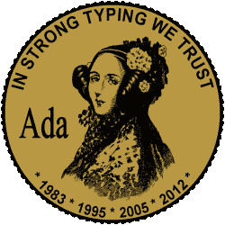
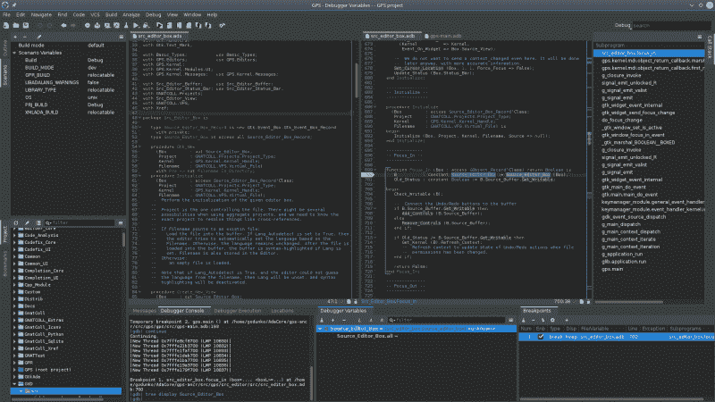
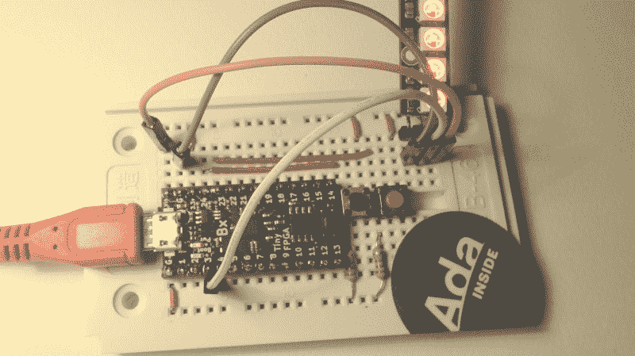

# 为什么 Ada 是你想用来编程系统的语言

> 原文：<https://hackaday.com/2019/09/10/why-ada-is-the-language-you-want-to-be-programming-your-systems-with/>

Ada 编程语言诞生于 20 世纪 70 年代中期，当时美国国防部(DoD)和英国国防部试图取代数百种用于嵌入式计算机系统的专用编程语言，嵌入式计算机系统日益成为军事项目的重要组成部分。相反，Ada 被设计成一种单一的语言，能够在所有嵌入式系统上运行，提供相同或更好的性能和可靠性。

在 1995 年的修订版中，该语言还针对通用系统，并增加了对面向对象编程(OOP)的支持，同时没有忽略可靠性、可维护性和效率的核心价值。今天，用 Ada 语言编写的软件不仅是军事硬件的支柱，也是航空电子和空中交通控制系统等商业项目的支柱。Ada 代码控制着像阿丽亚娜 4 号和 5 号这样的火箭、许多卫星和无数其他系统，在这些系统中，小故障会产生重大后果。

Ada 也可能是您下一个嵌入式项目的正确选择。

## 军事级别的规划

为了挑选新的编程语言，国防部授权由军事和学术专家组成的[高级语言工作组](https://en.wikipedia.org/wiki/High_Order_Language_Working_Group) (HOLWG)起草一份需求清单并挑选候选语言。结果就是所谓的“[斯蒂尔曼要求](https://dwheeler.com/steelman/steelman.htm)”。



Ariane 5ES: Ada Inside (photo DLR_de CC-BY-SA 2.0)

斯蒂尔曼的关键要求是:

*   一种通用的、**灵活的**设计，适合满足嵌入式计算机应用的需求。
*   **可靠性**。这种语言应该有助于可靠程序的设计和开发。
*   **易维护性**。代码应该是可读的，编程决策应该是明确的。
*   轻松生成**高效的**代码。低效的构造应该很容易识别。
*   **没有**不必要的**复杂**。语义结构要一致，尽量减少概念数量。
*   **易于实现**的语言规范。所有功能都应该易于理解。
*   **机器独立性**。该语言不应受限于任何硬件或操作系统细节。
*   **完整定义。**语言的所有部分都应得到完整和明确的定义。

需求的结论是防止程序员犯错是第一道也是最重要的防线。通过消除犯细微错误的机会，例如通过隐式类型转换和其他危险的构造所犯的错误，代码自动变得更加安全和易于维护。

选择过程的结果是，虽然没有现有的编程语言适合作为国防部项目的唯一语言，但创造一种能满足所有这些要求的新语言肯定是可行的。因此，四个施工人员被雇佣来完成这项工作。一个中间选择过程挑选了两个最有希望的方法，最终一种语言成为胜利者，并被命名为“ [Ada](https://en.wikipedia.org/wiki/Ada_%28programming_language%29) ”。

## 默认深度防御

Ada 的类型系统不仅仅是强类型的，而且经常被称为“超强类型”，因为它不允许任何级别的隐式转换。以这段 C 代码为例:

```

typedef uint32_t myInt;
myInt foo = 42;
uint32_t bar = foo;

```

这是有效的代码，将编译、运行并产生预期的结果，用`bar`打印生命、宇宙和一切的答案。阿达却不是这样:

```

type MyInt is Integer;
foo: MyInt;
bar: Integer;
foo := 42;
bar := foo;

```

这将使 Ada 编译器抛出一个令人讨厌的错误，因为' Integer '和' MyInt '显然是不同的。这样做的主要好处是，如果以后要更改类型定义，不会突然让一千个隐式转换在整个代码库中爆炸。相反，人们必须在类型之间进行显式转换，这通过防止类型混合来促进良好的设计，因为“它们无论如何都是相同的”。

任何经历过混合标准 C、Linux 和 Win32 类型定义的困境的人都可能会意识到，不必翻遍无数页的文档和格式不佳的源代码来找出哪个 typedef 或宏包含了在编译中途或调试会话期间突然出现的内容的实际类型定义。



Ada 通过编译时检查和运行时检查增加了进一步的防护。在 Ada 语言中，程序员需要明确地命名程序块的结束语句，并说明变量的取值范围。Ada 没有定义像`int`或`float`这样的标准类型，而是要求从一开始就创建具有特定范围的类型。字符串也是如此，除了无界字符串，所有字符串都有固定的长度。

在运行时，可以测试诸如非法内存访问、缓冲区溢出、范围违规、逐个错误和数组访问等错误。然后可以安全地处理这些错误，而不是导致应用程序崩溃或更糟。

Ada 实现了访问类型模型，而不是提供低级通用指针。每种访问类型都由一个存储池处理，可以是默认的，也可以是自定义的，以允许更奇特的系统内存实现，如 NUMA。Ada 程序员从不直接访问堆内存，而是必须使用这个存储池管理器。

最后，编译器或运行时决定数据如何传入或传出函数或过程调用。虽然必须指定每个参数的方向(用“ *in* ”、“ *out* ”或“ *in out* ”)，但数据是通过寄存器、堆还是作为引用传递的最终决定将由编译器或运行时做出，而不是由程序员做出。这可以防止堆栈空间不足时出现溢出问题。

拉文斯卡简介和 T2 星火方言都是 Ada 的子集，后者主要关注 T4 契约。随着时间的推移，这些子集的特性[已经被](https://www.adacore.com/about-ada)吸收到主语言规范中。

## 今天用 Ada 编程

ANSI 在 1983 年认证了 Ada 83 规范；英特尔的 80286 刚刚发布，而摩托罗拉的 68000 只有四年历史。这是家用电脑的黎明，但也是 20 世纪 70 年代到 80 年代的尴尬过渡，当时微控制器变得更加流行。想想英特尔 8051 及其惊人的 4 kB EPROM 和 128 字节 RAM。

今天流行的微控制器比 1983 年的功能强大许多倍。可以抓任何 ARM，AVR，RISC-V 等。MCU(或 Lego Mindstorms NXT kit)并开始为它开发，就像开发任何其他基于 C 的工具链一样。毫不奇怪，流行的 [GNAT Ada 编译器](http://getadanow.com/)是建立在 GCC 之上的。基于 LLVM 的工具链也正在开发中，目前使用的是[龙蛋](http://dragonegg.llvm.org/)项目。

基于 GCC 的 Ada 工具链有两个版本。AdaCore 版本享有商业支持，但有一些附加条件。自由软件基金会的版本自然是免费的，并且或多或少与 AdaCore 具有同等的功能。

为了快速入门，你可以使用 GNAT 工具链的 [AdaCore 版本](https://www.adacore.com/download)附带的 [GNAT 编程工作室](https://en.wikipedia.org/wiki/GNAT_Programming_Studio) IDE (GPS )(以及 Github 上的[),或者用你选择的文本编辑器粗略地编辑并手工编译，或者通过编写 Makefiles 来作弊。这里的工具链比 C 或 C++稍微复杂一些，但是通过使用`gnatmake`实用程序变得非常简单，该实用程序包装了各个工具，基本上像 GCC 一样工作，因此它可以很容易地集成到构建系统中。](https://github.com/AdaCore/gps)



The GNAT Programming Studio main interface.

你可以在[的项目页面](https://github.com/MayaPosch/Sarge)上找到一个由你真正以命令行参数解析器的形式编写的小而不平凡的 Ada 项目的例子。您可以在`ada/`文件夹中找到构建项目的 Makefile，它设置了可以找到 Ada 包规范(`.ads`)和包主体(`.adb`)文件的文件夹。

这些文件大致对应于 C 和 C++中的头文件和源文件，但有一些重要的区别。与 C 不同，Ada 没有预处理器，也不合并源文件和头文件来创建编译单元。相反，将引用规范中指定的包的名称及其接口。这里,`.ads`文件的名称也不需要匹配包的名称。这提供了很大的灵活性，并防止了 C 语言中常见的问题，即循环依赖或需要以特定的顺序包含头文件。

## 从这里去哪里

在抓住 GNAT 工具链，启动 GPS 或 Vim/Emacs，盯着空白页面上闪烁的光标看了一会儿后，您可能想知道如何开始。幸运的是，我们最近报道了这个项目，它有一个基于 Ada 的项目运行在 PicoRV32 RISC-V 内核上。这使用了开源 FPGA 工具链支持的普通 ICE40LP8K CPLD，包括 [Yosys](http://www.clifford.at/yosys/) 。



Ada running on a RISC-V core, driving LEDs.

这种语言本身的介绍和参考资料可以在 Java 和 C++开发人员的简单介绍中找到(PDF)、 [AdaCore 基本参考资料](https://learn.adacore.com/)、WikiBooks 上的[参考资料](https://en.wikibooks.org/wiki/Ada_Programming)，当然还有 Ada 2012 中的“[编程”，以死树格式提供给那些喜欢额外内容的人。这可能是除了钻研 2012 年](https://www.amazon.com/Programming-Ada-2012-John-Barnes/dp/110742481X) [Ada 语言参考手册](http://www.ada-auth.org/standards/ada12.html) (LRM)及其辉煌的 945 页之外最完整的参考。

虽然 Ada 在业余爱好者圈子中仍然是一种非常罕见的语言，但它是一种完全开放的语言，具有可靠的、受商业支持的工具链，用于编写从 ICBM 和 F-15 航空电子设备到医疗设备固件的任何软件。虽然这是一种超出核心特性的相当广泛的语言，但它绝对应该出现在你在项目中使用的语言列表中，仅仅是因为它在你的简历上看起来很酷。