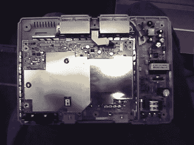
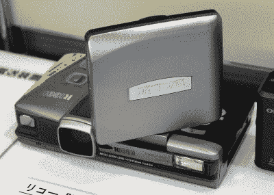
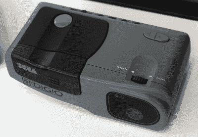
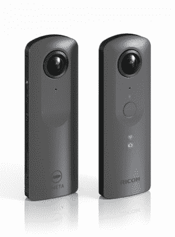
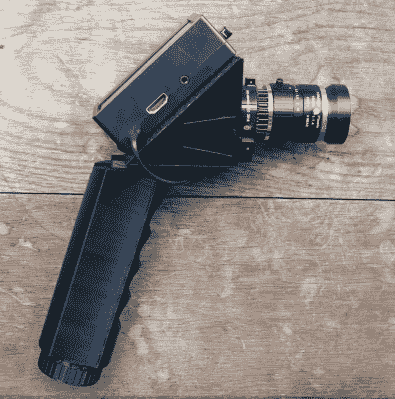
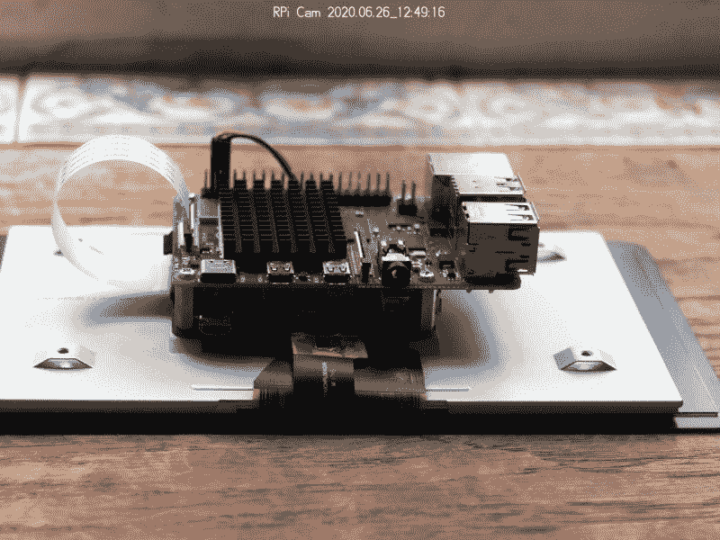

# 为什么数码相机还是很无聊？

> 原文：<https://hackaday.com/2020/07/01/why-are-digital-cameras-still-boring/>

在技术进步的问题上，我们作为一个物种，大多是贪得无厌的。最新的玩具，最快的硅片，最大的存储空间，等等。以数码相机为例，你的第一台是什么？我的是 1997 年左右的卡西欧 QV200，虽然我不能马上找到它，但我仍然把它放在某个地方，它可以在 4Mb 的板载内存中存储当时高达 64 VGA 分辨率的图片。

The QV200 showing off its VGA photography capabilities. It’s March 1998, and this is a brand-new PlayStation that I’m about to install a mod chip inside.

令人震惊的是，自那以来已经过去了近四分之一世纪，它的定焦 640×480 相机模块和紫外线敏感的 CMOS 传感器让一切都带上了一点蓝色，甚至不会成为 2020 年最便宜的功能手机。自 20 世纪 80 年代和 90 年代初的第一批型号开始类似于我们今天所知的独立数码相机以来，数码相机的每个方面都有了无可估量的改进，它们具有近乎无限的存储空间、优秀的镜头、巨大且可忠实再现的传感器，以及广播质量的视频功能。

但是相机制造商对外形有多感兴趣呢？我们在科幻电影中看到记者拿着相机，看起来一点也不像他们的电影祖先。就创意人体设计而言，我们现实生活中的数码相机能提供什么？

## 当摄影公司没有推动数码相机市场的时候

数码相机的每个方面都有所改进，除了一点。当大众市场的数码相机问世时，它们的设计者试验了相机的形状因素。卡西欧就是一个例子，它不是一个镜头从中间伸出的砖块，而是将相机放在一端的旋转炮塔中。这是第一次有可能从一个角度拍照，而不是把脸朝向取景器。

The Ricoh RDC-i700 from 2000, one of a line of cameras with a distinctive form factor from the company. Morio / [CC BY-SA 3.0](https://commons.wikimedia.org/wiki/File:Ricoh_RDC-i700_Model_G_CP%2B_2011.jpg)

其他制造商也采取了类似的偏离常规的做法，仅举几个例子:苹果 1994 年的 QuickTake 100 的外形尺寸约为平装书大小，镜头和取景器位于两端；尼康 1996 年的 Coolpix 100 的外形尺寸为垂直，隐藏了 PCMCIA 卡，用于检索照片；20 世纪 90 年代的一系列理光相机采用直板格式，让人想起 110 盒式胶片相机，但顶部有上翻式 LCD。

自从 35mm 胶片被广泛采用以来，相机基本上保持了几十年不变，产品设计师可以自由地重新发明相机，结果是有趣的新设备激增。他们中的一些人可能有点前卫，但他们中的一些人确实让拍照变得更容易了。

到了 2000 年代，这个充满创造力的时代嘎然而止，数码相机退回到 35mm 祖先的最新仿制品，只不过配有液晶显示屏。紧凑型相机失去了取景器，比它们的电影祖先更纤薄，一种全新的不完全是单反的桥式相机出现了，它看起来好像在某个地方可能有一个 35mm 的小筒，而单反相机是它们的电影前辈的复制品，但却像吃了类固醇一样膨胀和超重，并用按钮装饰。现在，紧凑型相机在手机面前几乎是死的，桥式相机已经让位于无反光镜相机，这种相机看起来就像 35 毫米测距仪。我敢说，相机有点无聊。

## 你父母不想要任何刺激的东西

Even Sega tried their hand at digital cameras, with the 1996 Digio SJ-1\. Morio / [CC BY-SA 3.0](https://commons.wikimedia.org/wiki/File:Sega_DIGIO_SJ-1_CP%2B_2011.jpg)

那么，哪里出了问题？答案在于 20 世纪 90 年代谁在制造相机，谁在购买相机。总的来说，你的父母没有数码相机，相反，他们是早期采用者的保留地。事实上，你们中可能有相当多的人后来成为了黑客读者。硬币的另一面是，它们是由电子公司制造的，而不是我们传统上可能从其购买相机的摄影品牌。这些公司带来了制造电脑外设的产品设计经验，而不是相机外观的根深蒂固的想法。

像我们这样的顾客想要看得见的高科技产品，而制造商准备打破这种模式。这是一些令人兴奋的产品的完美配方。相比之下，在 2000 年代，你的父母买了他们的第一台数码相机，他们可能是从他们信任的品牌购买的，因为他们已经拥有一台带有相同标志的胶片相机。他们天生的保守主义使 35mm 外形的复制品成为安全的东西，结果我们来到了 2020 年，我的相机看起来像是 20 世纪 50 年代制造的。

Ricoh Theta V 360 degree camera (front and back)

然而，并非一切都失去了。数码相机用数字传感器拍摄的平面矩形图像取代了胶片拍摄的平面矩形图像。但新一代相机正在探索超越这一范式。这里你可以看到一个 360 度相机的外形，它将两个不同半球镜头拍摄的图像缝合在一起。所有迹象都表明 3D 摄像机正在地平线上窥视。毫无疑问，这些外形因素将被用来呼应它们的功能与以前有多大的不同，跟随动作相机的脚步，通过炫耀它们强健、几乎坚不可摧的本性来使自己与众不同。

对于那些有兴趣拓展相机外形的人来说，这是成为硬件黑客的绝佳时机。几乎任何东西都可以用价格低廉的组件来建造。给我们一个相机模块和一台小型电脑，我们就可以生产出我们想要的相机，而不是我们父母想要的那种。我对此进行了测试，拿起一个 [Raspberry Pi HQ 相机模块](https://hackaday.com/2020/05/01/new-part-day-raspberry-pi-camera-gets-serious-with-12-megapixels-proper-lenses/)，和一个 C-mount 镜头。它可能不是真正高端型号的匹配，但它是一个足够体面的组合，为实验者打开了无限的可能性。

## 相机外形的未来在你手中

My pistol grip camera. Needs a bit of tweaking maybe, but breaking the 35mm-inspired form factor.

在某种程度上，我的外形有点保守，是一个手枪式握把设计，向 8 毫米电影摄像机和最近的前视红外热感摄像机致敬。但这是一个说明性的作品，展示了用这些组件创建一个可用的相机是多么容易。

OpenSCAD 中的一些工作制作了一个简单的三角形机箱，前面安装了摄像头模块，斜面上可以使用 Velcro 带将带显示器的树莓 Pi 外壳连接到上面。手柄的两侧和底部都有锥形定位点，可以安装手柄或其他配件。手枪式握把可能过大，因为它的设计可以在固定器中容纳两个 18650 电池，但它可以很容易地被侧握柄、GoPro 风格的配件夹或任何其他想象力可以想到的东西所取代。[找到我的 GitHub 仓库中的所有文件](https://github.com/JennyList/PistolGripCamera)。在软件方面，假以时日，我肯定能设计出一个漂亮的界面，但现在我运行的是[【席尔瓦·梅尔希尔】的网络界面](https://github.com/silvanmelchior/RPi_Cam_Web_Interface)，我可以在一个非常慢的网络浏览器上加载它，运行的是一个原始的单核 Pi model B+到时候我会想办法实现一个没有 Raspbian X 膨胀的工作预览(如果有人能帮我把 Netsurf 的 framebuffer 版本编译到[编译](https://source.netsurf-browser.org/netsurf.git/plain/docs/quick-start.md)和*运行*而不是倒在一个 Model B+上，我会非常感激！)，但就目前而言，硬件一直是驱动力。

This isn’t a review of the Pi HQ camera, but here’s a sample picture from my pistol grip camera.

在使用中，这是对过去完全手动相机时代的意外回归。甚至我的 80 年代的 35mm 单反相机也有自动测光和棱镜对焦辅助装置，相比之下，对于习惯了自动对焦无反光镜相机的人来说，这完全是凭感觉拍摄。但是在光圈和焦点上多做一点工作很快就会成为流程的一部分，我可以用它拍出质量不错的照片。最终结果肯定是在功能方面，但我喜欢认为我已经避免生产相机的[荷马](https://simpsons.fandom.com/wiki/The_Homer)。

令人愉快的古怪数码相机外形的日子现在可能已经远离我们了，但我希望我已经表明，即使相机制造商不再有勇气打破任何模具，黑客社区仍然可以在这个舞台上获得乐趣。我们终于达到了拥有负担得起的高质量相机组件的地步，所以是时候发挥创造力了。你打算如何重新解读相机，请与我们分享！