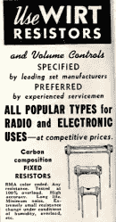

# 为什么电阻器有颜色代码？

> 原文：<https://hackaday.com/2020/01/13/why-do-resistors-have-a-color-code/>

在电子学中，你首先要学的一件事是如何识别电阻值。通孔电阻有颜色代码，初学者一般从这里开始。但是为什么要这样标注呢？就像道路中间的红色停止标志和黄色线，只是看起来好像一直都是这样，而事实上，并不是这样。

在 20 世纪 20 年代之前，部件是按照制造商喜欢的旧方式进行标记的。然后在 1924 年，芝加哥的 50 家无线电制造商组成了一个贸易团体。这个想法是在成员之间分享专利。几乎同时，名称从“联合无线电制造商”变成了“无线电制造商协会”或 RMA。几年后又有几次更名，直到最后，它变成了 EIA 或电子工业联盟。EIA 实际上已经不存在了。它分解成几个具体的部门，但这是另一个故事。

这是一个关于色带如何出现在世界上每个制造商的每个通孔电阻上的故事。

## 点然后带

[](https://hackaday.com/wp-content/uploads/2019/12/oldres.jpg)

[Ésistances anciennes annees 50](https://commons.wikimedia.org/wiki/File:R%C3%A9sistances_anciennes_annees_50.jpg) by François Collard, CC-BY-SA 4.0

到 20 世纪 20 年代末，军事革命制定了标准，其中之一就是军事革命彩色编码标准。问题是标记小部件很困难，尤其是在 20 世纪 20 年代。

解决办法是色带，但不完全像我们今天所知道的那样。颜色的标准是相同的，但是电阻器的主体充当第一带。那么将会有两个或三个其他波段来显示其余的值。在某些情况下，第三条带实际上是一个点。因此电阻器的主体将是第一波段颜色。电阻器的“尖端”将是第二频带，点将是倍增器。使用这种方案的收音机在 1930 年开始出现。这是 1941 年《今日电台年鉴》的颜色代码表:

那本杂志上推销电阻器的广告很小心地注意到它们是用军事革命的颜色编码的。该代码很快扩展到电容器(冷凝器，在当代的说法)。

[](https://hackaday.com/wp-content/uploads/2019/12/wirt.png) 圆点，如同印在圆柱上的一段文字，视电阻的位置而定，可能被隐藏起来。所以最终，大家都转到了乐队。

这些颜色意味着遵循可见光谱(还记得 ROY G BIV 吗？).然而，军事革命省略了靛蓝，因为显然许多人不区分蓝色，靛蓝和紫色作为三种不同的颜色；靛蓝实际上是一种三原色，显然，牛顿把它包括在内是因为他对神秘学感兴趣。这样就剩下四个插槽，所以深色代表低端(黑色和棕色)，亮色代表高端(灰色和白色)。

当然，如果你是色盲，这一点都不好笑。用仪表或电路外的电桥读取电阻当然是一个答案。然而，在电路中读取是另一回事。

## E 系列价值的起源

1952 年，国际电工委员会(IEC，另一个标准组织)定义了 E 系列，它规定了电阻的值，以便在电阻的对数标度上获得相等的间距。如果这听起来令人困惑，考虑一个例子。

E12 系列适用于 10%电阻，上面的值每十进制为您提供 12 个值。基本值是

```
1, 1.2, 1.5, 1.8, 2.2, 2.7, 3.3., 3.9, 4.7, 5.6, 6.8, 8.2
```

这就是为什么你可以得到，比如说一个 4.7 K 或 47 K 的电阻，而不是一个 40K 的电阻。

但是，考虑一下公差。10%的 39 K 电阻可能相差 3.9 K，如果误差将电阻推高，则相差 42.9K，因此不需要 40 K 电阻。也就是说，一个 39 K 的电阻很可能就是一个 40 K 的电阻。另一方面，低 47K 电阻可能为 42.3 K，低于高值 39 K 单位。

正如您所料，值的数量随着容差的减小而增加。例如，在 2%时，您将使用 E48，它每十进制有 48 个值(如果您猜测 E96 —用于 1%的标准有 96 个值，那么您是对的)。使用 E48，40 K 附近的值是 38.3 K 和 40.2 K。这是 39.06 偏高，39.2 偏低。

## 下次

下次你拿起一个电阻并从中读取代码时，你可以回忆起它背后的历史。色带的传统延续到表面贴装领域，不是作为颜色，而是作为代表前两个数字和电阻值乘数的三位数字。如今，许多电子产品，如无线模块和锂电池，都包含一个数据矩阵(类似 QR 码的东西)。老实说，我很惊讶所有元件——通孔和表面贴装——都没有某种形式的微数据矩阵，让你可以将手机对准它们，查看完整的数据手册。也许有一天。