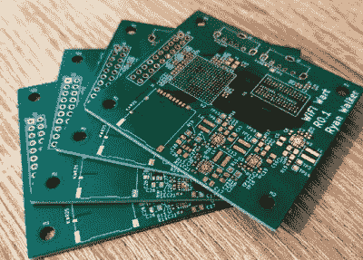
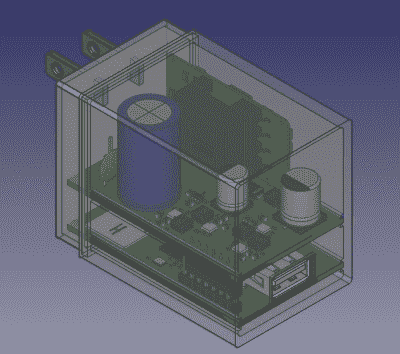

# WiFiWart Linux Pentesting 设备获得首批 PCB

> 原文：<https://hackaday.com/2021/07/03/wifiwart-linux-pentesting-device-gets-first-pcbs/>

当我们最后一次登录 WiFiWart 时，这是一个雄心勃勃的项目，旨在从头构建一个 Linux 驱动的渗透测试投件箱，小到足以伪装成标准的手机充电器，它仍处于早期规划阶段。事实上，整个事情只不过是一个想法。但是我们有一种预感，[Walker]有足够的毅力将这个项目坚持到底，现在不到两个月后，[我们很高兴地报告，不仅第一个原型 PCB 已经组装好了](https://machinehum.medium.com/im-putting-a-wifi-router-into-a-wall-charger-part-1-882df714bbf3)，而且一个由志同道合的人组成的社区正在围绕这个令人兴奋的开源项目建立起来。

 现在，在你过于兴奋之前，我们应该说原型实际上并没有工作。更糟糕的是，当一个仅额定为 2.75 V 的引脚被无意中馈入 3.3 V 时，珍贵的魔法烟雾从电路板的 Allwinner A33 ARM SoC 中释放出来。罪魁祸首是谁？不知何故[Walker]说他错误地订购了一个 3.3 V 的调节器，尽管他在材料清单中有合适的 2.5 V 型号。毫无疑问，这很糟糕，但这就是原型的作用。

尽管[Walker]没能让电路板火起来，但它们被生产出来的事实表明了在相对较短的时间内取得了多大的进展。关于 1 GB DDR3 RAM 如何连接到 A33，我们考虑了很多，其中包括如何在 KiCad 中进行自动走线长度匹配的简要概述。他还锁定了组件选择，如 RTL8188CUS WiFi 模块，截至我们上次更新时仍在考虑中。

Multiple boards make better use of vertical space.

在文章的最后，他甚至讨论了电路板的最终布局，因为他目前正在做的只是一个功能原型，永远不会真正适合手机充电器。听起来，这个计划是利用充电器塑料外壳内的垂直空间，而不是试图将所有东西都塞进二维设计中。

想要享受乐趣，还是想在[Walker]开始这一史诗般的旅程时了解最新动态？也许你有兴趣加入他最近成立的[开源安全硬件不和谐服务器](https://discord.gg/EtZT7mjNuM)。无论你对设计有什么意见，或者只是想出去看看 WiFiWart 的开发，我们相信他会很高兴你能来。

关于这个项目的第一篇帖子得到了黑客读者的热烈响应，这是有充分理由的。虽然许多黑客和制作人员对安全方面的事情只是暂时感兴趣，但我们都喜欢我们小小的 Linux 板。尤其是那些正在公开开发的。