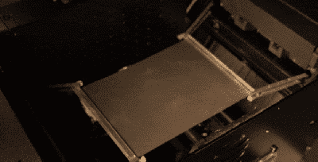

# 摆动屏幕和 DLP 为这种体积视点显示提供动力

> 原文：<https://hackaday.com/2021/07/01/wiggling-screen-and-dlp-power-this-volumetric-pov-display/>

看起来这个世界已经为真正的 3D 显示做好了准备。几十年来，我们已经在科幻小说中看到了它们，它们能够从任何角度观看场景，并近距离观察。它们仍然难以捉摸，但这可能会改变，这要归功于[这种开源的视觉暂留立体显示](https://hackaday.io/project/180304-vvd-an-open-source-real-3d-volumetric-display)。

 如果这个被其创造者【Madaeon】命名的 VVD 看起来有些熟悉，也许是因为主编【Mike Szczys】[在 2019 年的罗马创客节](https://hackaday.com/2019/10/25/giant-leds-ruby-lasers-hologram-displays-and-other-cool-stuff-seen-at-maker-faire-rome/)上遇到了它。看起来从那以后进步了不少，但是基本思想还是一样的。一个薄而柔软的薄膜横跨在一个框架上，附着在铰接臂上。薄膜可以快速上下移动，速度快到需要 1000 fps 的高速摄像机才能看到它的移动。这让你看到了行动中的魔法；数字光处理器(DLP)模块将 3D 图像的切片投射到薄片上，为膜的每个垂直位置发送正确的图像。仔细协调图像会产生立体图像漂浮在空间中的视点错觉，可以从任何角度观察，不需要特殊的眼镜，甚至可以分组观看。

对于这样的展示，我们习惯于发出警告“毫无疑问，它本人看起来更好”，但我们不得不说，在 gif 和视频中，VVD 看起来相当不错。我们认为这是入选 2021 年[黑客日奖](https://prize.supplyframe.com/)的必然结果，我们很高兴看到它进入了[第](https://hackaday.com/2021/06/28/ten-projects-won-the-rethink-displays-round-of-the-hackaday-prize/)轮“反思展示”的半决赛。

[hack adayprize 2021](https://prize.supplyframe.com)主办单位: