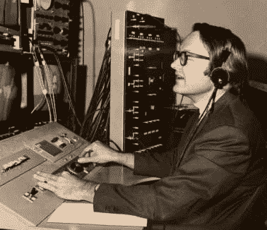
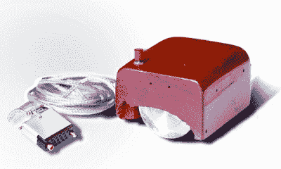
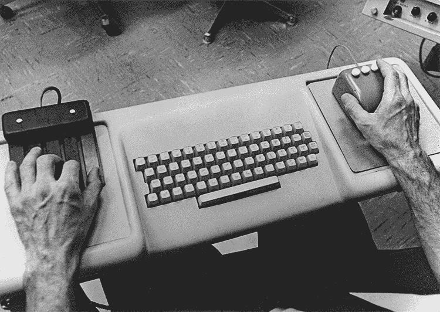

# 电脑鼠标的共同创造者威廉·英格利西去世了

> 原文：<https://hackaday.com/2020/08/03/william-english-computer-mouse-co-creator-has-passed/>

我们沉痛地宣布，电脑鼠标的共同发明者威廉·英格利西于 7 月 26 日在加州圣拉斐尔去世。他已经 91 岁了。

Bill at the controls at Stanford Research Institute. Image via [MSN](https://www.msn.com/en-us/news/technology/column-bill-english-wizard-behind-the-scenes-of-seminal-computer-technologies-dies-at-91/ar-BB17qF8z)

每一项技术都始于一个愿景，一个事物可能或应该如何的模糊概念。电脑鼠标也不例外。事实上，鼠标的设计是为了成为个人计算未来不可或缺的一部分——从穿孔卡片和神秘转向一个更易访问和用户友好的窗口数据显示、超链接、视频会议等系统。所有这一切都将由屏幕上的一个点来指挥，与操作者的意图同步移动，使用一个由手控制的硬件。

只要有人有办法，科幻小说里的东西就会变成现实。通常手段包括另一个人，一个智力上的补充，他能变出同样粗略的愿景并填补空白。对于道格拉斯·恩格尔巴特对现在无处不在的电脑鼠标的设想，那个人就是威廉·英格利西。

威廉·英格利希 1929 年 1 月 27 日出生于肯塔基州的列克星敦。他的父亲是一名电气工程师，威廉从亚利桑那州一所以农场为主的寄宿学校毕业后也走上了同样的道路。在海军服役一段时间后，他在加利福尼亚的斯坦福研究所谋得一个职位，在那里他遇到了道格拉斯·恩格尔巴特。

The first computer mouse, built by William English in the 1960s. Image via [Wikipedia](https://en.wikipedia.org/wiki/Bill_English_(computer_engineer)#/media/File:SRI_Computer_Mouse.jpg)

恩格尔巴特向威廉展示了他的笔记和图纸，他建造了恩格尔巴特设想的输入设备——一种可以在屏幕上选择字符和单词并彻底改变文本编辑的设备。X/Y 位置指示器，很快就被称为鼠标:一种粗糙但光滑的松木赛车输入设备，走向个人计算的未来。

威廉的鼠标很实用:一个底部有两个垂直轮子的木块，里面有一对电位计来解释轮子的 X 和 Y 位置。模拟输入被转换成数字并显示在屏幕上。第一款鼠标只有一个按钮，电线从底部伸出，而不是顶部。

这个控制器被设计用来操纵恩格尔巴特的巨著，一台被称为联机系统的实验计算机，后来被称为 NLS，它被证明是现代网络计算的伟大预言家。1968 年 12 月 9 日，恩格尔巴特和英国人在旧金山进行了一次传奇式的展示，展示了 NLS 的方方面面。[这个被称为所有技术演示之母的事件](https://hackaday.com/2019/01/03/retrotechtacular-the-mother-of-all-demos-50-years-on/)，被我们自己的【Dan Maloney】在纪念 50 周年的传记/回顾性混合报道中很好地报道了。当他们演示的时候，鼠标有三个按钮，放在一个由赫曼米勒设计的庄严的椅子上的膝上控制台上。这个 NLS 控制台包含一个 IBM 电动键盘，左侧有一个 5 键和弦键盘。

The luxury console of the NLS. Image via [The Smithsonian](https://invention.si.edu/mother-all-demos)

Bill 为演示设计了所有的音频和视频，做好了一切准备，并通过耳机与 Englebart 和其他人进行了 90 多分钟的演示。从技术角度来看，这个展览是可能的，因为比尔偶然遇到了一位硅谷电话技术人员，并说服他在大厅和他们位于门洛帕克约 30 英里外的实验室之间建立了语音和视频无线链接。此外，他们还从美国宇航局借来了巨大的 Eidophor 投影仪，向数百名与会工程师展示了演示。English 和 Englebart 在下面的采访中讨论了 NLS、Eidophor 和更多内容，但这个主题值得更深入地探讨(这是 [Mike Harrison 在 2016 年 Hackaday Belgrade 会议](https://hackaday.com/2016/04/19/mike-harrison-exposes-hot-oil-and-high-voltage-of-ancient-live-projector/)上的演讲中所做的)。

1971 年，比尔离开了斯坦福研究所，进入施乐著名的帕洛阿尔托研究中心(PARC)，在那里他继续将 NLS 的特色发展成为阿尔托。你可能从这里知道这个故事——比尔·盖茨和史蒂夫·乔布斯都参观了 PARC，都看到了奥拓，都把个人电脑引向了自己的梦想。

 [https://www.youtube.com/embed/L1oNBImSX0M?version=3&rel=1&showsearch=0&showinfo=1&iv_load_policy=1&fs=1&hl=en-US&autohide=2&wmode=transparent](https://www.youtube.com/embed/L1oNBImSX0M?version=3&rel=1&showsearch=0&showinfo=1&iv_load_policy=1&fs=1&hl=en-US&autohide=2&wmode=transparent)

通过 [NYT](https://www.nytimes.com/2020/07/31/technology/william-english-who-helped-build-the-computer-mouse-dies-at-91.html) 的主图像和缩略图