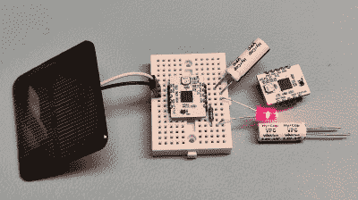

# Hackaday 地球日竞赛的获胜者:太阳能 LIC、自动返回翼伞和水流量计

> 原文：<https://hackaday.com/2021/04/28/winners-of-hackadays-earth-day-contest-solar-lic-auto-return-parafoil-water-flowmeter/>

黑客日地球日挑战赛的获胜者已经公布。我们一直在寻找提高环境问题意识的项目，并很高兴庆祝三个最佳获奖者。每个人都赢得了赞助本次比赛的 Digi-Key 提供的 200 美元购物礼包。

上图是【Eben】的[开放式流量计](https://hackaday.io/project/176376-open-flow-meter)。该建筑包括沉入河流或小溪中的传感器，以测量水流速度。它使用商品管道流量传感器来帮助降低成本，添加 Arduino 和触摸屏来读取传感器并向用户提供 UI。

高空气球用于空气质量和天气传感。为了使这些传感器包更加可重复使用，[Hadji Yohan]一直在研究自动返回到 GPS 设定点的降落伞回收系统。这是一个自动驾驶的翼伞！

能量收集是一个迷人而棘手的游戏。为了帮助减少对电池的依赖，[Jasper Sikken]开发了一种太阳能收集模块，通过一个非常小的太阳能电池板为锂离子电容器(LIC)充电。基于大约一个 ~~100 uF~~ 30 F 电容器，它使用一个 AEM10941 能量收集芯片，其中包括最大功率点跟踪(MPPT)，以尽可能有效地利用太阳能电池板。充满电的模块可以输出调节后的 2.2 V 电压，针对分布式传感器封装，无需任何电池即可运行。

祝贺这三名顶尖选手，以及在比赛中获得亚军的 b 寄生虫电容式土壤水分传感器。本次挑战赛共有 72 个参赛作品，所以不要忘记[看看整个领域](https://hackaday.io/submissions/earth-day-challenge/list)，并对吸引你眼球的作品发表评论，让他们知道我们都喜欢看到伟大作品的细节！

