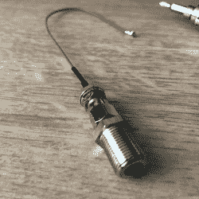

# 有线无线同轴电缆

> 原文：<https://hackaday.com/2018/10/19/wired-wireless-over-coax/>

如果它很蠢，而且有效，那它就不蠢。没有比[【托拜厄斯】的网络设置](https://tbspace.de/wifioversatellitecoax.html)更好的证据了。

最近，他不得不在整个建筑中分布以太网，有几种方法可以做到这一点。您可以使用普通的双绞线或光纤，但在这种情况下，不可能使用新电缆。WiFi 将是下一个显而易见的选择，距离对于“常规”WiFi 链接来说有点太远了。电力线以太网是一种选择，但房子里有业余无线电操作员，他们发出一堆干扰和噪音。解决方案是误用现有的 75 欧姆卫星电视同轴电缆。

 正确的做法是使用标准的 DOCSIS 调制解调器，成为自己的有线互联网提供商。这样做的设备是昂贵的，如果你已经在考虑通过同轴电缆运行 WiFI，你就陷入了兔子洞，不能花真金白银。相反，[Tobias]只是制作了一些从 u.FL 到 SMA 的 u.FL 到 F-连接器适配器，然后是 SMA 到 F-连接器适配器。

这个计划有一些问题。WiFi 50 欧姆，电视同轴电缆 75 欧姆。只有一个 MIMO 信道可用，这意味着最大理论带宽将为 433 Mbps。WiFi 的频率也远高于同轴电缆的设计频率。

通过两个 WiFi 天线到同轴电缆适配器，[Tobias]只需将同轴电缆直接连接到一个路由器，该路由器设置为通过 WiFi 桥接以太网。整个系统运行正常，尽管测试显示它只能获得 60 Mbps 的吞吐量。对于由旧零件和未使用的电线拼凑而成的东西来说，这并不坏。这种方法奏效令人惊讶吗？不，不是真的，但你可能从未见过有人真的这么做。这是它确实有效的证据，如果你曾经陷入困境，这就是你如何使 WiFi 有线。