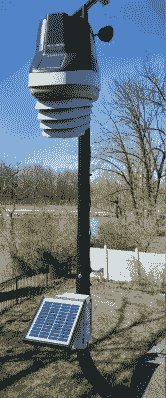

# 无线气象站获得太阳能超级电容升级

> 原文：<https://hackaday.com/2022/04/07/wireless-weather-station-gets-solar-powered-supercap-upgrade/>

当[奈特-of-ni]购买了一个 Acurite Atlas 气象站来取代他早期的 5 合 1 模型时，他最初对它的性能感到满意。然而，仅仅十个月后，室外单元的电池就没电了；由于以前的型号一次充电可以愉快地运行几年，这有点令人失望。每年爬上屋顶不止一次只是为了更换电池也变得不方便，所以[骑士-ni]设计了一个带有超级电容器备份和远程监控的[太阳能系统](https://moteino.blogspot.com/p/5v-solar-power-supply.html)，它应该保持传感器全天候运行，无论晴雨。

 新电力系统的核心是一对总容量为 250 法拉的超级电容器，集成了保护电路，将电压限制在 5.4 伏。帽子由 12 V 太阳能电池板充电；这意味着当超级电容器充满电时，保护电路会消耗相当多的功率，但由于这是完全免费的太阳能，所以这不是什么大问题。6 V 的电池板在阳光充足的情况下也能正常工作，但在阴天或下雪天可能会有问题。

然而，骑士并不满足于让新的电力系统无人值守地运行，他还决定集成一个远程监控工具。为此，他使用了一个 Moteino，这是一个 Arduino 类型的板，集成了 915 MHz 收发器。来自该板的数据由运行 Linux 的 Raspberry Pi 接收，并通过一个漂亮的 web 界面呈现。多亏了这些数据，在一个阳光明媚的早晨,[奈特-of-ni]能够确认超级电容仅在一个半小时内充满电，在一个黑暗的雨天可能是这个时间的三至四倍。

如果你对太阳能气象站感兴趣，我们推荐了几个:[一些非常简单的](https://hackaday.com/2016/08/17/solar-powered-weather-station-has-the-complete-suite-of-sensors/)、[一些更全面的](https://hackaday.com/2019/05/03/low-power-weather-station-blows-the-competition-away/)和[一个嵌入宜家灯笼的](https://hackaday.com/2016/08/22/ikea-lantern-houses-full-featured-weather-station/)。如果你想回顾一下超级电容器的工作原理以及它们与电池的区别，只需看看我们关于超级电容器的深入文章。

谢谢你的提示，[费利克斯]！